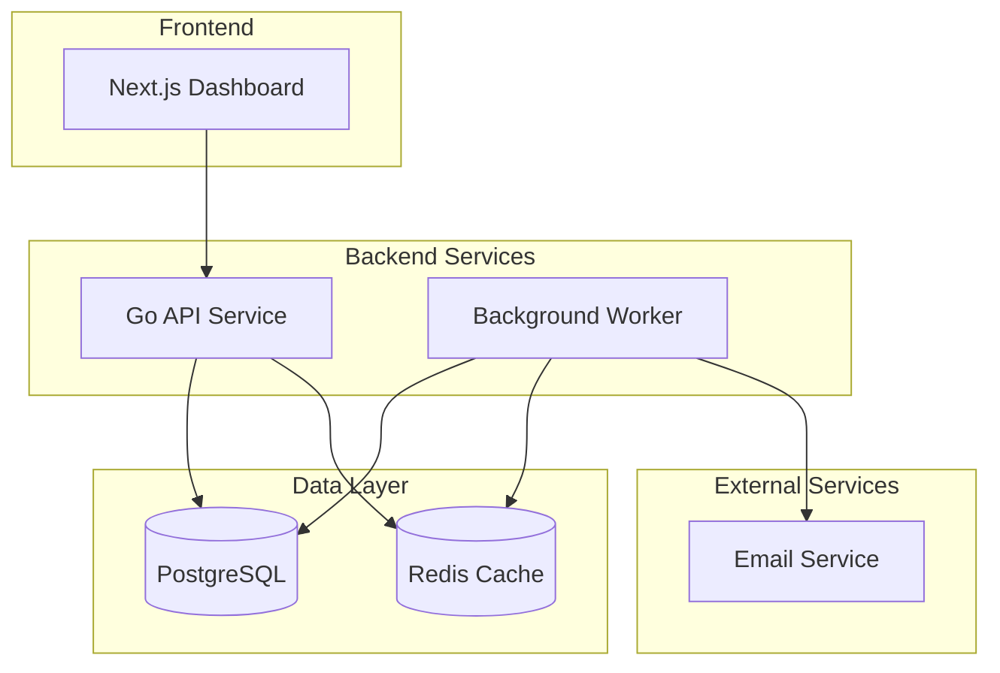

# Payment Watchdog
## Payment Recovery Management Platform

[](https://golang.org/)
[](https://nextjs.org/)
[](LICENSE)

---

## Project Overview

Payment Watchdog is a payment recovery management platform designed to help SaaS companies handle payment failures through automated detection and recovery workflows.

### Current Features
- Payment failure detection via webhooks (Stripe)
- Basic retry mechanisms with exponential backoff
- Simple analytics dashboard
- REST API for integration
- Web interface for monitoring
- Docker-based deployment

---

## Architecture

### Technology Stack
- **Backend**: Go 1.24, Gin, GORM, PostgreSQL, Redis
- **Frontend**: Next.js 14, TypeScript, Tailwind CSS
- **Infrastructure**: Docker, Docker Compose

### Services
- **API Service**: REST API with Go + Gin framework
- **Worker Service**: Background processing and retry orchestration
- **Web Interface**: Next.js dashboard
- **Database**: PostgreSQL
- **Cache**: Redis for event processing

---

## Quick Start

### Prerequisites
- Docker & Docker Compose
- Go 1.24+
- Node.js 18+

### Local Development
```bash
# Clone the repository
git clone https://github.com/payment-watchdog.git
cd payment-watchdog

# Start all services
docker-compose up -d

# API will be available at http://localhost:8080
# Web interface at http://localhost:4896
# Database at localhost:5432
# Redis at localhost:6379
```

### Development Commands
```bash
# API Service
cd api && go run cmd/main.go

# Worker Service
cd worker && go run cmd/main.go

# Web Interface
cd web && npm run dev
```

### Testing
```bash
# Run all tests
go test ./...

# Run specific service tests
go test ./services -v

# Test with coverage
go test ./... -cover
```

---

## 🚀 Local Deployment (Isolated Environment)

For isolated local testing and development, separate from CI/CD flows:

### Quick Start
```bash
# Start isolated local deployment
make local-start
# Or
./scripts/local-deploy.sh start

# Access services
# Web Interface: http://localhost:3016
# API Endpoint: http://localhost:8096
# MailHog: http://localhost:8041
```

### Management Commands
```bash
# Stop services
make local-stop

# Restart services  
make local-restart

# Check status
make local-status

# View logs
make local-logs

# Run health checks
make local-health

# Clean all data (WARNING: destroys database)
make local-clean
```

### Port Configuration
| Service | Development | Local |
|---------|-------------|-------|
| API | 8080 | 8096 |
| Web | 4896 | 3016 |
| PostgreSQL | 5432 | 5448 |
| Redis | 6379 | 6395 |

---

## API Documentation

### Base URLs
- **Local**: `http://localhost:8080`

### Key Endpoints
- `GET /health` - Service health check
- `GET /api/v1/status` - API status
- `GET /metrics` - Basic metrics

---

## Docker Services

```yaml
services:
  api:           # Go REST API (Port 8080)
  worker:        # Background processing
  web:           # Next.js dashboard (Port 4896)
  postgres:      # Database (Port 5432)
  redis:         # Cache & Queue (Port 6379)
  mailhog:       # Email testing (Port 8025)
```

---

## Deployment

### Local Development
```bash
docker-compose up -d
```

### Production Deployment
```bash
# Build production images
docker build -f api/Dockerfile.production -t payment-watchdog/api ./api
docker build -f worker/Dockerfile.production -t payment-watchdog/worker ./worker
docker build -f web/Dockerfile.production -t payment-watchdog/web ./web

# Deploy to staging
docker-compose -f docker-compose.staging.yml up -d

# Deploy to production (Kubernetes)
kubectl apply -f api/deployments/kubernetes/
```

---

## Architecture Overview

Payment Watchdog follows a microservices architecture with the following components:



### Service Responsibilities

#### API Service (Port 8080)
- RESTful API endpoints
- Webhook ingestion (Stripe)
- Payment failure processing
- Health checks and metrics

#### Worker Service
- Background job processing
- Retry logic with exponential backoff
- Payment failure detection
- Analytics processing

#### Web Interface (Port 4896)
- Payment metrics dashboard
- Recovery workflow monitoring
- Configuration management

### Database Schema
- `payment_failures`: Failed payment attempts
- `recovery_attempts`: Retry execution logs
- `analytics`: Failure patterns and metrics
- `users`: System user accounts

---

## Contributing

1. Fork the repository
2. Create a feature branch
3. Make your changes
4. Add tests
5. Submit a pull request

### Development Guidelines
- Follow Go best practices
- Use conventional commits
- Write comprehensive tests
- Update documentation

---

## License

This project is licensed under the MIT License - see the [LICENSE](LICENSE) file for details.

---

## Support

For support, please open an issue on GitHub.
