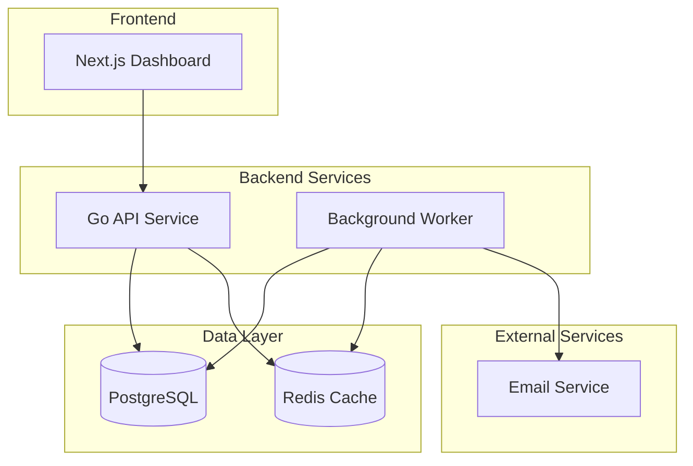

# Payment Watchdog
## Payment Recovery Management Platform

[](https://golang.org/)
[](https://nextjs.org/)
[](LICENSE)

---

## Project Overview

Payment Watchdog is a payment recovery management platform designed to help SaaS companies handle payment failures through automated detection and recovery workflows.

### Enhanced Features
- Payment failure detection via webhooks (Stripe)
- Advanced workflow orchestration with smart retry logic
- VIP customer detection and prioritized recovery
- Cross-method reconciliation (Stripe ↔ Xero)
- Micro-transaction cost optimization (<$100 transactions)
- AI-powered failure pattern detection and prediction
- Advanced analytics with trend analysis
- Sovereign data compliance (AU-only infrastructure)
- Distributed locking for high-availability recovery
- Multi-channel notifications (email, SMS)

---

## Architecture

### Technology Stack
- **Backend**: Go 1.24, Gin, GORM, PostgreSQL, Redis
- **Frontend**: Next.js 14, TypeScript, Tailwind CSS
- **Infrastructure**: Docker, Docker Compose

### Services
- **API Service**: REST API with Go + Gin framework
- **Worker Service**: Background processing and retry orchestration
- **Web Interface**: Next.js dashboard
- **Database**: PostgreSQL
- **Cache**: Redis for event processing

---

## Quick Start

### Prerequisites
- Docker & Docker Compose
- Go 1.24+
- Node.js 18+

### Local Development
```bash
# Clone the repository
git clone https://github.com/payment-watchdog.git
cd payment-watchdog

# Start all services
docker-compose up -d

# API will be available at http://localhost:8080
# Web interface at http://localhost:4896
# Database at localhost:5432
# Redis at localhost:6379
```

### Development Commands
```bash
# Code formatting
./format.sh

# Sovereignty audit
./scripts/AUDIT_SOVEREIGNTY.sh

# API Service
cd api && go run cmd/main.go

# Worker Service
cd worker && go run cmd/main.go

# Web Interface
cd web && npm run dev
```

### Testing
```bash
# Run all tests
go test ./...

# Run specific service tests
go test ./services -v

# Test with coverage
go test ./... -cover
```

---

## 🚀 Local Deployment (Isolated Environment)

For isolated local testing and development, separate from CI/CD flows:

### Quick Start
```bash
# Start isolated local deployment
make local-start
# Or
./scripts/local-deploy.sh start

# Access services
# Web Interface: http://localhost:3016
# API Endpoint: http://localhost:8096
# MailHog: http://localhost:8041
```

### Management Commands
```bash
# Stop services
make local-stop

# Restart services  
make local-restart

# Check status
make local-status

# View logs
make local-logs

# Run health checks
make local-health

# Clean all data (WARNING: destroys database)
make local-clean
```

### Port Configuration
| Service | Development | Local |
|---------|-------------|-------|
| API | 8080 | 8096 |
| Web | 4896 | 3016 |
| PostgreSQL | 5432 | 5448 |
| Redis | 6379 | 6395 |

---

## 🛡️ Sovereign Data Compliance

Payment Watchdog supports "Sovereign Mode" to ensure all application data and telemetry remain strictly within isolated Australian cloud regions (AWS, GCP, OCI, Azure) to comply with data residency laws.

### Enabling Sovereign Mode
To enable, set `SOVEREIGN_MODE=true` as an environment variable in both the `api` and `worker` services. The application will actively validate its database connection string upon startup and **abort** if a non-AU endpoint is detected.

### Sovereign Kubernetes Deployment
A Kustomize overlay is provided to enforce "Air-Gapped" network policies and use local cluster resources (like Prometheus and Redis) instead of global ones.

```bash
# Apply Sovereign Kubernetes configuration
kubectl apply -k api/deployments/kubernetes/overlays/sovereign-au
```

### Infrastructure Auditing
You can generate a Residency Report during deployments or manually run the manifest auditor to ensure no US-based or global external resources are hardcoded:

```bash
# Run the manifest auditor
./scripts/AUDIT_SOVEREIGNTY.sh
```

### GCP Sydney Setup
For sovereign Australian infrastructure deployment:

```bash
# Setup GCP Sydney region infrastructure
./deployment/gcp-sydney-setup.sh
```

---

## API Documentation

### Base URLs
- **Local**: `http://localhost:8080`

### Key Endpoints
- `GET /health` - Service health check
- `GET /api/v1/status` - API status
- `GET /metrics` - Basic metrics

---

## Docker Services

```yaml
services:
  api:           # Go REST API (Port 8080)
  worker:        # Background processing
  web:           # Next.js dashboard (Port 4896)
  postgres:      # Database (Port 5432)
  redis:         # Cache & Queue (Port 6379)
  mailhog:       # Email testing (Port 8025)
```

---

## Deployment

### Local Development
```bash
docker-compose up -d
```

### Production Deployment
```bash
# Build production images
docker build -f api/Dockerfile.production -t payment-watchdog/api ./api
docker build -f worker/Dockerfile.production -t payment-watchdog/worker ./worker
docker build -f web/Dockerfile.production -t payment-watchdog/web ./web

# Deploy to staging
docker-compose -f docker-compose.staging.yml up -d

# Deploy to production (Kubernetes)
kubectl apply -f api/deployments/kubernetes/

# Deploy to sovereign AU environment
kubectl apply -k api/deployments/kubernetes/overlays/sovereign-au
```

---

## Architecture Overview

Payment Watchdog follows a microservices architecture with the following components:



### Service Responsibilities

#### API Service (Port 8080)
- RESTful API endpoints
- Webhook ingestion (Stripe, Xero)
- Payment failure processing
- Advanced workflow orchestration
- VIP customer detection
- Health checks and metrics

#### Worker Service
- Background job processing
- Smart retry logic with cost optimization
- Cross-method reconciliation
- AI-powered pattern detection
- Advanced analytics processing
- Distributed locking coordination

#### Web Interface (Port 4896)
- Payment metrics dashboard
- Recovery workflow monitoring
- Configuration management

### Database Schema
- `payment_failures`: Failed payment attempts
- `recovery_attempts`: Retry execution logs
- `analytics`: Failure patterns and trend metrics
- `users`: System user accounts
- `vip_customers`: Priority customer configurations
- `reconciliation_records`: Cross-method payment matching

---

## Contributing

1. Fork the repository
2. Create a feature branch
3. Make your changes
4. Add tests
5. Submit a pull request

### Development Guidelines
- Follow Go best practices
- Use conventional commits
- Write comprehensive tests
- Update documentation

---

## License

This project is licensed under the MIT License - see the [LICENSE](LICENSE) file for details.

---

## Support

For support, please open an issue on GitHub.
