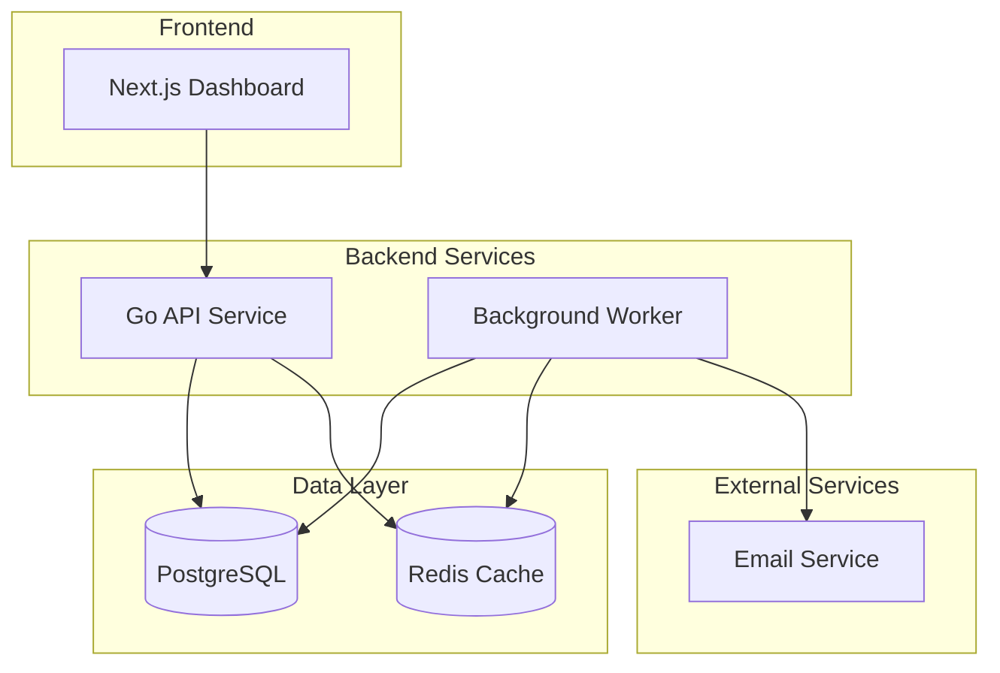

# Payment Watchdog
## Payment Recovery Management Platform

[](https://golang.org/)
[](https://nextjs.org/)
[](LICENSE)
[](#security)
[](https://github.com/features/security)
[](https://dependabot.com/)

---

## Project Overview

Payment Watchdog is a payment recovery management platform designed to help SaaS companies handle payment failures through automated detection and recovery workflows.

### Features
- Payment failure detection and monitoring
- Basic recovery workflows with retry logic
- Analytics dashboard for payment metrics
- REST API for integration
- Web interface for management
- **Enterprise-grade security scanning** (Phase 1 implemented)

---

## Architecture

### Technology Stack
- **Backend**: Go 1.23, Gin, GORM, PostgreSQL, Redis
- **Frontend**: Next.js 14, TypeScript, Tailwind CSS
- **Infrastructure**: Docker, Docker Compose
- **Database**: PostgreSQL with Redis for caching

### Services
- **API Service**: REST API with Go + Gin framework
- **Worker Service**: Background processing
- **Web Interface**: Next.js dashboard
- **Database**: PostgreSQL
- **Cache**: Redis for event processing

---

## Quick Start

### Prerequisites
- Docker & Docker Compose
- Go 1.23+
- Node.js 18+

### Local Development
```bash
# Clone the repository
git clone https://github.com/payment-watchdog.git
cd payment-watchdog

# Start all services
docker-compose up -d

# API will be available at http://localhost:8080
# Web interface at http://localhost:4896
# Database at localhost:5432
# Redis at localhost:6379
```

### Development Commands
```bash
# API Service
cd api && go run cmd/main.go

# Worker Service
cd worker && go run cmd/main.go

# Web Interface
cd web && npm run dev
```

### Testing
```bash
# Run all tests
go test ./...

# Run specific service tests
go test ./services -v

# Test with coverage
go test ./... -cover
```

---

## 🛡️ Security

Payment Watchdog implements enterprise-grade security scanning using Phase 1 free tools to ensure the security and integrity of our payment processing platform.

### **Security Scanning Tools**
- **GitHub CodeQL** - Native SAST for Go and JavaScript code analysis
- **OWASP Dependency Check** - Open source vulnerability detection
- **Trivy** - Container and file system security scanning
- **Gosec** - Go-specific security analysis
- **npm audit** - Node.js dependency vulnerability scanning
- **GitHub Dependabot** - Automated dependency monitoring

### **Security Features**
- ✅ **Automated Scanning** - Runs on every push/PR + daily schedule
- ✅ **Security Gates** - Critical findings block deployment
- ✅ **Centralized Results** - GitHub Security tab integration
- ✅ **Zero Cost** - All tools are free tier
- ✅ **Comprehensive Coverage** - All services and dependencies

### **Security Pipeline**
```
Unit Tests → Security Scan → Build Images → Deploy
                ↓
         Critical Issues Block Deployment
```

### **Viewing Security Results**
- **GitHub Security Tab**: See SARIF findings from CodeQL, Trivy, Gosec
- **Actions Artifacts**: Download detailed HTML and JSON reports
- **Pull Request Comments**: Security scan summaries
- **CI/CD Logs**: Real-time scan progress

### **Security Configuration**
- **Security Workflow**: `.github/workflows/security-scan.yml`
- **Dependabot Config**: `.github/dependabot.yml`
- **CI/CD Integration**: Security scans required before deployment

---

## API Documentation

### Base URLs
- **Local**: `http://localhost:8080`

### Key Endpoints
- `GET /health` - Service health check
- `GET /api/v1/status` - API status
- `GET /metrics` - Basic metrics

---

## Docker Services

```yaml
services:
  api:           # Go REST API (Port 8080)
  worker:        # Background processing
  web:           # Next.js dashboard (Port 4896)
  postgres:      # Database (Port 5432)
  redis:         # Cache & Queue (Port 6379)
  mailhog:       # Email testing (Port 8025)
```

---

## Deployment

### Local Development
```bash
docker-compose up -d
```

### Production Deployment
```bash
# Build images
docker build -t payment-watchdog/api ./api
docker build -t payment-watchdog/worker ./worker
docker build -t payment-watchdog/web ./web

# Deploy with Docker Compose
docker-compose -f docker-compose.prod.yml up -d
```

---

## Solution Design

### Architecture Overview

Payment Watchdog follows a microservices architecture with the following components:



### Data Flow

1. **Payment Events**: Webhooks and API calls enter through the API service
2. **Processing**: Background worker processes payment failures and retries
3. **Storage**: Payment data and metrics stored in PostgreSQL
4. **Caching**: Redis used for session management and temporary data
5. **Notifications**: Email notifications sent for critical failures

### Service Responsibilities

#### API Service (Port 8080)
- RESTful API endpoints
- Request validation and routing
- Database connection management
- Health checks and metrics

#### Worker Service
- Background job processing
- Payment failure detection
- Retry logic execution
- Email notification handling

#### Web Interface (Port 4896)
- Dashboard for payment metrics
- Configuration management
- Real-time status monitoring

### Database Schema

The system uses PostgreSQL with the following key tables:
- `payments`: Payment transaction records
- `payment_failures`: Failed payment attempts
- `recovery_attempts`: Retry execution logs
- `users`: System user accounts

### Deployment Architecture

The application is designed to run in Docker containers with:
- Stateless services for horizontal scaling
- External database for data persistence
- Redis for caching and session management
- Environment-based configuration

---

## Contributing

1. Fork the repository
2. Create a feature branch
3. Make your changes
4. Add tests
5. Submit a pull request

### Development Guidelines
- Follow Go best practices
- Use conventional commits
- Write comprehensive tests
- Update documentation

---

## License

This project is licensed under the MIT License - see the [LICENSE](LICENSE) file for details.

---

## Support

For support, please open an issue on GitHub.

Payment Watchdog - Payment Recovery Management
