# Payment Watchdog
## 🇦🇺 Australian Payment Recovery Platform

[](https://golang.org/)
[](https://nextjs.org/)
[](LICENSE)
[](https://github.com/sambitmohanty1/payment-watchdog/actions)
[](https://codecov.io/gh/sambitmohanty1/payment-watchdog)

---

### 🛡️ Sovereign AU Status: **ACTIVE & INTELLIGENT**

**Phase 1 (Stabilization): COMPLETE** ✅
- Resolved `CrashLoopBackOff` across API/Worker services.
- Finalized explicit K8s environment variable injection.
- Optimized persistent storage for OCI Sydney.

**Phase 2 (Core Logic Activation): COMPLETE** ✅
- **Intelligence Driven**: Rule-based failure classification active in Webhook pipeline.
- **Dynamic Dispatch**: Implemented `ProviderRegistry` for zero-downtime failover to intent-recording.
- **Service Mastery**: Resolved all `nil` dependencies; full business logic is now wired and persistent.
- **Visibility**: Communication tracking and manual retry orchestration fully operational.

---

## � Quick Start

### **Prerequisites**
- Go 1.21+
- Node.js 18+
- Docker & Docker Compose
- PostgreSQL 15+
- Redis 7+

### **Development Setup**

```bash
# Clone repository
git clone https://github.com/sambitmohanty1/payment-watchdog.git
cd payment-watchdog

# Start development environment
docker-compose up -d

# Access services
# API: http://localhost:8080
# Web: http://localhost:4896
# Database: localhost:5432
# Redis: localhost:6379
```

### **Environment Configuration**

| Environment | Docker Compose File | Ports | Database |
|-------------|-------------------|-------|----------|
| Development | `docker-compose.yml` | API:8080, Web:4896, DB:5432, Redis:6379 | `payment_watchdog` |
| Staging | `docker-compose.staging.yml` | API:8091, Web:3011, DB:5443, Redis:6390 | `payment_watchdog_staging` |
| Local | `docker-compose.local.yml` | API:8096, Web:4896, DB:5432, Redis:6379 | `payment_watchdog_local` |

### **🏗️ Building Services**

```bash
# Build API
cd api && go build -o payment-watchdog-api ./cmd/main.go

# Build Worker  
cd worker && go build -o payment-watchdog-worker ./cmd/main.go

# Build Web
cd web && npm run build
```

### **🧪 Testing**

```bash
# Run all tests
go test ./... -v -race -cover

# Run service-specific tests
cd api && go test ./... -v
cd worker && go test ./... -v
```

### **🚀 Deployment**

#### **Development**
```bash
docker-compose up -d
```

#### **Staging**
```bash
docker-compose -f docker-compose.staging.yml up -d
```

#### **Production**
```bash
# Manual deployment via GitHub Actions
# See .github/workflows/ci-cd-pipeline.yml
```

### **�️ Sovereign Compliance**

- Australian data residency enforced
- Network isolation policies
- PCI-DSS compliance
- Secure secret management

---

## 📚 Documentation Structure

### **📋 Strategic Documents**
- **[📊 FUTURE_STATE.md](FUTURE_STATE.md)** - Strategic roadmap and market analysis
- **[🎯 FEATURE_BACKLOG.md](FEATURE_BACKLOG.md)** - Product features and user stories
- **[🏢 PLATFORM_BACKLOG.md](PLATFORM_BACKLOG.md)** - Technical debt and platform improvements

### **🏗️ Architecture Documentation**
- **System Design**: [SYSTEM_DESIGN.md](docs/ARCHITECTURE/SYSTEM_DESIGN.md)
- **Low-Level Design**: [LOW_LEVEL_DESIGN.md](docs/ARCHITECTURE/LOW_LEVEL_DESIGN.md)
- **API Documentation**: [API.md](docs/ARCHITECTURE/API_SPECIFICATION.md)
- **Worker Documentation**: [WORKER.md](docs/WORKER.md)
- **[📐 SYSTEM_DESIGN.md](docs/ARCHITECTURE/SYSTEM_DESIGN.md)** - High-level system architecture
- **[🔌 API_SPECIFICATION.md](docs/ARCHITECTURE/API_SPECIFICATION.md)** - Complete API documentation
- **[📋 BUSINESS_REQUIREMENTS.md](docs/STRATEGIC/BUSINESS_REQUIREMENTS.md)** - Business requirements and user stories

### **🔧 Operations Documentation**
- **[🔒 SECURITY.md](SECURITY.md)** - Security policies and compliance
- **[📝 LOGGING_GUIDELINES.md](docs/OPERATIONS/LOGGING_GUIDELINES.md)** - Logging standards and best practices
- **[📄 ENVIRONMENT_VARIABLES.md](docs/ENVIRONMENT_VARIABLES.md)** - Configuration reference

### **📚 Reference Documentation**
- **[💱 CURRENCY_GUIDELINES.md](api/CURRENCY_GUIDELINES.md)** - Currency field usage guidelines

### **🗃️ Archived Documentation**
- **[📁 ARCHIVED/TECH_DEBT_BACKLOG_OLD.md](docs/ARCHIVED/TECH_DEBT_BACKLOG_OLD.md)** - Previous technical debt backlog
- **[📁 ARCHIVED/LOGGING_IMPROVEMENTS_OLD.md](docs/ARCHIVED/LOGGING_IMPROVEMENTS_OLD.md)** - Previous logging improvements

### 🏗️ Architecture Overview

### **📐 Technology Stack**
- **Backend**: Go 1.24, Gin, GORM, PostgreSQL, Redis
- **Frontend**: Next.js 14, TypeScript, Tailwind CSS
- **Infrastructure**: Docker, Kubernetes, AWS
- **Payment Rails**: PayTo, NPP, BECS, Stripe, PayPal
- **Monitoring**: Prometheus, Grafana, ELK Stack

### **🚀 Microservices Architecture**
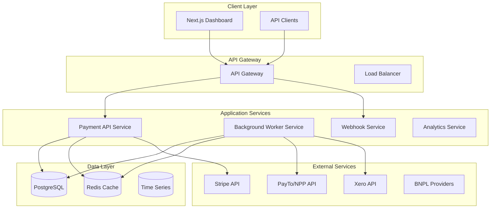

### **🔒 Security Architecture**
- **Authentication**: JWT-based authentication with MFA
- **Authorization**: Role-based access control (RBAC)
- **Data Protection**: AES-256 encryption, TLS 1.3
- **Compliance**: Australian data residency, PCI-DSS Level 1
- **Monitoring**: Security scanning, vulnerability management

---

## 🚀 Deployment

### **🏗️ Production Deployment**
Payment Watchdog is deployed using Kubernetes with automated CI/CD pipelines.

#### **📋 Deployment Environments**
- **Development**: `docker-compose.yml` (localhost)
- **Staging**: `docker-compose.staging.yml` (staging servers)
- **Production**: Kubernetes clusters (AWS/Azure)

#### **🔄 CI/CD Pipeline**
- **Build**: Automated build and test execution
- **Security**: Security scanning and vulnerability assessment
- **Deploy**: Automated deployment to staging and production
- **Monitor**: Health checks and rollback capabilities

#### **🔧 Deployment Commands**
```bash
# Build Docker images
make build-prod

# Deploy to staging
make deploy-staging

# Deploy to production
make deploy-production

# Check deployment status
make deploy-status
```

### **📊 Monitoring and Observability**
- **Health Checks**: `/health` and `/health/detailed` endpoints
- **Metrics**: Prometheus metrics collection
- **Logging**: Structured logging with ELK stack
- **Alerting**: Grafana dashboards and alerting

---

## 📊 API Documentation

### **🔌 API Reference**
Complete API documentation is available at:
- **Interactive**: [Swagger UI](http://localhost:8080/docs) (development)
- **Specification**: [API Specification](docs/ARCHITECTURE/API_SPECIFICATION.md)
- **OpenAPI**: [OpenAPI JSON](http://localhost:8080/api/v1/openapi.json)

### **📋 Key Endpoints**
- **Health**: `GET /health` - Basic health check
- **Authentication**: `POST /api/v1/auth/login` - User authentication
- **Payment Failures**: `GET /api/v1/payment-failures` - Payment failure data
- **Workflows**: `GET /api/v1/workflows` - Recovery workflows
- **Analytics**: `GET /api/v1/analytics/*` - Analytics and reporting

---

## 🤝 Contributing

### **📋 Development Workflow**
1. Fork the repository
2. Create a feature branch (`git checkout -b feature/amazing-feature`)
3. Make your changes
4. Run tests (`go test ./...`)
5. Commit changes (`git commit -m "Add amazing feature"`)
6. Push to branch (`git push origin feature/amazing-feature`)
7. Create Pull Request
8. Wait for review and merge

### **📝 Code Standards**
- **Go**: Follow Go best practices and `gofmt` formatting
- **TypeScript**: Use TypeScript with strict mode
- **Testing**: Maintain 90%+ test coverage
- **Documentation**: Update relevant documentation

### **🧪 Testing**
```bash
# Run all tests
go test ./... -v -race -cover

# Run specific service tests
go test ./services -v

# Run integration tests
go test ./integration -v

# Run benchmarks
go test -bench=.
```

---

## 📞 Support

### **🆘 Getting Help**
- **Documentation**: [docs/](https://github.com/sambitmohanty1/payment-watchdog/docs)
- **Issues**: [GitHub Issues](https://github.com/sambitmohanty1/payment-watchdog/issues)
- **Discussions**: [GitHub Discussions](https://github.com/sambitmohanty1/payment-watchdog/discussions)
- **Email**: support@payment-watchdog.com.au

### **📞 Community**
- **Slack**: [Join our Slack community](https://payment-watchdog.slack.com)
- **Twitter**: [@paymentwatchdog](https://twitter.com/paymentwatchdog)
- **LinkedIn**: [Payment Watchdog](https://linkedin.com/company/payment-watchdog)

### **📚 Resources**
- **Website**: [https://payment-watchdog.com.au](https://payment-watchdog.com.au)
- **Blog**: [Blog posts and tutorials](https://blog.payment-watchdog.com.au)
- **Status**: [System status page](https://status.payment-watchdog.com.au)
- **Changelog**: [Release notes and updates](https://github.com/sambitmohanty1/payment-watchdog/releases)

---

## 🚀 Quick Start

### Prerequisites
- Docker & Docker Compose
- Go 1.24+
- Node.js 18+

### Local Development
```bash
# Clone the repository
git clone https://github.com/sambitmohanty1/payment-watchdog.git
cd payment-watchdog

# Start all services
docker-compose up -d

# API will be available at http://localhost:8080
# Web interface at http://localhost:4896
# Database at localhost:5432
# Redis at localhost:6379
```

### 🚀 Staging Environment
```bash
# Start staging environment
docker-compose -f docker-compose.staging.yml up -d

# API will be available at http://localhost:8091
# Web interface at http://localhost:3011
# Database at localhost:5443
# Redis at localhost:6390
```

### 🏢 Local Deployment (Isolated)
```bash
# Start isolated local deployment
make local-start

# Access services
# Web Interface: http://localhost:3016
# API Endpoint: http://localhost:8096
# MailHog: http://localhost:8041
```

### Development Commands
```bash
# Code formatting
./format.sh

# Sovereignty audit
./scripts/AUDIT_SOVEREIGNTY.sh

# API Service
cd api && go run cmd/main.go

# Worker Service
cd worker && go run cmd/main.go

# Web Interface
cd web && npm run dev
```

### Testing
```bash
# Run all tests
go test ./...

# Run specific service tests
go test ./services -v

# Test with coverage
go test ./... -cover
```

---

## � Development Environment

### **🔧 Development Tools**
- **IDE**: VS Code, GoLand, WebStorm
- **Database**: PostgreSQL 15+, Redis 7+
- **Container**: Docker Desktop, Docker Compose
- **Version Control**: Git, GitHub
- **CI/CD**: GitHub Actions

### **📋 Environment Variables**
Refer to [📄 ENVIRONMENT_VARIABLES.md](docs/ENVIRONMENT_VARIABLES.md) for complete configuration reference.

### **🔍 Debugging**
```bash
# View logs
docker-compose logs -f payment-api

# Check service status
docker-compose ps

# Access database shell
docker-compose exec postgres psql -U postgres -d payment_watchdog

# Access Redis CLI
docker-compose exec redis redis-cli
```

---

## 🚀 Deployment

For isolated local testing and development, separate from CI/CD flows:

### Quick Start
```bash
# Start isolated local deployment
make local-start
# Or
./scripts/local-deploy.sh start

# Access services
# Web Interface: http://localhost:3016
# API Endpoint: http://localhost:8096
# MailHog: http://localhost:8041
```

### Management Commands
```bash
# Stop services
make local-stop

# Restart services  
make local-restart

# Check status
make local-status

# View logs
make local-logs

# Run health checks
make local-health

# Clean all data (WARNING: destroys database)
make local-clean
```

### Port Configuration
| Service | Development | Local |
|---------|-------------|-------|
| API | 8080 | 8096 |
| Web | 4896 | 3016 |
| PostgreSQL | 5432 | 5448 |
| Redis | 6379 | 6395 |

---

## AU/NZ Rail Orchestrator

### PW-101: PayTo Failover Mediator
**Technical Implementation**: `PayToExecutor` in `step_executors.go`
- **Trigger**: Payment failures with reason `insufficient_funds` or `card_declined`
- **Action**: Submits PayTo agreement request job via retry service
- **Flow**: 
  1. Validate failure reason
  2. Create recovery action record with type `payto_agreement_requested`
  3. Submit job to retry service with PayTo provider
  4. Track execution via workflow context

### PW-102: Cross-Method Xero Reconciliation  
**Technical Implementation**: `HandleCrossMethodReconciliation` in `recovery_orchestration_service.go`
- **Trigger**: Manual bank transfer detection in Xero
- **Action**: Finds matching payment failures and resolves them
- **Flow**:
  1. Query payment failures by invoice ID, amount, and company
  2. Update status to `resolved` with reason `cross_method_reconciliation`
  3. Cancel all active workflow executions for the payment failure
  4. Log reconciliation reference

### PW-103: Micro-Transaction Cost Logic
**Technical Implementation**: Cost-aware routing in `PaymentRetryExecutor`
- **Trigger**: Transactions < 10,000 cents ($100) on high-fee providers
- **Action**: Switch provider to `becs` before retry execution
- **Flow**:
  1. Check if `amount_cents < 10000` and provider is `stripe` or `international_card`
  2. Override `config.Provider = "becs"`
  3. Execute retry with local BECS rails
  4. Log cost optimization event

---

## �️ Sovereign Data Compliance

Payment Watchdog supports "Sovereign Mode" to ensure all application data and telemetry remain strictly within isolated Australian cloud regions (AWS, GCP, OCI, Azure) to comply with data residency laws.

### Enabling Sovereign Mode
To enable, set `SOVEREIGN_MODE=true` as an environment variable in both the `api` and `worker` services. The application will actively validate its database connection string upon startup and **abort** if a non-AU endpoint is detected.

### Sovereign Kubernetes Deployment
A Kustomize overlay is provided to enforce "Air-Gapped" network policies and use local cluster resources (like Prometheus and Redis) instead of global ones.

```bash
# Apply Sovereign Kubernetes configuration
kubectl apply -k api/deployments/kubernetes/overlays/sovereign-au
```

### Infrastructure Auditing
You can generate a Residency Report during deployments or manually run the manifest auditor to ensure no US-based or global external resources are hardcoded:

```bash
# Run the manifest auditor
./scripts/AUDIT_SOVEREIGNTY.sh
```

### GCP Sydney Setup
For sovereign Australian infrastructure deployment:

```bash
# Setup GCP Sydney region infrastructure
./deployment/gcp-sydney-setup.sh
```

---

## API Documentation

### Base URLs
- **Local**: `http://localhost:8080`

### Key Endpoints
- `GET /health` - Service health check
- `GET /api/v1/status` - API status
- `GET /metrics` - Basic metrics

---

## Docker Services

```yaml
services:
  api:           # Go REST API (Port 8080)
  worker:        # Background processing
  web:           # Next.js dashboard (Port 4896)
  postgres:      # Database (Port 5432)
  redis:         # Cache & Queue (Port 6379)
  mailhog:       # Email testing (Port 8025)
```

---

## Deployment

### Local Development
```bash
docker-compose up -d
```

### Production Deployment
```bash
# Build production images
docker build -f api/Dockerfile.production -t payment-watchdog/api ./api
docker build -f worker/Dockerfile.production -t payment-watchdog/worker ./worker
docker build -f web/Dockerfile.production -t payment-watchdog/web ./web

# Deploy to staging
docker-compose -f docker-compose.staging.yml up -d

# Deploy to production (Kubernetes)
kubectl apply -f api/deployments/kubernetes/

# Deploy to sovereign AU environment
kubectl apply -k api/deployments/kubernetes/overlays/sovereign-au
```

---

## Architecture Overview

Payment Watchdog follows a microservices architecture with the following components:

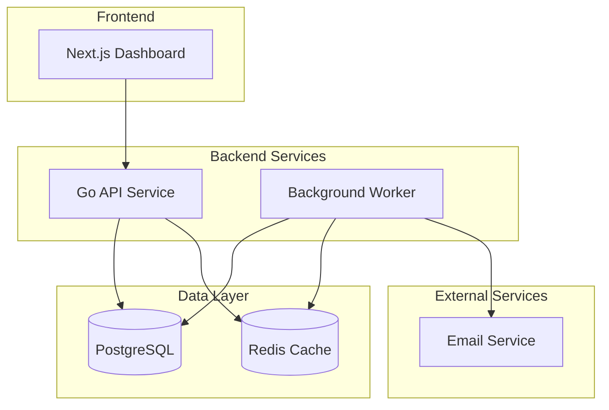

### Service Responsibilities

#### API Service (Port 8080)
- RESTful API endpoints
- Webhook ingestion (Stripe, Xero)
- Payment failure processing
- Advanced workflow orchestration
- VIP customer detection
- PayTo failover execution
- Cross-method reconciliation handling
- Health checks and metrics

#### Worker Service
- Background job processing
- Smart retry logic with cost optimization
- BECS rail routing for micro-transactions
- Cross-method reconciliation
- AI-powered pattern detection
- Advanced analytics processing
- Distributed locking coordination

#### Web Interface (Port 4896)
- Payment metrics dashboard
- Recovery workflow monitoring
- Configuration management

### Database Schema
- `payment_failures`: Failed payment attempts
- `recovery_attempts`: Retry execution logs
- `analytics`: Failure patterns and trend metrics
- `users`: System user accounts
- `vip_customers`: Priority customer configurations
- `reconciliation_records`: Cross-method payment matching

---

## 📊 Class Diagrams

### Payment Recovery Orchestration Flow

```mermaid
classDiagram
    class RecoveryOrchestrationService {
        -db: *gorm.DB
        -retryService: *RetryService
        -communicationService: *CommunicationService
        -analyticsService: *AnalyticsService
        -stepExecutors: map[string]StepExecutor
        -tracer: trace.Tracer
        -logger: *zap.Logger
        -redisClient: *redis.Client
        -activeExecutions: map[uuid.UUID]*WorkflowExecution
        +ExecuteWorkflow(ctx, workflowID, paymentFailureID) error
        +CancelWorkflow(executionID) error
        +GetExecutionStatus(executionID) (*WorkflowExecution, error)
        +ProcessWorkflowStep(execution *WorkflowExecution) error
    }

    class WorkflowExecution {
        +ID: uuid.UUID
        +WorkflowID: uuid.UUID
        +PaymentFailureID: uuid.UUID
        +CompanyID: uuid.UUID
        +Status: string
        +CurrentStepIndex: int
        +Context: map[string]interface{}
        +StartedAt: time.Time
        +CancelFunc: context.CancelFunc
    }

    class StepExecutor {
        <<interface>>
        +Execute(ctx, step) error
        +Validate(step) error
        +GetEstimatedTime() time.Duration
    }

    class PayToExecutor {
        -service: *RecoveryOrchestrationService
        -tracer: trace.Tracer
        +GetStepType() string
        +Execute(ctx, execution, step) (*StepResult, error)
    }

    class PaymentRetryExecutor {
        -service: *RecoveryOrchestrationService
        -tracer: trace.Tracer
        +GetStepType() string
        +Execute(ctx, execution, step) (*StepResult, error)
    }

    class PaymentFailureService {
        -db: *gorm.DB
        -logger: *zap.Logger
        +GetPaymentFailures(ctx, companyID, filters, page, limit) ([]PaymentFailureEvent, int64, error)
        +CreatePaymentFailure(ctx, failure) error
        +UpdatePaymentFailure(ctx, id, updates) error
        +GetFailureByID(ctx, id) (*PaymentFailureEvent, error)
    }

    RecoveryOrchestrationService --> WorkflowExecution : manages
    RecoveryOrchestrationService --> StepExecutor : uses
    RecoveryOrchestrationService --> PaymentFailureService : queries
    RecoveryOrchestrationService --> PayToExecutor : registers
    RecoveryOrchestrationService --> PaymentRetryExecutor : registers
    PayToExecutor --|> StepExecutor : implements
    PaymentRetryExecutor --|> StepExecutor : implements
```

### Webhook Processing Flow

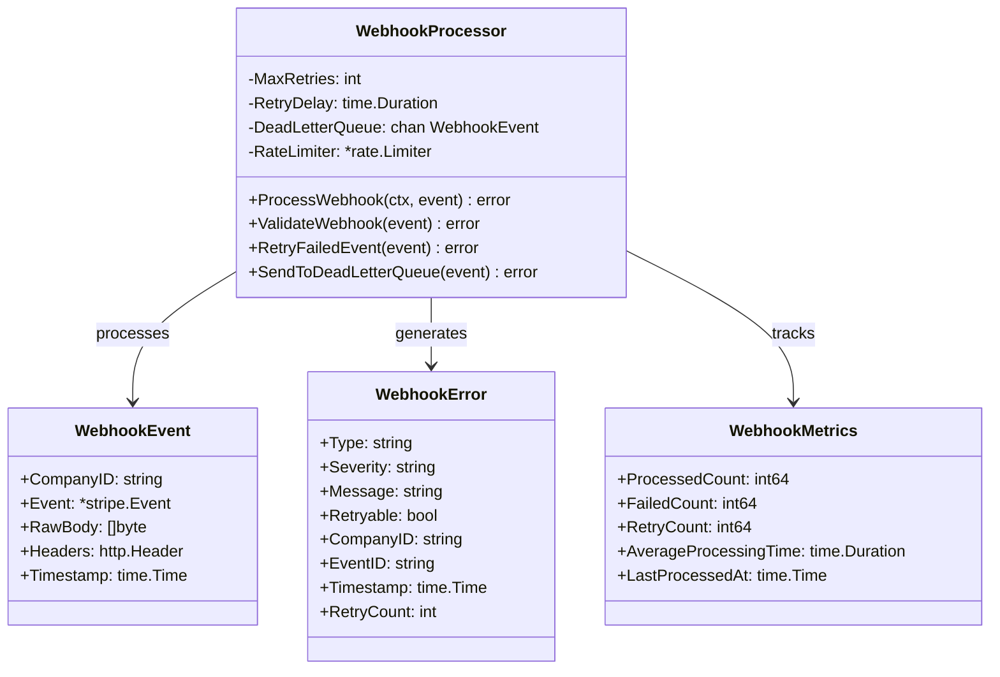

### Analytics Engine Flow

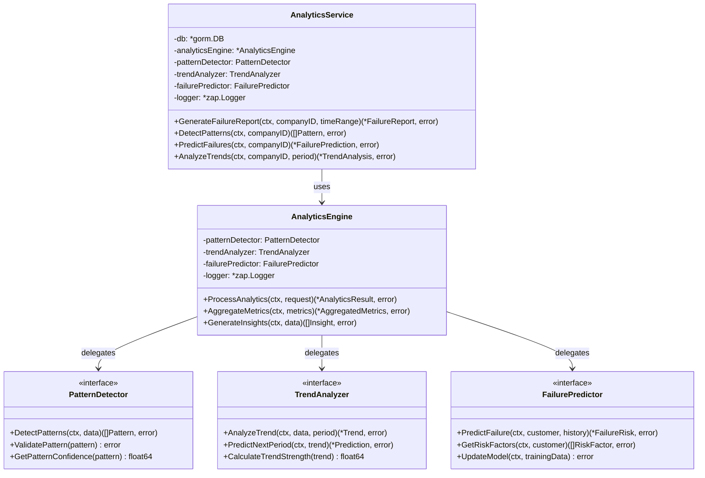

### Distributed Locking Flow

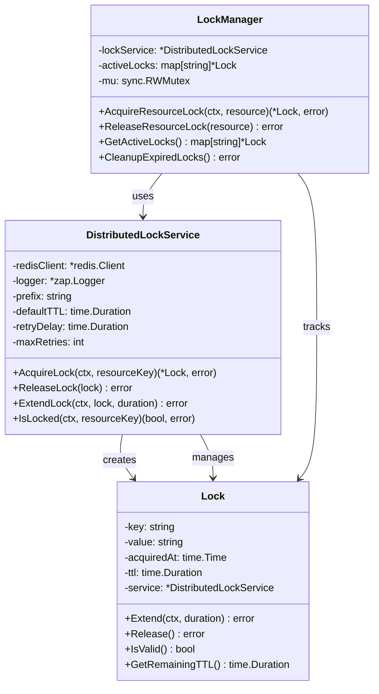

### Xero Mediator Flow

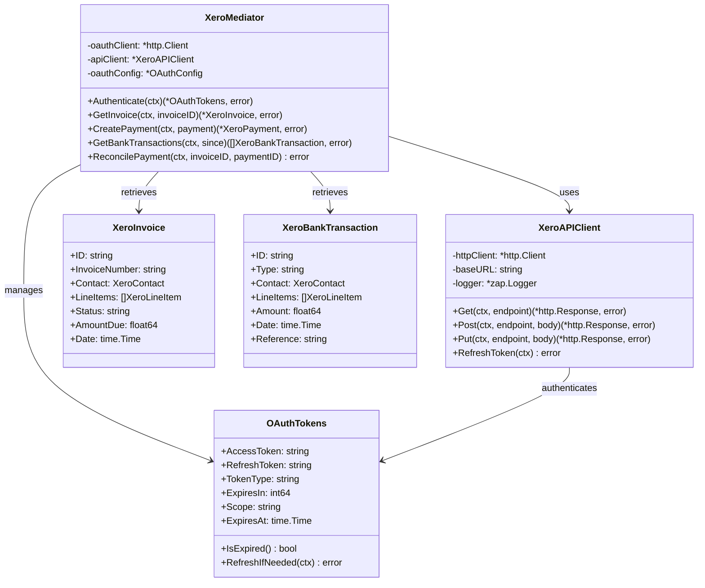

### Service Integration Flow

```mermaid
classDiagram
    class APIGateway {
        -recoveryService: *RecoveryOrchestrationService
        -failureService: *PaymentFailureService
        -analyticsService: *AnalyticsService
        -webhookProcessor: *WebhookProcessor
        +HandleWebhook(ctx, request) error
        +GetRecoveryStatus(ctx, id) (*RecoveryStatus, error)
        +GetAnalytics(ctx, companyID) (*AnalyticsData, error)
    }

    class WorkerService {
        -orchestrationService: *RecoveryOrchestrationService
        -lockService: *DistributedLockService
        -analyticsService: *AnalyticsService
        -mediator: PaymentProvider
        +ProcessRecoveryWorkflow(ctx, workflow) error
        +ExecuteRetryLogic(ctx, payment) error
        +UpdateAnalytics(ctx, event) error
    }

    class DatabaseLayer {
        -postgres: *gorm.DB
        -redis: *redis.Client
        +SavePaymentFailure(ctx, failure) error
        +GetRecoveryAttempts(ctx, paymentID) ([]RecoveryAttempt, error)
        +CacheAnalytics(ctx, data) error
        +GetCachedData(ctx, key) (interface{}, error)
    }

    APIGateway --> RecoveryOrchestrationService : delegates
    APIGateway --> PaymentFailureService : queries
    APIGateway --> AnalyticsService : requests
    APIGateway --> WebhookProcessor : processes
    WorkerService --> RecoveryOrchestrationService : executes
    WorkerService --> DistributedLockService : coordinates
    WorkerService --> AnalyticsService : updates
    RecoveryOrchestrationService --> DatabaseLayer : persists
    AnalyticsService --> DatabaseLayer : queries
    DistributedLockService --> DatabaseLayer : locks
```

---

## 🔄 Sequence Diagrams

### Payment Failure Recovery Workflow

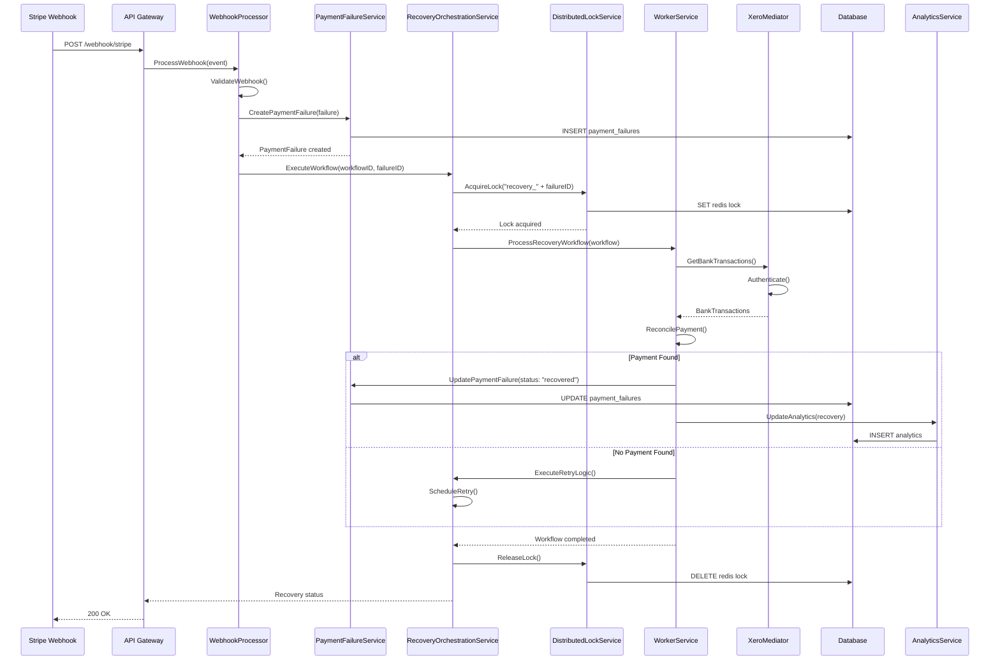

### Analytics Processing Flow

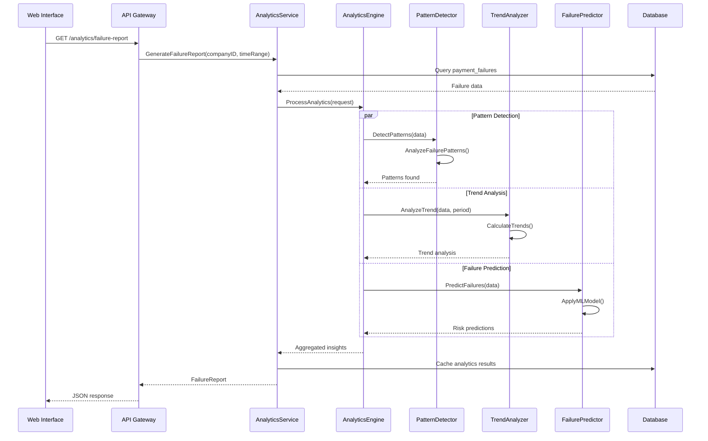

### Distributed Locking Coordination

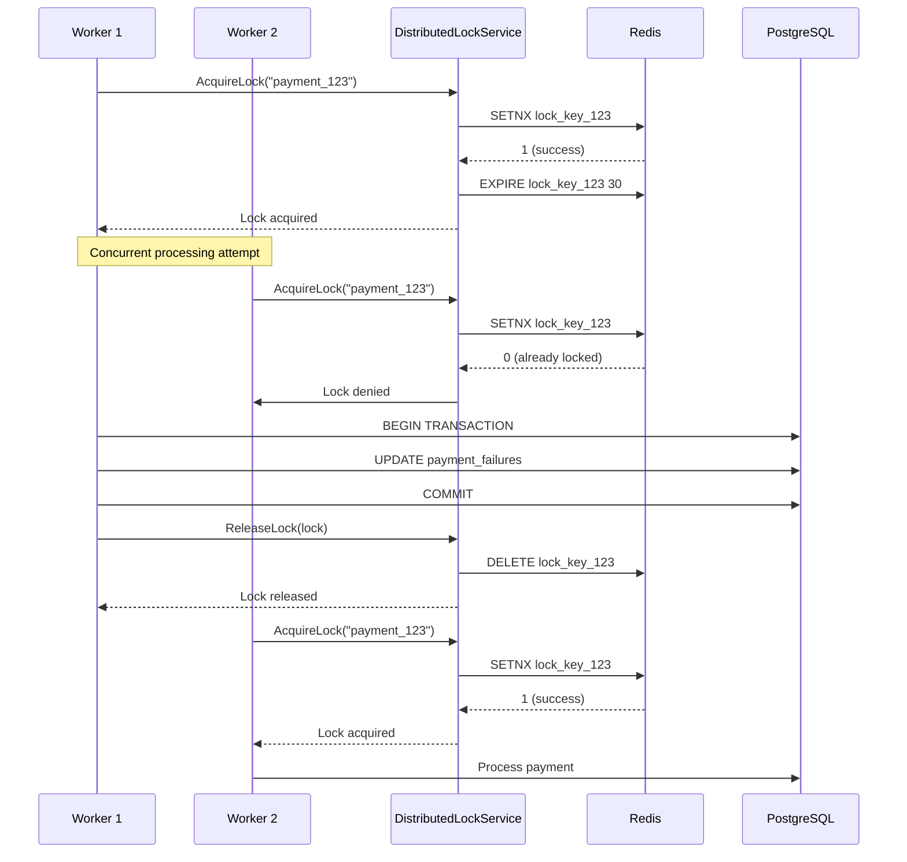

### Xero Integration Flow

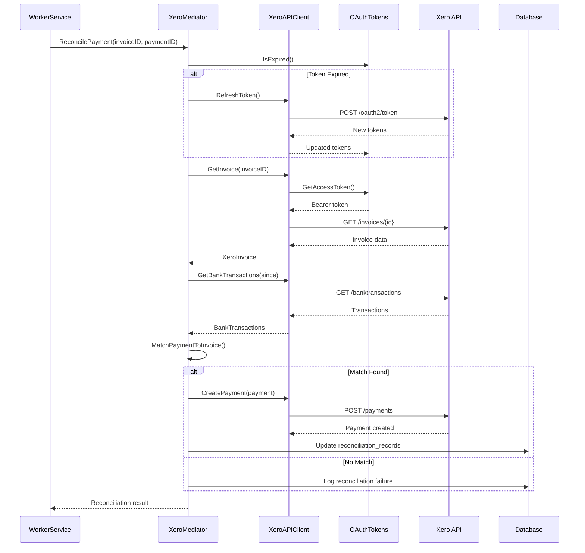

### Webhook Processing with Retry Logic

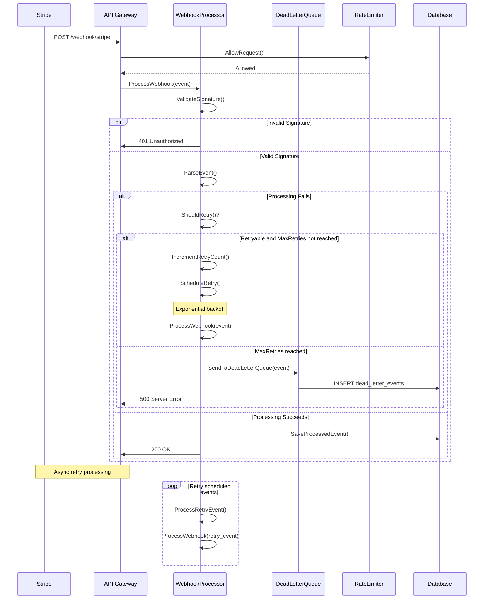

### PayTo Failover Sequence (PW-101)

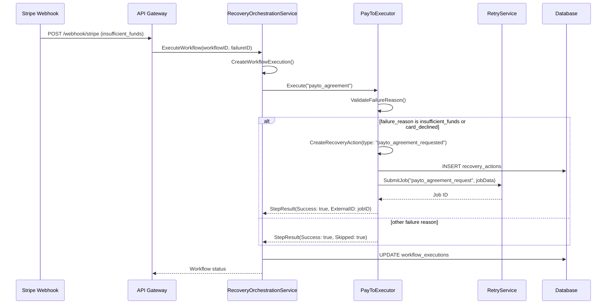

### Micro-Transaction Cost Optimization (PW-103)

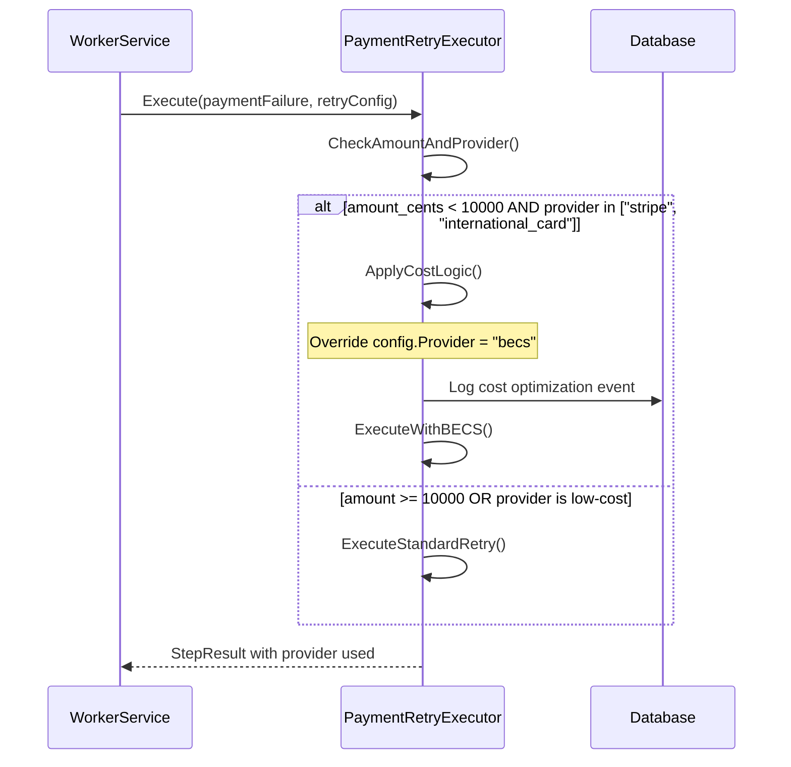

### Multi-Service Recovery Orchestration

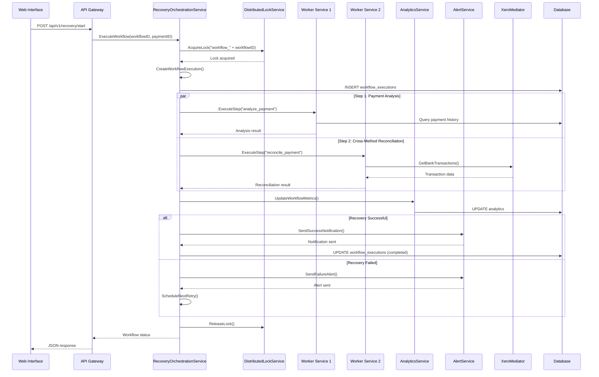

---

## Contributing

1. Fork the repository
2. Create a feature branch
3. Make your changes
4. Add tests
5. Submit a pull request

### Development Guidelines
- Follow Go best practices
- Use conventional commits
- Write comprehensive tests
- Update documentation

---

## License

This project is licensed under the MIT License - see the [LICENSE](LICENSE) file for details.

---

## Support

For support, please open an issue on GitHub.
# Trigger worker build
