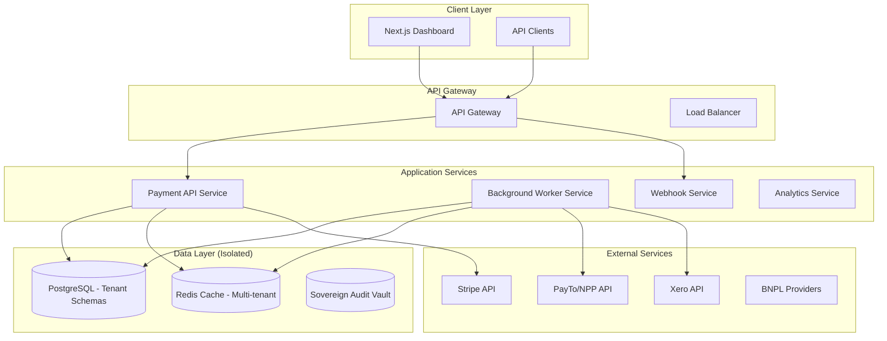
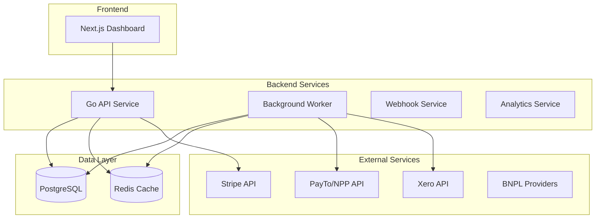
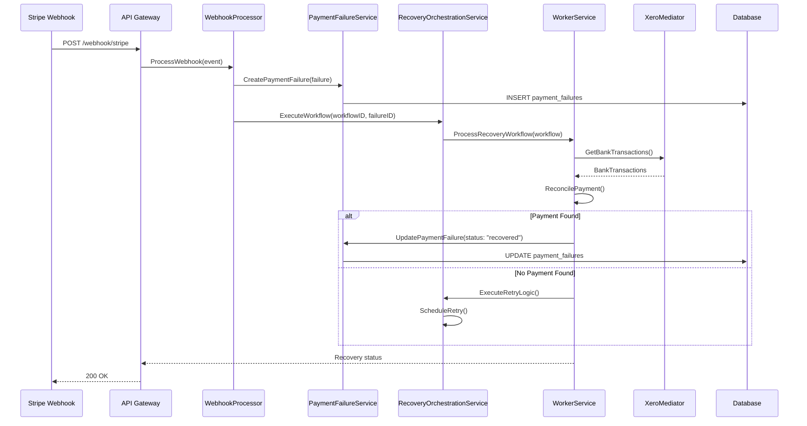
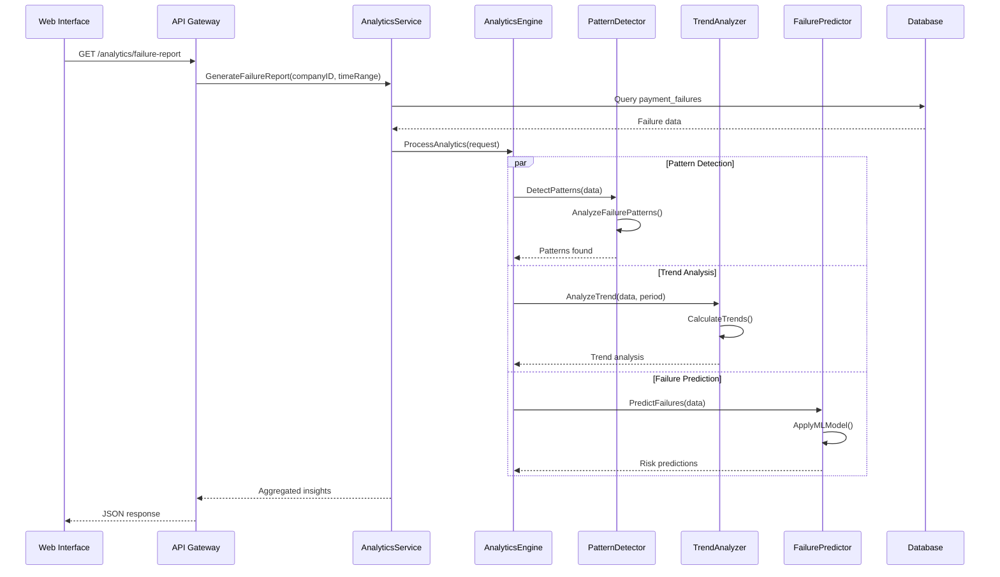

# Payment Watchdog

A payment recovery platform for Australian businesses that automatically detects and recovers failed payments through intelligent retry logic and multi-provider integration.

## Status

**Current State**: Development in progress  
**Last Updated**: April 2026  
**Go Version**: 1.25.0  
**Next.js**: 14.2.3  

<<<<<<< Updated upstream
**Phase 1 (Stabilization): COMPLETE** ✅
- Resolved `CrashLoopBackOff` across API/Worker services.
- Finalized explicit K8s environment variable injection.
- Optimized persistent storage for OCI Sydney/Melbourne.

**Phase 2 (Core Logic Activation): COMPLETE** ✅
- **Intelligence Driven**: Rule-based failure classification active in Webhook pipeline.
- **Dynamic Dispatch**: Implemented `ProviderRegistry` for zero-downtime failover to intent-recording.
- **Service Mastery**: Resolved all `nil` dependencies; full business logic is now wired and persistent.
- **Visibility**: Communication tracking and manual retry orchestration fully operational.

**Phase 3 (SaaS Scale & Multi-Tenancy): IN PROGRESS** 🏗️
- **Schema Isolation**: Implementing "Schema-per-tenant" model for Australian SMBs.
- **Multi-Tenant Identity**: Firebase Custom Claims based tenant identification.
- **Internal Billing**: Built-in "dogfooded" subscription recovery engine.
- **White-Labelling**: Custom domain support for regulated firms.

---

## � Quick Start

### **Prerequisites**
- Go 1.21+
- Node.js 18+
- Docker & Docker Compose
- PostgreSQL 15+
- Redis 7+

### **Development Setup**
=======
## Quick Start
>>>>>>> Stashed changes

```bash
# Clone and setup
git clone https://github.com/sambitmohanty1/payment-watchdog.git
cd payment-watchdog

# Start development environment
docker-compose up -d

### **Infrastructure Access (Sovereign AU)**
- **API (ClusterIP)**: `10.96.158.63` (Internal)
- **API (LoadBalancer)**: `207.211.158.1` (Public)
- **Web Interface**: `168.138.21.140` (Public)
- **Database**: `postgres.sovereign-au.svc.cluster.local` (Port 5432)
- **Redis**: `redis.sovereign-au.svc.cluster.local` (Port 6379)
```

## What It Does

Payment Watchdog monitors payment failures and automatically attempts recovery through:

- **Smart Retry Logic**: Exponential backoff with provider-specific routing
- **Multi-Provider Support**: Stripe, PayTo, BECS, Xero integration  
- **Analytics Engine**: Pattern detection and failure prediction
- **Australian Data Residency**: Sovereign mode for AU compliance
- **Real-time Dashboard**: Payment metrics and recovery monitoring

<<<<<<< Updated upstream
```bash
# Build API
cd api && go build -o payment-watchdog-api ./cmd/main.go

# Build Worker  
cd worker && go build -o payment-watchdog-worker ./cmd/main.go

# Build Web
cd web && npm run build
```

### **🧪 Testing**

```bash
# Run all tests
go test ./... -v -race -cover

# Run service-specific tests
cd api && go test ./... -v
cd worker && go test ./... -v
```

### **🚀 Deployment**

#### **Development**
```bash
docker-compose up -d
```

#### **Staging**
```bash
docker-compose -f docker-compose.staging.yml up -d
```

#### **Production**
```bash
# Manual deployment via GitHub Actions
# See .github/workflows/ci-cd-pipeline.yml
```

### **�️ Sovereign Compliance**

- Australian data residency enforced
- Network isolation policies
- PCI-DSS compliance
- Secure secret management

---

## 📚 Documentation Structure

### **📋 Strategic Documents**
- **[📊 FUTURE_STATE.md](FUTURE_STATE.md)** - Strategic roadmap and market analysis
- **[🎯 FEATURE_BACKLOG.md](FEATURE_BACKLOG.md)** - Product features and user stories
- **[🏢 PLATFORM_BACKLOG.md](PLATFORM_BACKLOG.md)** - Technical debt and platform improvements

### **🏗️ Architecture Documentation**
- **System Design**: [SYSTEM_DESIGN.md](docs/ARCHITECTURE/SYSTEM_DESIGN.md)
- **Low-Level Design**: [LOW_LEVEL_DESIGN.md](docs/ARCHITECTURE/LOW_LEVEL_DESIGN.md)
- **API Documentation**: [API.md](docs/ARCHITECTURE/API_SPECIFICATION.md)
- **Worker Documentation**: [WORKER.md](docs/WORKER.md)
- **[📐 SYSTEM_DESIGN.md](docs/ARCHITECTURE/SYSTEM_DESIGN.md)** - High-level system architecture
- **[🔌 API_SPECIFICATION.md](docs/ARCHITECTURE/API_SPECIFICATION.md)** - Complete API documentation
- **[📋 BUSINESS_REQUIREMENTS.md](docs/STRATEGIC/BUSINESS_REQUIREMENTS.md)** - Business requirements and user stories

### **🔧 Operations Documentation**
- **[🔒 SECURITY.md](SECURITY.md)** - Security policies and compliance
- **[📝 LOGGING_GUIDELINES.md](docs/OPERATIONS/LOGGING_GUIDELINES.md)** - Logging standards and best practices
- **[📄 ENVIRONMENT_VARIABLES.md](docs/ENVIRONMENT_VARIABLES.md)** - Configuration reference

### **📚 Reference Documentation**
- **[💱 CURRENCY_GUIDELINES.md](api/CURRENCY_GUIDELINES.md)** - Currency field usage guidelines

### **🗃️ Archived Documentation**
- **[📁 ARCHIVED/TECH_DEBT_BACKLOG_OLD.md](docs/ARCHIVED/TECH_DEBT_BACKLOG_OLD.md)** - Previous technical debt backlog
- **[📁 ARCHIVED/LOGGING_IMPROVEMENTS_OLD.md](docs/ARCHIVED/LOGGING_IMPROVEMENTS_OLD.md)** - Previous logging improvements

### 🏗️ Architecture Overview

### **📐 Technology Stack**
- **Backend**: Go 1.24, Gin, GORM, PostgreSQL (Schema-per-tenant)
- **Frontend**: Next.js 14, TypeScript, Tailwind CSS
- **Infrastructure**: OCI (Oracle Cloud Infrastructure - Australian Sovereign Nodes)
- **Auth**: Firebase Custom Claims (Multi-tenant)
- **Payment Rails**: PayTo, NPP, BECS, Stripe
- **Monitoring**: Prometheus, Grafana

### **🚀 Microservices Architecture**


### **🔒 Security Architecture**
- **Authentication**: Firebase Identity with Custom Tenant Claims
- **Authorization**: Tenant-Scoped Isolation (search_path)
- **Data Protection**: AES-256 encryption, TLS 1.3
- **Compliance**: Australian Data Residency (OCI ap-melbourne-1), APRA CPS 234, OAIC Privacy Actin
- **Monitoring**: Security scanning, vulnerability management

---

## 🚀 Deployment

### **🏗️ Production Deployment**
Payment Watchdog is deployed using Kubernetes with automated CI/CD pipelines.

#### **📋 Deployment Environments**
- **Development**: `docker-compose.yml` (localhost)
- **Staging**: `docker-compose.staging.yml` (staging servers)
- **Production**: Sovereign OCI Cluster (ap-melbourne-1)

#### **🔄 CI/CD Pipeline**
- **Build**: Automated build and test execution
- **Security**: Security scanning and vulnerability assessment
- **Deploy**: Automated deployment to staging and production
- **Monitor**: Health checks and rollback capabilities

#### **🔧 Deployment Commands**
```bash
# Build Docker images
make build-prod

# Deploy to staging
make deploy-staging

# Deploy to production
make deploy-production

# Check deployment status
make deploy-status
```

### **📊 Monitoring and Observability**
- **Health Checks**: `/health` and `/health/detailed` endpoints
- **Metrics**: Prometheus metrics collection
- **Logging**: Structured logging with ELK stack
- **Alerting**: Grafana dashboards and alerting

---

## 📊 API Documentation

### **🔌 API Reference**
Complete API documentation is available at:
- **Interactive**: [Swagger UI](http://localhost:8080/docs) (development)
- **Specification**: [API Specification](docs/ARCHITECTURE/API_SPECIFICATION.md)
- **OpenAPI**: [OpenAPI JSON](http://localhost:8080/api/v1/openapi.json)

### **📋 Key Endpoints**
- **Health**: `GET /health` - Basic health check
- **Authentication**: `POST /api/v1/auth/login` - User authentication
- **Payment Failures**: `GET /api/v1/payment-failures` - Payment failure data
- **Workflows**: `GET /api/v1/workflows` - Recovery workflows
- **Analytics**: `GET /api/v1/analytics/*` - Analytics and reporting

---

## 🤝 Contributing

### **📋 Development Workflow**
1. Fork the repository
2. Create a feature branch (`git checkout -b feature/amazing-feature`)
3. Make your changes
4. Run tests (`go test ./...`)
5. Commit changes (`git commit -m "Add amazing feature"`)
6. Push to branch (`git push origin feature/amazing-feature`)
7. Create Pull Request
8. Wait for review and merge

### **📝 Code Standards**
- **Go**: Follow Go best practices and `gofmt` formatting
- **TypeScript**: Use TypeScript with strict mode
- **Testing**: Maintain 90%+ test coverage
- **Documentation**: Update relevant documentation

### **🧪 Testing**
```bash
# Run all tests
go test ./... -v -race -cover

# Run specific service tests
go test ./services -v

# Run integration tests
go test ./integration -v

# Run benchmarks
go test -bench=.
```

---

## 📞 Support

### **🆘 Getting Help**
- **Documentation**: [docs/](https://github.com/sambitmohanty1/payment-watchdog/docs)
- **Issues**: [GitHub Issues](https://github.com/sambitmohanty1/payment-watchdog/issues)
- **Discussions**: [GitHub Discussions](https://github.com/sambitmohanty1/payment-watchdog/discussions)
- **Email**: support@payment-watchdog.com.au

### **📞 Community**
- **Slack**: [Join our Slack community](https://payment-watchdog.slack.com)
- **Twitter**: [@paymentwatchdog](https://twitter.com/paymentwatchdog)
- **LinkedIn**: [Payment Watchdog](https://linkedin.com/company/payment-watchdog)

### **📚 Resources**
- **Website**: [https://payment-watchdog.com.au](https://payment-watchdog.com.au)
- **Blog**: [Blog posts and tutorials](https://blog.payment-watchdog.com.au)
- **Status**: [System status page](https://status.payment-watchdog.com.au)
- **Changelog**: [Release notes and updates](https://github.com/sambitmohanty1/payment-watchdog/releases)

---

## 🚀 Quick Start

### Prerequisites
- Docker & Docker Compose
- Go 1.24+
- Node.js 18+

### Local Development
```bash
# Clone the repository
git clone https://github.com/sambitmohanty1/payment-watchdog.git
cd payment-watchdog

# Start all services
docker-compose up -d

# API will be available at http://localhost:8080
# Web interface at http://localhost:4896
# Database at localhost:5432
# Redis at localhost:6379
```

### 🚀 Staging Environment
```bash
# Start staging environment
docker-compose -f docker-compose.staging.yml up -d

# API will be available at http://localhost:8091
# Web interface at http://localhost:3011
# Database at localhost:5443
# Redis at localhost:6390
```

### 🏢 Local Deployment (Isolated)
```bash
# Start isolated local deployment
make local-start

# Access services
# Web Interface: http://localhost:3016
# API Endpoint: http://localhost:8096
# MailHog: http://localhost:8041
```

### Development Commands
```bash
# Code formatting
./format.sh

# Sovereignty audit
./scripts/AUDIT_SOVEREIGNTY.sh

# API Service
cd api && go run cmd/main.go

# Worker Service
cd worker && go run cmd/main.go

# Web Interface
cd web && npm run dev
```

### Testing
```bash
# Run all tests
go test ./...

# Run specific service tests
go test ./services -v

# Test with coverage
go test ./... -cover
```

---

## 🛠️ Development Environment

### **🔧 Development Tools**
- **IDE**: VS Code, GoLand, WebStorm
- **Database**: PostgreSQL 15+, Redis 7+
- **Container**: Docker Desktop, Docker Compose
- **Version Control**: Git, GitHub
- **CI/CD**: GitHub Actions

### **📋 Environment Variables**
Refer to [📄 ENVIRONMENT_VARIABLES.md](docs/ENVIRONMENT_VARIABLES.md) for complete configuration reference.

### **🔍 Debugging**
```bash
# View logs
docker-compose logs -f payment-api

# Check service status
docker-compose ps

# Access database shell
docker-compose exec postgres psql -U postgres -d payment_watchdog

# Access Redis CLI
docker-compose exec redis redis-cli
```

---

## 🚀 Deployment

For isolated local testing and development, separate from CI/CD flows:

### Quick Start
```bash
# Start isolated local deployment
make local-start
# Or
./scripts/local-deploy.sh start

# Access services
# Web Interface: http://localhost:3016
# API Endpoint: http://localhost:8096
# MailHog: http://localhost:8041
```

### Management Commands
```bash
# Stop services
make local-stop

# Restart services  
make local-restart

# Check status
make local-status

# View logs
make local-logs

# Run health checks
make local-health

# Clean all data (WARNING: destroys database)
make local-clean
```

### Port Configuration
| Service | Development | Local |
|---------|-------------|-------|
| API | 8080 | 8096 |
| Web | 4896 | 3016 |
| PostgreSQL | 5432 | 5448 |
| Redis | 6379 | 6395 |

---

## AU/NZ Rail Orchestrator

### PW-101: PayTo Failover Mediator
**Technical Implementation**: `PayToExecutor` in `step_executors.go`
- **Trigger**: Payment failures with reason `insufficient_funds` or `card_declined`
- **Action**: Submits PayTo agreement request job via retry service
- **Flow**: 
  1. Validate failure reason
  2. Create recovery action record with type `payto_agreement_requested`
  3. Submit job to retry service with PayTo provider
  4. Track execution via workflow context

### PW-102: Cross-Method Xero Reconciliation  
**Technical Implementation**: `HandleCrossMethodReconciliation` in `recovery_orchestration_service.go`
- **Trigger**: Manual bank transfer detection in Xero
- **Action**: Finds matching payment failures and resolves them
- **Flow**:
  1. Query payment failures by invoice ID, amount, and company
  2. Update status to `resolved` with reason `cross_method_reconciliation`
  3. Cancel all active workflow executions for the payment failure
  4. Log reconciliation reference

### PW-103: Micro-Transaction Cost Logic
**Technical Implementation**: Cost-aware routing in `PaymentRetryExecutor`
- **Trigger**: Transactions < 10,000 cents ($100) on high-fee providers
- **Action**: Switch provider to `becs` before retry execution
- **Flow**:
  1. Check if `amount_cents < 10000` and provider is `stripe` or `international_card`
  2. Override `config.Provider = "becs"`
  3. Execute retry with local BECS rails
  4. Log cost optimization event

---

## �️ Sovereign Data Compliance

Payment Watchdog supports "Sovereign Mode" to ensure all application data and telemetry remain strictly within isolated Australian cloud regions (AWS, GCP, OCI, Azure) to comply with data residency laws.

### Enabling Sovereign Mode
To enable, set `SOVEREIGN_MODE=true` as an environment variable in both the `api` and `worker` services. The application will actively validate its database connection string upon startup and **abort** if a non-AU endpoint is detected.

### Sovereign Kubernetes Deployment
A Kustomize overlay is provided to enforce "Air-Gapped" network policies and use local cluster resources (like Prometheus and Redis) instead of global ones.

```bash
# Apply Sovereign Kubernetes configuration
kubectl apply -k api/deployments/kubernetes/overlays/sovereign-au
```

### Infrastructure Auditing
You can generate a Residency Report during deployments or manually run the manifest auditor to ensure no US-based or global external resources are hardcoded:

```bash
# Run the manifest auditor
./scripts/AUDIT_SOVEREIGNTY.sh
```

### GCP Sydney Setup
For sovereign Australian infrastructure deployment:

```bash
# Setup GCP Sydney region infrastructure
./deployment/gcp-sydney-setup.sh
```

---

## API Documentation

### Base URLs
- **Local**: `http://localhost:8080`

### Key Endpoints
- `GET /health` - Service health check
- `GET /api/v1/status` - API status
- `GET /metrics` - Basic metrics

---

## Docker Services

```yaml
services:
  api:           # Go REST API (Port 8080)
  worker:        # Background processing
  web:           # Next.js dashboard (Port 4896)
  postgres:      # Database (Port 5432)
  redis:         # Cache & Queue (Port 6379)
  mailhog:       # Email testing (Port 8025)
```

---

## Deployment

### Local Development
```bash
docker-compose up -d
```

### Production Deployment
```bash
# Build production images
docker build -f api/Dockerfile.production -t payment-watchdog/api ./api
docker build -f worker/Dockerfile.production -t payment-watchdog/worker ./worker
docker build -f web/Dockerfile.production -t payment-watchdog/web ./web

# Deploy to staging
docker-compose -f docker-compose.staging.yml up -d

# Deploy to production (Kubernetes)
kubectl apply -f api/deployments/kubernetes/

# Deploy to sovereign AU environment
kubectl apply -k api/deployments/kubernetes/overlays/sovereign-au
```

---

## Architecture Overview

Payment Watchdog follows a microservices architecture with the following components:
=======
## Architecture
>>>>>>> Stashed changes



### Service Responsibilities

#### API Service (Port 8080)
- RESTful API endpoints
- Webhook ingestion (Stripe, Xero)
- Payment failure processing
- Advanced workflow orchestration
- Health checks and metrics

#### Worker Service
- Background job processing
- Smart retry logic with cost optimization
- BECS rail routing for micro-transactions
- Cross-method reconciliation
- Analytics processing

#### Web Interface (Port 4896)
- Payment metrics dashboard
- Recovery workflow monitoring
- Configuration management

### Database Schema
- `payment_failures`: Failed payment attempts
- `recovery_attempts`: Retry execution logs
- `analytics`: Failure patterns and trend metrics
- `users`: System user accounts
- `vip_customers`: Priority customer configurations
- `reconciliation_records`: Cross-method payment matching

## Development

### Prerequisites
- Go 1.25.0+
- Node.js 18+
- Docker & Docker Compose
- PostgreSQL 15+
- Redis 7+

### Building Services
```bash
# API
cd api && go build -o payment-watchdog-api ./cmd/main.go

# Worker  
cd worker && go build -o payment-watchdog-worker ./cmd/main.go

# Web
cd web && npm run build
```

### Testing
```bash
# Run all tests with coverage
go test ./... -v -race -cover

# Run specific service tests
cd api && go test ./... -v
cd worker && go test ./... -v
```

## Deployment

### Environments
| Environment | Config File | API Port | Web Port | Database |
|------------|--------------|-----------|-----------|----------|
| Development | docker-compose.yml | 8080 | 4896 | payment_watchdog |
| Staging | docker-compose.staging.yml | 8091 | 3011 | payment_watchdog_staging |

### Local Deployment
```bash
# Standard development
docker-compose up -d

# Staging environment  
docker-compose -f docker-compose.staging.yml up -d

# Production (requires Kubernetes setup)
kubectl apply -f infrastructure/kubernetes/
```

## Key Features

### Payment Recovery
- **Automatic Detection**: Webhook integration for real-time failure capture
- **Intelligent Routing**: Cost-aware provider selection (BECS vs international)
- **Cross-Method Reconciliation**: Xero integration for manual payment matching
- **Retry Orchestration**: Multi-step workflow with distributed locking

### Analytics & Intelligence  
- **Pattern Detection**: ML-based failure pattern identification
- **Trend Analysis**: Historical failure rate analysis
- **Risk Prediction**: Customer-level failure probability scoring
- **Cost Optimization**: Micro-transaction routing to low-cost providers

### Compliance & Security
- **Australian Data Residency**: Sovereign mode with AU-only infrastructure
- **PCI-DSS Compliance**: Secure payment data handling
- **JWT Authentication**: Role-based access control
- **Audit Logging**: Complete transaction traceability

## API Documentation

### Core Endpoints
- `GET /health` - Service health check
- `POST /api/v1/auth/login` - Authentication
- `GET /api/v1/payment-failures` - Payment failure data
- `POST /api/v1/recovery/start` - Manual recovery trigger
- `GET /api/v1/analytics/*` - Analytics and reporting

### Documentation
- **Interactive Docs**: Available at `http://localhost:8080/docs` (development)
- **OpenAPI Spec**: `/api/v1/openapi.json`

## Workflow Diagrams

### Payment Recovery Flow



### Analytics Processing Flow



## Configuration

### Environment Variables
Key configuration required for operation:

```bash
# Database
DATABASE_HOST=localhost
DATABASE_PORT=5432
DATABASE_NAME=payment_watchdog
DATABASE_USER=postgres
DATABASE_PASSWORD=password

# Redis
REDIS_URL=redis://localhost:6379

# API
SERVER_PORT=8080
ENVIRONMENT=development

# Sovereign Mode (optional)
SOVEREIGN_MODE=true  # Enforces AU data residency
```

## Monitoring

### Health Checks
- **Basic**: `/health` - Service status
- **Detailed**: `/health/detailed` - Component-level status
- **Metrics**: `/metrics` - Prometheus metrics

### Logging
- **Structured JSON**: Consistent log format across services
- **Correlation IDs**: Request tracing across microservices
- **Error Tracking**: Comprehensive error categorization

## Contributing

1. Fork the repository
2. Create a feature branch (`git checkout -b feature-name`)
3. Make changes with tests
4. Follow Go best practices (`gofmt`, `go vet`)
5. Submit pull request with description

### Code Standards
- **Go**: Standard formatting, comprehensive tests
- **TypeScript**: Strict mode, type safety
- **Testing**: Maintain 80%+ coverage
- **Documentation**: Update relevant sections

## Troubleshooting

### Common Issues
- **Port Conflicts**: Check if ports 8080/4896/5432/6379 are available
- **Database Connection**: Verify PostgreSQL is running and accessible
- **Build Failures**: Ensure Go 1.25.0+ and Node.js 18+
- **Permission Errors**: Check Docker daemon permissions

### Getting Help
- **Issues**: [GitHub Issues](https://github.com/sambitmohanty1/payment-watchdog/issues)
- **Documentation**: See `/docs` directory for detailed guides
- **Discussions**: [GitHub Discussions](https://github.com/sambitmohanty1/payment-watchdog/discussions)

## License

This project is licensed under the MIT License - see [LICENSE](LICENSE) file for details.
