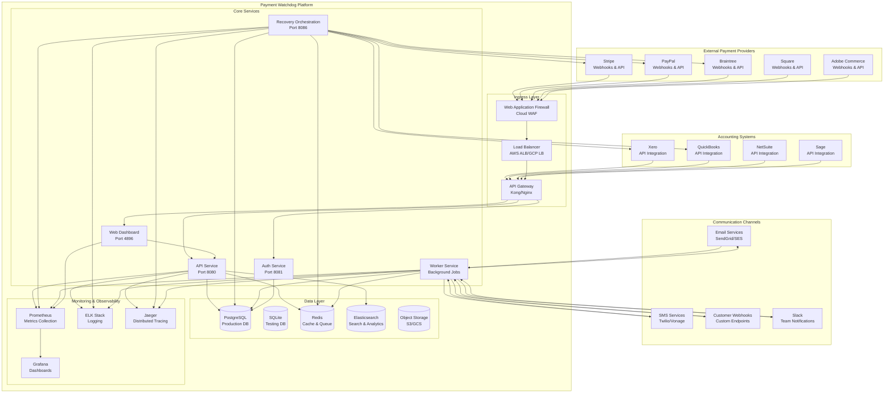
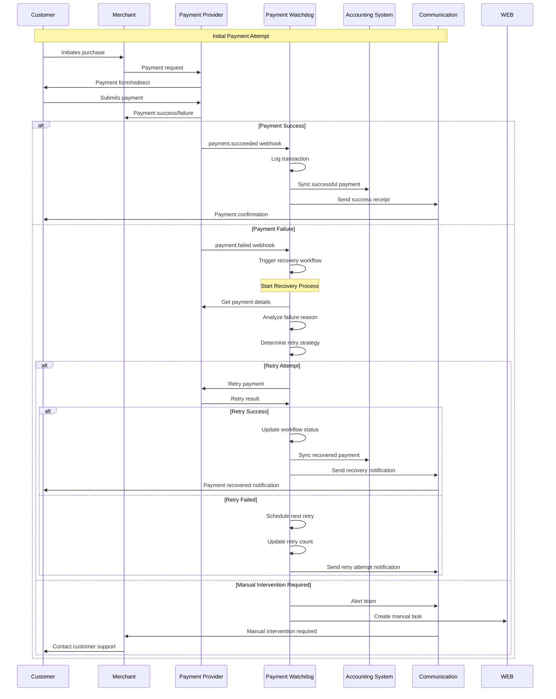
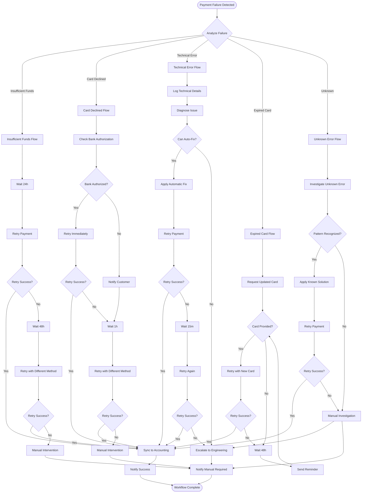
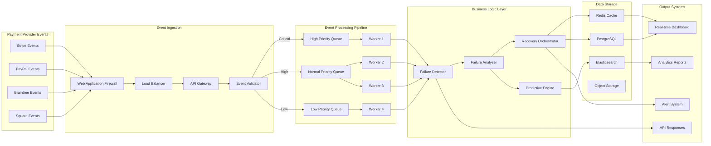
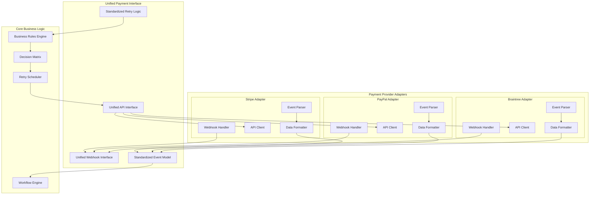
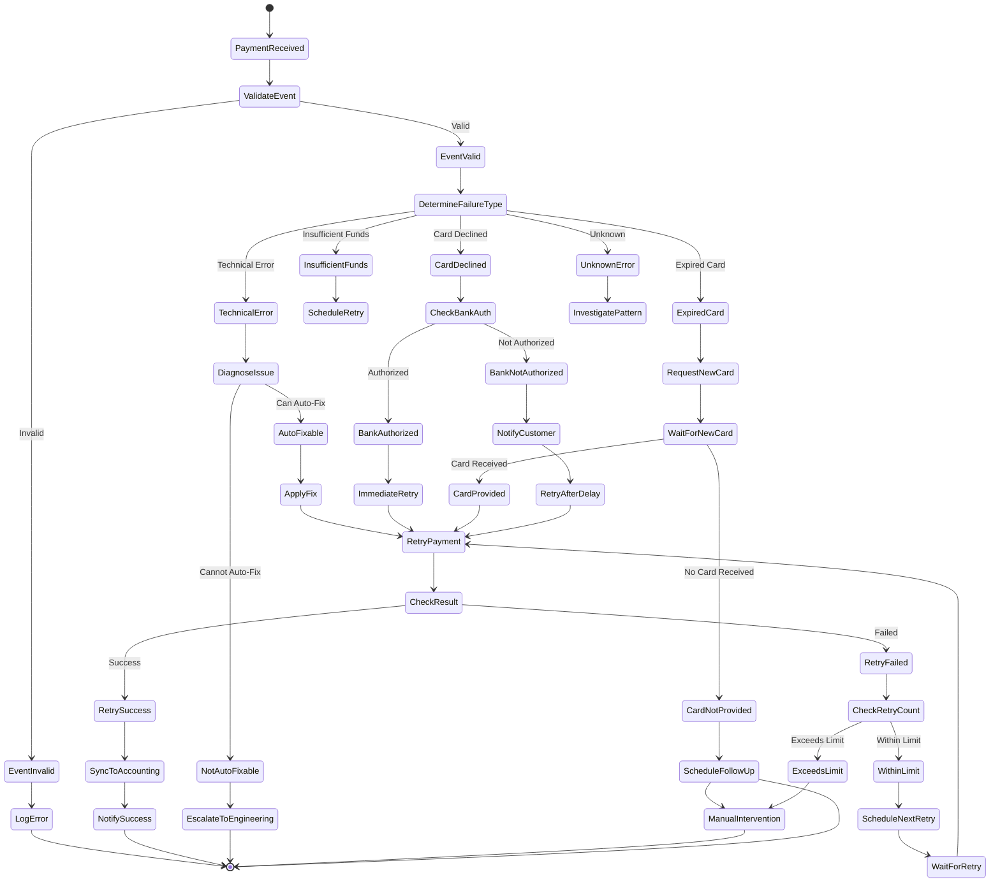
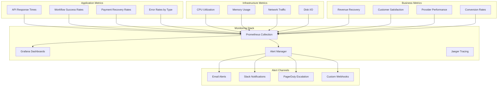

# Payment Watchdog - Solution Design Diagrams

## Database-Agnostic Architecture

### Database Detection and Adaptation Flow

```mermaid
graph TB
    subgraph "Service Layer"
        SVC[Recovery Analytics Service]
        DETECT[Database Detection]
        PGSQL[PostgreSQL Handler]
        SQLT[SQLite Handler]
    end
    
    subgraph "Database Layer"
        PG[(PostgreSQL<br/>Production)]
        SQLITE[(SQLite<br/>In-Memory<br/>Testing)]
    end
    
    subgraph "Query Examples"
        PGQ[EXTRACT(HOUR FROM created_at)<br/>hour::int<br/>recovered::float]
        SQLQ[CAST(strftime('%H', created_at) AS INTEGER)<br/>hour<br/>CAST(recovered AS REAL)]
    end
    
    SVC --> DETECT
    DETECT -->|Production| PGSQL
    DETECT -->|Testing| SQLT
    PGSQL --> PG
    SQLT --> SQLITE
    PGSQL --> PGQ
    SQLT --> SQLQ
    
    style PG fill:#e1f5fe
    style SQLITE fill:#f3e5f5
    style PGQ fill:#e8f5e8
    style SQLQ fill:#fff3e0
```

### Benefits of Database-Agnostic Design

- **Production Ready**: PostgreSQL with advanced features (JSONB, EXTRACT, etc.)
- **Testing Friendly**: SQLite in-memory for fast, ephemeral testing
- **No Race Conditions**: Eliminated sqlmock concurrency issues
- **CI/CD Ready**: Tests run anywhere without external dependencies
- **Flexible**: Easy to add support for other databases

---

## Payment Provider Integration Architecture

### Overall System Integration Diagram



## Complete Payment Lifecycle Flow

### 1. Payment Processing Flow



### 2. Recovery Orchestration Workflow



### 3. Real-time Data Flow Architecture



### 4. Multi-Provider Integration Pattern



### 5. Error Handling and Recovery Patterns



### 6. Monitoring and Observability Flow



## Integration Technical Specifications

### Payment Provider API Integration Details

#### Stripe Integration
```yaml
stripe:
  webhook_endpoints:
    - payment_intent.succeeded
    - payment_intent.payment_failed
    - invoice.payment_failed
    - customer.subscription.deleted
  
  api_endpoints:
    - GET /v1/payment_intents/{id}
    - POST /v1/payment_intents/{id}/confirm
    - GET /v1/customers/{id}
  
  authentication:
    type: api_key
    header: Authorization
    format: Bearer sk_test_...
  
  retry_logic:
    max_attempts: 3
    backoff_strategy: exponential
    base_delay: 1h
    max_delay: 24h
```

#### PayPal Integration
```yaml
paypal:
  webhook_events:
    - PAYMENT.SALE.COMPLETED
    - PAYMENT.SALE.DENIED
    - PAYMENT.SALE.FAILED
    - BILLING.SUBSCRIPTION.CANCELLED
  
  api_methods:
    - POST /v1/payments/sale/{id}/retry
    - GET /v1/payments/sale/{id}
    - GET /v1/customers/{id}
  
  authentication:
    type: oauth2
    client_id: ${PAYPAL_CLIENT_ID}
    client_secret: ${PAYPAL_CLIENT_SECRET}
  
  rate_limits:
    requests_per_second: 10
    burst: 100
```

#### Braintree Integration
```yaml
braintree:
  webhooks:
    - subscription_went_past_due
    - subscription_charged_successfully
    - transaction_failed
    - disbursement
  
  api:
    - POST /transactions/{id}/retry
    - GET /transactions/{id}
    - GET /customers/{id}
  
  authentication:
    type: credentials
    merchant_id: ${BRAINTREE_MERCHANT_ID}
    public_key: ${BRAINTREE_PUBLIC_KEY}
    private_key: ${BRAINTREE_PRIVATE_KEY}
```

### Data Flow Specifications

#### Event Processing Pipeline
```yaml
pipeline:
  ingestion:
    rate_limit: 10000_events_per_second
    validation:
      - signature_verification
      - schema_validation
      - duplicate_detection
    
  processing:
    priority_levels:
      - critical: payment_failures
      - high: recovery_workflows
      - normal: analytics_events
      - low: periodic_tasks
    
    workers:
      count: 20
      batch_size: 100
      timeout: 30s
  
  storage:
    hot_data: redis_cluster
    cold_data: postgresql_replica
    archive: s3_glacier
```

#### Recovery Workflow Engine
```yaml
workflow_engine:
  supported_providers:
    - stripe
    - paypal
    - braintree
    - square
    - adobe_commerce
  
  retry_strategies:
    exponential_backoff:
      base_delay: 1h
      multiplier: 2
      max_delay: 24h
      jitter: true
    
    linear_backoff:
      base_delay: 6h
      increment: 6h
      max_delay: 48h
    
    immediate_retry:
      max_attempts: 2
      delay: 30s
  
  decision_matrix:
    failure_types:
      insufficient_funds:
        strategy: exponential_backoff
        max_attempts: 3
        notify_customer: true
      
      card_declined:
        strategy: linear_backoff
        max_attempts: 5
        require_auth: true
      
      technical_error:
        strategy: immediate_retry
        max_attempts: 2
        escalate_after: true
```

## Security and Compliance Flow

### Payment Data Security

```mermaid
graph LR
    subgraph "Payment Provider"
        PP_ENCRYPT[Encrypted Payment Data]
    end
    
    subgraph "Ingress Security"
        WAF[Web Application Firewall]
        DDoS[DDoS Protection]
        RATE_LIMIT[Rate Limiting]
        VALIDATION[Input Validation]
    end
    
    subgraph "Application Security"
        AUTH[Authentication]
        AUTHZ[Authorization]
        ENCRYPTION[Data Encryption]
        MASKING[Data Masking]
    end
    
    subgraph "Data Security"
        ENCRYPTION_AT_REST[AES-256 at Rest]
        ENCRYPTION_IN_TRANSIT[TLS 1.3 in Transit]
        KEY_MANAGEMENT[Cloud KMS]
        ACCESS_CONTROL[RBAC/ABAC]
    end
    
    PP_ENCRYPT --> WAF
    WAF --> DDoS
    DDoS --> RATE_LIMIT
    RATE_LIMIT --> VALIDATION
    VALIDATION --> AUTH
    AUTH --> AUTHZ
    AUTHZ --> ENCRYPTION
    ENCRYPTION --> MASKING
    MASKING --> ENCRYPTION_AT_REST
    ENCRYPTION_AT_REST --> ENCRYPTION_IN_TRANSIT
    ENCRYPTION_IN_TRANSIT --> KEY_MANAGEMENT
    KEY_MANAGEMENT --> ACCESS_CONTROL
```


---

**Document Version**: 1.0  
**Created**: 2026-02-12  
**Author**: Solution Architecture Team  
**Purpose**: Technical visualization of Payment Watchdog integration flows
