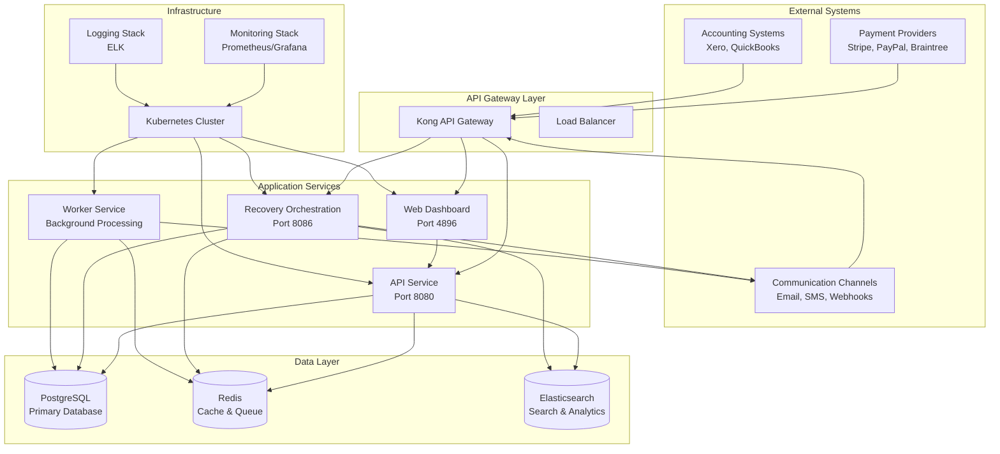
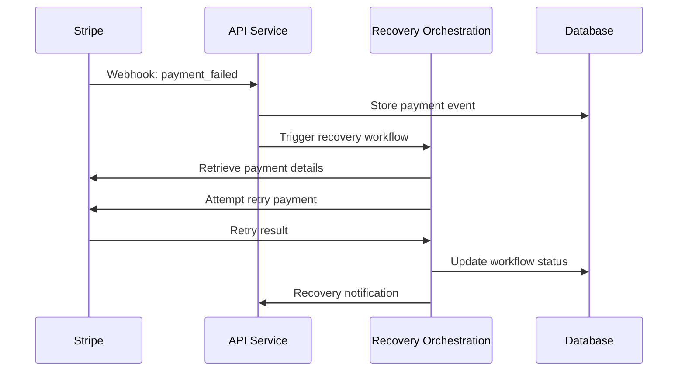

# Payment Watchdog - Solution Design Document

## Executive Summary

**Payment Watchdog** is an AI-powered SaaS payment failure intelligence platform designed to transform how businesses handle payment failures. The platform provides real-time detection, intelligent recovery, and predictive analytics to minimize revenue loss from failed payments.

### Project Objectives
- **Reduce Revenue Loss**: Minimize failed payment impact through intelligent recovery workflows
- **Enhance Customer Experience**: Proactive communication and seamless retry mechanisms
- **Provide Actionable Insights**: Real-time analytics and predictive failure forecasting
- **Streamline Operations**: Unified platform for payment management across multiple providers

### Key Benefits
- **60-70% Market Coverage**: Support for major payment providers (Stripe, PayPal, Braintree)
- **$2.4B Addressable Market**: Target SaaS companies struggling with payment failures
- **Zero Touch Deployment**: Fully automated Kubernetes-based deployment
- **Real-time Processing**: Sub-second payment failure detection and response

---

## Architecture Vision

### High-Level Vision
Payment Watchdog employs a cloud-native, microservices architecture designed for scalability, reliability, and maintainability. The solution leverages event-driven processing, AI-powered analytics, and automated recovery workflows to create a comprehensive payment intelligence platform.

### Scope and Context
- **In Scope**: Payment failure detection, intelligent recovery, analytics dashboard, multi-provider integration
- **Out of Scope**: Payment processing (acts as intelligence layer), customer billing systems, direct payment gateway operations
- **Target Market**: SaaS companies with subscription-based revenue models
- **Deployment Model**: Cloud-native (AWS/GCP/Azure) with Kubernetes orchestration

### Architectural Principles
1. **Microservices**: Loosely coupled, independently deployable services
2. **Event-Driven**: Asynchronous processing for scalability
3. **Cloud-Native**: Container-based deployment with auto-scaling
4. **API-First**: RESTful APIs for all integrations
5. **Security-First**: Zero-trust architecture with defense-in-depth

---

## Business Requirements

### Business Problems Addressed

#### 1. Revenue Loss from Payment Failures
- **Problem**: SaaS companies lose 2-5% of revenue to failed payments
- **Impact**: $240K-$600K annual loss for $12M ARR company
- **Solution**: Intelligent retry mechanisms and predictive failure prevention

#### 2. Manual Recovery Processes
- **Problem**: Teams spend 20+ hours/week manually handling failed payments
- **Impact**: High operational costs and slow recovery times
- **Solution**: Automated workflows with configurable retry policies

#### 3. Lack of Visibility
- **Problem**: No real-time insights into payment failure patterns
- **Impact**: Reactive rather than proactive failure management
- **Solution**: Real-time dashboard with predictive analytics

### Business Objectives

#### Primary Objectives
1. **Reduce Failed Payment Impact**: Target 50% reduction in revenue loss
2. **Improve Recovery Rates**: Achieve 85%+ successful recovery rate
3. **Enhance Customer Retention**: Reduce churn by 15% through better payment experience
4. **Operational Efficiency**: Reduce manual intervention by 80%

#### Secondary Objectives
1. **Provider Agnostic**: Support for all major payment providers
2. **Scalable Platform**: Handle 100K+ transactions per hour
3. **Compliance Ready**: PCI DSS and GDPR compliant
4. **Developer Friendly**: Comprehensive APIs and SDKs

### Success Metrics
- **Revenue Recovery**: 50% reduction in failed payment revenue loss
- **Automation Rate**: 80% of recoveries handled automatically
- **Customer Satisfaction**: 25% improvement in payment-related NPS
- **Operational Efficiency**: 80% reduction in manual processing time

---

## Technology Baseline

### Current State Assessment

#### Existing Systems (Before Implementation)
- **Payment Processing**: Direct integration with payment providers (Stripe, PayPal)
- **Database**: Basic transaction logging with single database
- **Monitoring**: Limited error tracking
- **Recovery**: Manual processes and basic retry logic
- **Analytics**: Spreadsheet-based reporting

#### Technology Gaps Identified
1. **Real-time Processing**: No event-driven architecture
2. **Intelligence Layer**: No AI/ML capabilities
3. **Unified Dashboard**: Fragmented reporting systems
4. **Automation**: Manual-heavy recovery processes
5. **Scalability**: Monolithic architecture limitations

#### Integration Requirements
- **Payment Providers**: Stripe, PayPal, Braintree, Xero, QuickBooks
- **Accounting Systems**: Xero, QuickBooks integration
- **Communication**: Email, SMS, webhook notifications
- **Analytics**: Business intelligence tools
- **Monitoring**: APM and observability platforms

### Baseline Infrastructure
- **Compute**: On-premise servers or basic cloud instances
- **Database**: Single-node PostgreSQL
- **Networking**: Basic load balancing
- **Security**: Basic firewall rules
- **Monitoring**: Limited logging and alerting

---

## Architectural Strategy

### Methodology and Approach

#### 1. Microservices Architecture
- **Rationale**: Independent scaling, fault isolation, technology diversity
- **Implementation**: Container-based services with Kubernetes orchestration
- **Benefits**: Improved maintainability, faster deployment cycles

#### 2. Event-Driven Architecture
- **Rationale**: Asynchronous processing, loose coupling
- **Implementation**: Redis-based event bus with pub/sub patterns
- **Benefits**: Scalability, resilience, real-time processing

#### 3. API-First Design
- **Rationale**: Consistent interfaces, easier integration
- **Implementation**: RESTful APIs with OpenAPI specification
- **Benefits**: Developer experience, ecosystem growth

#### 4. Cloud-Native Principles
- **Rationale**: Scalability, reliability, cost optimization
- **Implementation**: Containers, auto-scaling, managed services
- **Benefits**: Operational efficiency, global reach

### Architectural Models

#### 1. CQRS (Command Query Responsibility Segregation)
- **Commands**: Payment processing, recovery actions
- **Queries**: Analytics, reporting, dashboard data
- **Benefits**: Optimized read/write patterns, scalability

#### 2. Event Sourcing
- **Implementation**: Immutable event log for payment transactions
- **Benefits**: Audit trail, replay capabilities, state reconstruction

#### 3. Saga Pattern
- **Implementation**: Distributed transaction management
- **Benefits**: Consistency across microservices, fault tolerance

### Technology Stack and Tools

#### Core Technologies
- **Runtime**: Go 1.24+ for performance and concurrency
- **Framework**: Gin for HTTP services
- **Database**: Database-agnostic design with PostgreSQL (production) and SQLite (testing)
- **Cache**: Redis for session management and caching
- **Message Queue**: Redis Streams for event processing

#### Frontend Technologies
- **Framework**: Next.js 14 for React-based UI
- **Language**: TypeScript for type safety
- **Styling**: Tailwind CSS for rapid development
- **Charts**: Chart.js for data visualization

#### Infrastructure and DevOps
- **Containerization**: Docker for application packaging
- **Orchestration**: Kubernetes for container management
- **CI/CD**: GitHub Actions for automated pipelines
- **Monitoring**: Prometheus + Grafana for observability
- **Logging**: ELK Stack for centralized logging
- **Security**: Checkmarx for static code analysis

#### Development and Testing
- **Version Control**: Git with GitHub
- **API Documentation**: OpenAPI/Swagger
- **Testing**: Go testing framework with ephemeral SQLite databases, Jest for frontend
- **Code Quality**: SonarQube, ESLint, Go fmt

#### Testing Strategy
- **Ephemeral Testing**: SQLite in-memory databases for fast, dependency-free testing
- **Database-Agnostic**: Tests work with both SQLite and PostgreSQL
- **Race Condition Free**: Eliminated sqlmock concurrency issues
- **CI/CD Ready**: Tests run anywhere without external database setup

---

## System Architecture

### Overall Architecture Diagram



### Service Architecture

#### 1. API Service (Port 8080)
**Purpose**: Primary REST API for external integrations and dashboard

**Components**:
- HTTP Server (Gin framework)
- Authentication & Authorization
- Request validation and rate limiting
- Business logic orchestration

**Responsibilities**:
- Handle webhook processing from payment providers
- Serve dashboard data via REST endpoints
- Manage user authentication and permissions
- Coordinate with other services

#### 2. Recovery Orchestration Service (Port 8086)
**Purpose**: Advanced payment recovery workflows and intelligence

**Components**:
- Workflow Engine
- Provider Integration Layer
- Failure Prediction Engine
- OpenTelemetry Tracing

**Responsibilities**:
- Execute complex recovery workflows
- Integrate with multiple payment providers
- Predict payment failures
- Manage retry policies and schedules

#### 3. Worker Service
**Purpose**: Background processing and asynchronous tasks

**Components**:
- Job Queue Processor
- Event Handlers
- Scheduled Tasks
- Notification Engine

**Responsibilities**:
- Process payment events asynchronously
- Send customer notifications
- Generate analytics reports
- Perform data cleanup and maintenance

#### 4. Web Dashboard (Port 4896)
**Purpose**: User interface for monitoring and management

**Components**:
- React-based UI
- Real-time data visualization
- User management interface
- Configuration panels

**Responsibilities**:
- Display payment analytics
- Configure recovery workflows
- Monitor system health
- Manage user accounts

### Data Architecture

#### 1. Database Schema Design

**Core Tables**:
```sql
-- Payment Transactions
payments (
    id, provider_id, customer_id, amount, currency, 
    status, failure_reason, created_at, updated_at
)

-- Recovery Workflows
recovery_workflows (
    id, payment_id, workflow_type, status, 
    retry_count, next_retry_at, created_at
)

-- Customer Profiles
customers (
    id, email, payment_methods, risk_score, 
    preferences, created_at, updated_at
)

-- Provider Configurations
providers (
    id, name, api_keys, webhook_config, 
    retry_policies, status
)
```

#### 2. Data Flow Patterns

**Event Flow**:
1. Payment provider sends webhook
2. API service validates and persists
3. Event published to Redis
4. Worker processes event asynchronously
5. Recovery orchestration triggered if needed
6. Results stored and notifications sent

**Query Patterns**:
- **OLTP**: Real-time transaction processing
- **OLAP**: Analytics and reporting
- **Search**: Full-text search for troubleshooting

---

## Integration and Data Flow

### System Integration Architecture

#### 1. Payment Provider Integration

**Stripe Integration**:


**Multi-Provider Support**:
- **Adapter Pattern**: Unified interface for all providers
- **Configuration Management**: Provider-specific settings
- **Error Handling**: Standardized error responses
- **Rate Limiting**: Provider-specific rate limits

#### 2. Accounting System Integration

**Xero Integration**:
- **Invoice Synchronization**: Failed payment invoice updates
- **Customer Data**: Customer record synchronization
- **Financial Reporting**: Reconciliation data

**QuickBooks Integration**:
- **Payment Records**: Transaction synchronization
- **Customer Management**: Account updates
- **Reporting**: Financial data export

#### 3. Communication Channels

**Email Integration**:
- **Templates**: Customizable email templates
- **Delivery Tracking**: Email delivery status
- **Unsubscribe Management**: Customer preferences

**SMS Integration**:
- **Urgent Notifications**: Time-sensitive payment failures
- **Delivery Confirmation**: SMS delivery tracking
- **Opt-out Management**: Customer consent management

### Data Flow Architecture

#### 1. Real-time Data Flow

**Payment Processing Flow**:
```
Payment Provider → API Gateway → API Service → Event Bus → Worker Service → Recovery Orchestration → Database
```

**Key Characteristics**:
- **Latency**: < 100ms for webhook processing
- **Throughput**: 10K+ events per second
- **Reliability**: At-least-once delivery guarantee
- **Scalability**: Horizontal scaling support

#### 2. Batch Data Flow

**Analytics Processing**:
```
Database → Analytics Engine → Aggregated Data → Dashboard API → Frontend
```

**Scheduled Operations**:
- **Daily Reports**: Revenue and failure analytics
- **Data Cleanup**: Archive old transactions
- **Health Checks**: System performance monitoring

#### 3. Data Synchronization

**External System Sync**:
```
Payment Watchdog → Accounting Systems → Customer Records → Financial Reports
```

**Bidirectional Sync**:
- **Outbound**: Payment status updates
- **Inbound**: Customer data updates
- **Reconciliation**: Daily balance verification

### Integration Patterns

#### 1. Webhook Integration
- **Validation**: Signature verification
- **Idempotency**: Duplicate request handling
- **Retry Logic**: Exponential backoff
- **Error Handling**: Graceful degradation

#### 2. API Integration
- **RESTful Design**: Standard HTTP methods
- **Authentication**: OAuth 2.0 and API keys
- **Rate Limiting**: Provider-specific limits
- **Circuit Breaker**: Fault tolerance

#### 3. Message Queue Integration
- **Pub/Sub Pattern**: Event-driven communication
- **Message Persistence**: Durability guarantees
- **Dead Letter Queue**: Failed message handling
- **Consumer Groups**: Load distribution

---

## Security Architecture

### Security Framework Overview

Payment Watchdog implements a defense-in-depth security strategy with multiple layers of protection:

#### 1. Network Security
- **TLS 1.3**: End-to-end encryption for all communications
- **VPC Isolation**: Network segmentation for different environments
- **Firewall Rules**: Restrictive access controls
- **DDoS Protection**: Cloud-based DDoS mitigation

#### 2. Application Security
- **Input Validation**: Comprehensive request validation
- **SQL Injection Prevention**: Parameterized queries
- **XSS Protection**: Content Security Policy
- **CSRF Protection**: Token-based CSRF prevention

#### 3. Data Protection
- **Encryption at Rest**: AES-256 database encryption
- **Encryption in Transit**: TLS for all data transfers
- **Key Management**: Cloud KMS for key rotation
- **Data Masking**: Sensitive data obfuscation

### Authentication and Authorization

#### 1. Authentication Mechanisms

**Multi-Factor Authentication**:
- **Primary**: Username/password with bcrypt hashing
- **Secondary**: TOTP-based time-based codes
- **Tertiary**: Hardware security keys (U2F)

**API Authentication**:
- **OAuth 2.0**: Standardized API authentication
- **JWT Tokens**: Stateless session management
- **API Keys**: Service-to-service authentication
- **Webhook Signatures**: Provider webhook validation

#### 2. Authorization Model

**Role-Based Access Control (RBAC)**:
```yaml
roles:
  admin:
    permissions: [read, write, delete, manage_users]
  analyst:
    permissions: [read, write, export]
  viewer:
    permissions: [read]
  
resources:
  payments: [admin, analyst, viewer]
  customers: [admin, analyst]
  workflows: [admin, analyst]
  system: [admin]
```

**Attribute-Based Access Control (ABAC)**:
- **Context-aware**: Location, time, device-based access
- **Dynamic Permissions**: Real-time permission evaluation
- **Fine-grained Control**: Resource-level permissions

### Compliance and Regulatory

#### 1. PCI DSS Compliance
- **Scope Reduction**: Minimal card data storage
- **Tokenization**: Payment token usage where possible
- **Network Segmentation**: Isolated payment processing
- **Regular Audits**: Quarterly security assessments

#### 2. GDPR Compliance
- **Data Minimization**: Collect only necessary data
- **Right to Erasure**: Customer data deletion
- **Data Portability**: Export customer data
- **Consent Management**: Explicit consent tracking

#### 3. SOC 2 Type II
- **Security Controls**: Comprehensive security framework
- **Availability**: 99.9% uptime SLA
- **Processing Integrity**: Data accuracy guarantees
- **Confidentiality**: Data protection measures

### Security Monitoring and Incident Response

#### 1. Security Monitoring
- **SIEM Integration**: Centralized security logging
- **Threat Detection**: AI-powered anomaly detection
- **Vulnerability Scanning**: Regular security assessments
- **Penetration Testing**: Quarterly security testing

#### 2. Incident Response
- **Automated Alerts**: Real-time security notifications
- **Incident Triage**: Automated severity classification
- **Response Playbooks**: Standardized response procedures
- **Post-Incident Review**: Lessons learned documentation

---

## Infrastructure Architecture

### Compute Architecture

#### 1. Kubernetes Cluster Design

**Cluster Configuration**:
```yaml
cluster:
  nodes:
    master: 3 (High Availability)
    worker: 6 (Auto-scaling)
    regions: 3 (Multi-AZ deployment)
  
  resources:
    cpu: 48 vCPUs total
    memory: 192 GB total
    storage: 2 TB SSD
  
  networking:
    pod_cidr: 10.244.0.0/16
    service_cidr: 10.96.0.0/12
    load_balancer: Application Load Balancer
```

**Node Pools**:
- **System Pool**: Kubernetes system components
- **Application Pool**: Business application services
- **Batch Pool**: Background processing jobs
- **Gateway Pool**: API gateway and ingress controllers

#### 2. Container Resource Management

**Resource Specifications**:
```yaml
services:
  api:
    requests: {cpu: 200m, memory: 512Mi}
    limits: {cpu: 1000m, memory: 1Gi}
    replicas: 3
  
  recovery-orchestration:
    requests: {cpu: 100m, memory: 256Mi}
    limits: {cpu: 500m, memory: 512Mi}
    replicas: 2
  
  worker:
    requests: {cpu: 500m, memory: 1Gi}
    limits: {cpu: 2000m, memory: 2Gi}
    replicas: 4
  
  web:
    requests: {cpu: 100m, memory: 256Mi}
    limits: {cpu: 500m, memory: 512Mi}
    replicas: 2
```

### Storage Architecture

#### 1. Database Design

**PostgreSQL Configuration**:
```yaml
database:
  version: 14
  instances: 2 (Primary + Replica)
  storage: 500 GB SSD
  backup: Daily + Point-in-time recovery
  monitoring: Performance insights
  
  connection_pooling:
    max_connections: 200
    idle_timeout: 10m
    lifetime: 1h
```

**Redis Configuration**:
```yaml
cache:
  type: Redis Cluster
  nodes: 6 (3 masters + 3 replicas)
  memory: 64 GB total
  persistence: AOF + RDB
  sharding: Automatic
```

#### 2. Object Storage

**File Storage**:
- **Type**: S3-compatible object storage
- **Usage**: Logs, backups, static assets
- **Lifecycle**: Automatic tiering and cleanup
- **Encryption**: Server-side encryption

### Network Architecture

#### 1. Network Design

**VPC Configuration**:
```yaml
vpc:
  cidr: 10.0.0.0/16
  availability_zones: 3
  
  subnets:
    public: 10.0.1.0/24 (Load Balancers)
    private: 10.0.2.0/24 (Application)
    data: 10.0.3.0/24 (Database)
  
  security_groups:
    web: HTTP/HTTPS inbound
    app: Application traffic
    db: Database traffic only
```

#### 2. Load Balancing

**Application Load Balancer**:
- **Type**: Application Load Balancer (ALB)
- **SSL**: TLS termination at load balancer
- **Health Checks**: Comprehensive health monitoring
- **Auto-scaling**: Dynamic capacity management

### Monitoring and Observability

#### 1. Monitoring Stack

**Prometheus Configuration**:
```yaml
prometheus:
  retention: 30 days
  scrape_interval: 15s
  evaluation_interval: 15s
  
  targets:
    - application_metrics
    - infrastructure_metrics
    - business_metrics
  
  alerting:
    email: ops@payment-watchdog.com
    slack: #payment-watchdog-alerts
    pagerduty: Critical incidents
```

**Grafana Dashboards**:
- **System Health**: CPU, memory, disk, network
- **Application Metrics**: Request rates, error rates, latency
- **Business Metrics**: Payment success rates, recovery rates
- **Security Metrics**: Authentication failures, access patterns

#### 2. Logging Architecture

**ELK Stack Configuration**:
```yaml
elasticsearch:
  nodes: 3 (Hot-Warm architecture)
  storage: 1 TB SSD
  retention: 90 days
  
logstash:
  pipelines: 4 (Application, System, Security, Audit)
  workers: 8
  batch_size: 125

kibana:
  dashboards: 20+ pre-configured
  index_patterns: Automated
  security: Role-based access
```

---

## Non-Functional Requirements

### Performance Requirements

#### 1. Response Time Requirements

**API Response Times**:
- **Webhook Processing**: < 100ms (95th percentile)
- **Dashboard Loading**: < 2 seconds (95th percentile)
- **Analytics Queries**: < 5 seconds (95th percentile)
- **Authentication**: < 50ms (95th percentile)

**System Response Times**:
- **Database Queries**: < 10ms (average)
- **Cache Operations**: < 1ms (average)
- **Message Processing**: < 50ms (average)
- **Background Jobs**: < 5 minutes (completion)

#### 2. Throughput Requirements

**Transaction Processing**:
- **Webhook Events**: 10,000 events/second
- **Payment Processing**: 1,000 payments/second
- **Concurrent Users**: 500 simultaneous users
- **API Requests**: 5,000 requests/second

**Data Processing**:
- **Batch Jobs**: 1M records/hour
- **Analytics Processing**: 10GB data/hour
- **Report Generation**: 100 reports/hour
- **Data Export**: 1GB/minute

#### 3. Scalability Requirements

**Horizontal Scaling**:
- **Auto-scaling**: CPU and memory-based scaling
- **Load Distribution**: Even traffic distribution
- **Elastic Scaling**: Automatic capacity adjustment
- **Geographic Scaling**: Multi-region deployment

**Vertical Scaling**:
- **Resource Allocation**: Dynamic resource adjustment
- **Performance Tuning**: Continuous optimization
- **Capacity Planning**: Proactive scaling decisions
- **Resource Monitoring**: Real-time resource tracking

### Availability and Reliability

#### 1. Availability Requirements

**Uptime Targets**:
- **Overall System**: 99.9% uptime (8.76 hours downtime/year)
- **API Services**: 99.95% uptime (4.38 hours downtime/year)
- **Dashboard**: 99.9% uptime (8.76 hours downtime/year)
- **Background Processing**: 99.5% uptime (43.8 hours downtime/year)

**Maintenance Windows**:
- **Scheduled Maintenance**: 4 hours/month
- **Emergency Maintenance**: As needed with 2-hour notice
- **Zero-Downtime Deployment**: Rolling updates
- **Blue-Green Deployment**: Risk-free deployments

#### 2. Reliability Requirements

**Error Handling**:
- **Error Rate**: < 0.1% for all operations
- **Retry Logic**: Exponential backoff with jitter
- **Circuit Breaker**: Automatic fault isolation
- **Graceful Degradation**: Reduced functionality during outages

**Data Consistency**:
- **ACID Compliance**: Database transaction integrity
- **Eventual Consistency**: Acceptable for analytics
- **Data Replication**: Multi-AZ data replication
- **Backup Recovery**: Point-in-time recovery

### Security Requirements

#### 1. Data Protection
- **Encryption**: AES-256 for data at rest
- **Transmission**: TLS 1.3 for data in transit
- **Key Management**: Automated key rotation
- **Access Control**: Least privilege principle

#### 2. Compliance Requirements
- **PCI DSS**: Level 1 compliance
- **GDPR**: Full compliance for EU customers
- **SOC 2**: Type II certification
- **HIPAA**: Optional for healthcare customers

### Usability Requirements

#### 1. User Experience
- **Response Time**: < 2 seconds for all interactions
- **Mobile Support**: Responsive design for mobile devices
- **Accessibility**: WCAG 2.1 AA compliance
- **Internationalization**: Multi-language support

#### 2. Developer Experience
- **API Documentation**: Comprehensive OpenAPI specs
- **SDK Support**: Multiple programming languages
- **Testing Environment**: Full-featured sandbox
- **Developer Portal**: Self-service developer resources

### Maintainability Requirements

#### 1. Code Quality
- **Code Coverage**: > 80% test coverage
- **Static Analysis**: Automated code quality checks
- **Documentation**: Inline documentation and guides
- **Standards**: Consistent coding standards

#### 2. Operational Excellence
- **Monitoring**: Comprehensive system monitoring
- **Alerting**: Proactive issue detection
- **Automation**: Automated deployment and operations
- **Disaster Recovery**: Tested recovery procedures

### Capacity Requirements

#### 1. Storage Requirements
- **Database Storage**: 1 TB initial, 100 GB/month growth
- **Log Storage**: 500 GB initial, 50 GB/month growth
- **Backup Storage**: 3x primary storage
- **Archive Storage**: 10 TB for long-term retention

#### 2. Network Requirements
- **Bandwidth**: 10 Gbps internal, 1 Gbps external
- **Latency**: < 10ms internal, < 100ms external
- **Connections**: 50,000 concurrent connections
- **Data Transfer**: 100 TB/month external transfer

---

## Implementation Roadmap

### Phase 1: Foundation (Months 1-3)
- **Infrastructure Setup**: Kubernetes cluster and basic services
- **Core API Development**: Payment processing and webhook handling
- **Database Design**: Schema implementation and migration
- **Basic Dashboard**: Initial UI development

### Phase 2: Intelligence (Months 4-6)
- **Recovery Orchestration**: Advanced workflow engine
- **Analytics Engine**: Real-time analytics implementation
- **Provider Integrations**: Multi-provider support
- **Security Implementation**: Comprehensive security measures

### Phase 3: Scale (Months 7-9)
- **Performance Optimization**: System tuning and optimization
- **Advanced Features**: AI-powered failure prediction
- **Enterprise Features**: Advanced security and compliance
- **Customer Onboarding**: Beta customer testing

### Phase 4: Production (Months 10-12)
- **Production Deployment**: Full production rollout
- **Customer Support**: 24/7 support implementation
- **Continuous Improvement**: Ongoing optimization
- **Market Expansion**: Feature expansion and scaling

---

## Conclusion

The Payment Watchdog solution design provides a comprehensive, scalable, and secure platform for addressing the critical business problem of payment failures in SaaS companies. The architecture leverages modern cloud-native technologies, event-driven processing, and AI-powered intelligence to deliver a solution that significantly reduces revenue loss and improves operational efficiency.

The design emphasizes:
- **Scalability**: Horizontal scaling to handle growth
- **Reliability**: High availability and fault tolerance
- **Security**: Enterprise-grade security and compliance
- **Maintainability**: Clean architecture and automation
- **Performance**: Sub-second response times and high throughput

With this architecture, Payment Watchdog is positioned to capture a significant portion of the $2.4B addressable market while providing exceptional value to SaaS companies struggling with payment failures.

---

**Document Version**: 1.0  
**Last Updated**: 2026-02-12  
**Author**: Architecture Team  
**Review Status**: Draft for Review
