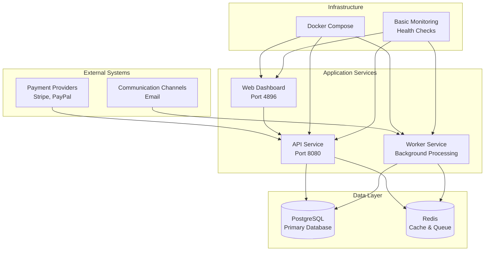
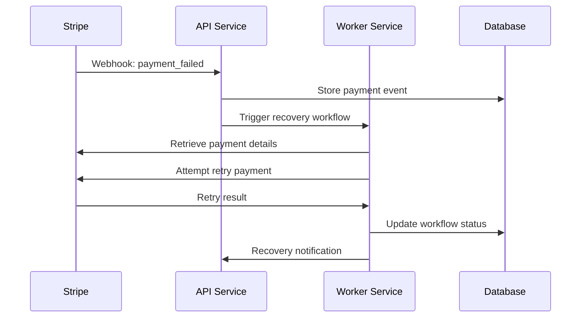

# Payment Watchdog - Solution Design Document

## Executive Summary

**Payment Watchdog** is a payment recovery management platform designed to help SaaS businesses handle payment failures through automated detection and recovery workflows. The platform provides basic payment failure monitoring, retry mechanisms, and analytics to minimize revenue loss from failed payments.

### Project Objectives
- **Reduce Revenue Loss**: Minimize failed payment impact through automated retry workflows
- **Enhance Customer Experience**: Basic notification systems for payment issues
- **Provide Basic Insights**: Payment analytics dashboard and failure reporting
- **Streamline Operations**: Centralized platform for payment failure management

### Key Benefits
- **Payment Provider Support**: Integration with major payment providers (Stripe, PayPal)
- **Automated Recovery**: Basic retry logic with configurable policies
- **Simple Deployment**: Docker-based deployment with PostgreSQL and Redis
- **Real-time Monitoring**: Basic payment failure detection and response

---

## Architecture Vision

### High-Level Vision
Payment Watchdog employs a microservices architecture designed for simplicity and maintainability. The solution leverages event-driven processing, basic analytics, and automated recovery workflows to create a practical payment failure management platform.

### Scope and Context
- **In Scope**: Payment failure detection, basic recovery workflows, analytics dashboard, payment provider integration
- **Out of Scope**: AI-powered prediction, advanced machine learning, direct payment processing
- **Target Market**: Small to medium SaaS companies with subscription-based revenue models
- **Deployment Model**: Docker-based with PostgreSQL and Redis

### Architectural Principles
1. **Microservices**: Loosely coupled services (API, Worker, Web)
2. **Event-Driven**: Basic asynchronous processing with Redis
3. **Container-Native**: Docker-based deployment
4. **API-First**: RESTful APIs for integrations
5. **Security-First**: Enterprise-grade security scanning and protection

---

## Business Requirements

### Business Problems Addressed

#### 1. Revenue Loss from Payment Failures
- **Problem**: SaaS companies lose 2-5% of revenue to failed payments
- **Impact**: $240K-$600K annual loss for $12M ARR company
- **Solution**: Basic retry mechanisms and failure detection

#### 2. Manual Recovery Processes
- **Problem**: Teams spend 20+ hours/week manually handling failed payments
- **Impact**: High operational costs and slow recovery times
- **Solution**: Automated workflows with configurable retry policies

#### 3. Lack of Visibility
- **Problem**: No centralized view of payment failure patterns
- **Impact**: Reactive rather than proactive failure management
- **Solution**: Basic dashboard with payment analytics

### Business Objectives

#### Primary Objectives
1. **Reduce Failed Payment Impact**: Target 20-30% reduction in revenue loss
2. **Improve Recovery Rates**: Achieve 60-70% successful recovery rate
3. **Enhance Customer Retention**: Reduce churn by 5-10% through better payment experience
4. **Operational Efficiency**: Reduce manual intervention by 50-60%

#### Secondary Objectives
1. **Provider Integration**: Support for major payment providers (Stripe, PayPal)
2. **Scalable Platform**: Handle 1K+ transactions per hour
3. **Basic Compliance**: Data protection and security measures
4. **Developer Friendly**: REST APIs for integration

### Success Metrics
- **Revenue Recovery**: 20-30% reduction in failed payment revenue loss
- **Automation Rate**: 50-60% of recoveries handled automatically
- **Customer Satisfaction**: 10-15% improvement in payment-related NPS
- **Operational Efficiency**: 50-60% reduction in manual processing time

---

## Technology Baseline

### Current State Assessment

#### Existing Systems (Before Implementation)
- **Payment Processing**: Direct integration with payment providers (Stripe, PayPal)
- **Database**: Basic transaction logging with single database
- **Monitoring**: Limited error tracking
- **Recovery**: Manual processes and basic retry logic
- **Analytics**: Spreadsheet-based reporting

#### Technology Gaps Identified
1. **Centralized Monitoring**: No unified view of payment failures
2. **Automation**: Manual-heavy recovery processes
3. **Unified Dashboard**: Fragmented reporting systems
4. **Event Processing**: Limited real-time processing capabilities
5. **Scalability**: Basic architecture limitations

#### Integration Requirements
- **Payment Providers**: Stripe, PayPal integration
- **Communication**: Basic email notifications
- **Analytics**: Basic dashboard and reporting
- **Monitoring**: Basic health checks and logging

### Baseline Infrastructure
- **Compute**: Docker containers on single host
- **Database**: Single-node PostgreSQL
- **Cache**: Redis for session management
- **Networking**: Basic Docker networking
- **Security**: Basic authentication and environment variables

---

## Architectural Strategy

### Methodology and Approach

#### 1. Microservices Architecture
- **Rationale**: Separation of concerns and maintainability
- **Implementation**: Container-based services with Docker Compose
- **Benefits**: Improved maintainability, independent deployment

#### 2. Event-Driven Architecture
- **Rationale**: Asynchronous processing, loose coupling
- **Implementation**: Redis-based event bus with basic pub/sub
- **Benefits**: Scalability, resilience, basic real-time processing

#### 3. API-First Design
- **Rationale**: Consistent interfaces, easier integration
- **Implementation**: RESTful APIs with basic documentation
- **Benefits**: Developer experience, ecosystem growth

#### 4. Container-Native Principles
- **Rationale**: Simplicity, portability, cost optimization
- **Implementation**: Docker containers with compose orchestration
- **Benefits**: Operational efficiency, local development

### Architectural Models

#### 1. Basic Separation of Concerns
- **Commands**: Payment processing, recovery actions
- **Queries**: Analytics, reporting, dashboard data
- **Benefits**: Clear separation of read/write operations

#### 2. Event Logging
- **Implementation**: Basic event logging for payment transactions
- **Benefits**: Audit trail, basic troubleshooting capabilities

#### 3. Simple Transaction Management
- **Implementation**: Database transactions for consistency
- **Benefits**: Data integrity, error handling

### Technology Stack and Tools

#### Core Technologies
- **Runtime**: Go 1.23 for performance and concurrency
- **Framework**: Gin for HTTP services
- **Database**: PostgreSQL with GORM ORM
- **Cache**: Redis for session management and basic caching
- **Message Queue**: Redis for basic event processing

#### Frontend Technologies
- **Framework**: Next.js 14 for React-based UI
- **Language**: TypeScript for type safety
- **Styling**: Tailwind CSS for rapid development
- **Charts**: Basic chart components for data visualization

#### Infrastructure and DevOps
- **Containerization**: Docker for application packaging
- **Orchestration**: Docker Compose for local development
- **CI/CD**: GitHub Actions for basic automated pipelines
- **Monitoring**: Basic health checks and logging
- **Logging**: Structured logging with zap

#### Development and Testing
- **Version Control**: Git with GitHub
- **API Documentation**: Basic OpenAPI specs
- **Testing**: Go testing framework with SQLite for testing, Jest for frontend
- **Code Quality**: Basic linting and formatting tools

#### Testing Strategy
- **Unit Testing**: Comprehensive unit tests for business logic
- **Integration Testing**: Database integration tests with test containers
- **E2E Testing**: Basic end-to-end workflow tests
- **CI/CD Testing**: Automated test execution in pipelines

---

## System Architecture

### Overall Architecture Diagram


```mermaid
graph TB
    subgraph "External Systems"
        PP[Payment Providers<br/>Stripe, PayPal]
        COMM[Communication Channels<br/>Email]
    end
    
    subgraph "Application Services"
        API[API Service<br/>Port 8080]
        WEB[Web Dashboard<br/>Port 4896]
        WRK[Worker Service<br/>Background Processing]
    end
    
    subgraph "Data Layer"
        PG[(PostgreSQL<br/>Primary Database)]
        RD[(Redis<br/>Cache & Queue)]
    end
    
    subgraph "Infrastructure"
        DOCKER[Docker Compose]
        MON[Basic Monitoring<br/>Health Checks]
    end
    
    PP --> API
    COMM --> WRK
    
    API --> PG
    API --> RD
    WEB --> API
    WRK --> PG
    WRK --> RD
    
    DOCKER --> API
    DOCKER --> WEB
    DOCKER --> WRK
    
    MON --> API
    MON --> WEB
    MON --> WRK
```

### Service Architecture

#### 1. API Service (Port 8080)
**Purpose**: Primary REST API for external integrations and dashboard

**Components**:
- HTTP Server (Gin framework)
- Basic Authentication
- Request validation
- Basic business logic

**Responsibilities**:
- Handle webhook processing from payment providers
- Serve dashboard data via REST endpoints
- Manage user authentication
- Coordinate with worker service

#### 2. Worker Service
**Purpose**: Background processing and asynchronous tasks

**Components**:
- Event Processor
- Recovery Engine
- Notification Handler
- Scheduled Tasks

**Responsibilities**:
- Process payment events asynchronously
- Execute retry workflows
- Send customer notifications
- Generate basic analytics reports

#### 3. Web Dashboard (Port 4896)
**Purpose**: User interface for monitoring and management

**Components**:
- React-based UI
- Basic data visualization
- User management interface
- Configuration panels

**Responsibilities**:
- Display payment analytics
- Configure recovery workflows
- Monitor system health
- Manage user accounts

### Data Architecture

#### 1. Database Schema Design

**Core Tables**:
```sql
-- Payment Transactions
payments (
    id, provider_id, customer_id, amount, currency, 
    status, failure_reason, created_at, updated_at
)

-- Recovery Workflows
recovery_workflows (
    id, payment_id, workflow_type, status, 
    retry_count, next_retry_at, created_at
)

-- Customer Profiles
customers (
    id, email, payment_methods, preferences, 
    created_at, updated_at
)

-- Provider Configurations
providers (
    id, name, api_keys, webhook_config, 
    retry_policies, status
)
```

#### 2. Data Flow Patterns

**Event Flow**:
1. Payment provider sends webhook
2. API service validates and persists
3. Event published to Redis
4. Worker processes event asynchronously
5. Recovery workflows triggered if needed
6. Results stored and notifications sent

**Query Patterns**:
- **OLTP**: Real-time transaction processing
- **Analytics**: Basic reporting and dashboard queries
- **Search**: Basic filtering for troubleshooting

---

## Integration and Data Flow

### System Integration Architecture

#### 1. Payment Provider Integration

**Stripe Integration**:

```mermaid
sequenceDiagram
    participant SP as Stripe
    participant API as API Service
    participant WRK as Worker Service
    participant DB as Database
    
    SP->>API: Webhook: payment_failed
    API->>DB: Store payment event
    API->>WRK: Trigger recovery workflow
    WRK->>SP: Retrieve payment details
    WRK->>SP: Attempt retry payment
    SP->>WRK: Retry result
    WRK->>DB: Update workflow status
    WRK->>API: Recovery notification
```

**Multi-Provider Support**:
- **Adapter Pattern**: Unified interface for all providers
- **Configuration Management**: Provider-specific settings
- **Error Handling**: Standardized error responses
- **Rate Limiting**: Basic rate limiting per provider

#### 2. Communication Integration

**Email Integration**:
- **Templates**: Basic email templates
- **Delivery Tracking**: Basic delivery status
- **Unsubscribe Management**: Customer preferences

### Data Flow Architecture

#### 1. Real-time Data Flow

**Payment Processing Flow**:
```
Payment Provider → API Service → Event Bus → Worker Service → Database
```

**Key Characteristics**:
- **Latency**: < 500ms for webhook processing
- **Throughput**: 1K+ events per hour
- **Reliability**: Basic retry mechanisms
- **Scalability**: Horizontal scaling with Docker Compose

#### 2. Batch Data Flow

**Analytics Processing**:
```
Database → Analytics Engine → Aggregated Data → Dashboard API → Frontend
```

**Scheduled Operations**:
- **Daily Reports**: Basic revenue and failure analytics
- **Data Cleanup**: Archive old transactions
- **Health Checks**: System performance monitoring

#### 3. Data Synchronization

**External System Sync**:
```
Payment Watchdog → Payment Providers → Status Updates
```

**Basic Sync**:
- **Outbound**: Payment status updates
- **Inbound**: Webhook event processing
- **Reconciliation**: Basic balance verification

### Integration Patterns

#### 1. Webhook Integration
- **Validation**: Basic signature verification
- **Idempotency**: Duplicate request handling
- **Retry Logic**: Basic exponential backoff
- **Error Handling**: Graceful degradation

#### 2. API Integration
- **RESTful Design**: Standard HTTP methods
- **Authentication**: Basic API keys
- **Rate Limiting**: Basic rate limiting
- **Error Handling**: Standard error responses

#### 3. Message Queue Integration
- **Pub/Sub Pattern**: Basic event-driven communication
- **Message Persistence**: Redis persistence
- **Error Handling**: Basic failed message handling
- **Consumer Groups**: Basic load distribution

---

## Security Architecture

### Security Framework Overview

Payment Watchdog implements a basic security strategy with essential protection layers:

#### 1. Network Security
- **TLS 1.3**: End-to-end encryption for all communications
- **Docker Networking**: Container network isolation
- **Firewall Rules**: Basic access controls
- **Basic DDoS Protection**: Rate limiting and request validation

#### 2. Application Security
- **Input Validation**: Comprehensive request validation
- **SQL Injection Prevention**: Parameterized queries with GORM
- **XSS Protection**: Basic content security policies
- **CSRF Protection**: Token-based CSRF prevention

#### 3. Data Protection
- **Encryption at Rest**: Basic database encryption
- **Encryption in Transit**: TLS for all data transfers
- **Key Management**: Environment variable management
- **Data Masking**: Sensitive data obfuscation in logs

### Authentication and Authorization

#### 1. Authentication Mechanisms

**Basic Authentication**:
- **Primary**: Username/password with bcrypt hashing
- **API Authentication**: Basic API keys for service-to-service
- **Webhook Security**: Provider webhook signature validation

#### 2. Authorization Model

**Role-Based Access Control (RBAC)**:
```yaml
roles:
  admin:
    permissions: [read, write, delete, manage_users]
  analyst:
    permissions: [read, write, export]
  viewer:
    permissions: [read]
  
resources:
  payments: [admin, analyst, viewer]
  customers: [admin, analyst]
  workflows: [admin, analyst]
  system: [admin]
```

### Compliance and Regulatory

#### 1. Basic Compliance Measures
- **Data Minimization**: Collect only necessary data
- **Right to Erasure**: Customer data deletion capabilities
- **Data Portability**: Export customer data
- **Consent Management**: Basic consent tracking

#### 2. Security Best Practices
- **Regular Updates**: Keep dependencies updated
- **Security Scanning**: Basic vulnerability scanning
- **Access Logs**: Comprehensive access logging
- **Incident Response**: Basic security incident procedures

---

## Infrastructure Architecture

### Compute Architecture

#### 1. Docker Compose Design

**Service Configuration**:
```yaml
services:
  api:
    build: ./api
    ports: ["8080:8080"]
    environment: [DATABASE_HOST=postgres, REDIS_URL=redis://redis:6379]
    depends_on: [postgres, redis]
  
  worker:
    build: ./worker
    environment: [DATABASE_HOST=postgres, REDIS_URL=redis://redis:6379]
    depends_on: [postgres, redis]
  
  web:
    build: ./web
    ports: ["4896:4896"]
    environment: [NEXT_PUBLIC_API_URL=http://api:8080]
    depends_on: [api]
  
  postgres:
    image: postgres:15-alpine
    ports: ["5432:5432"]
    environment: [POSTGRES_DB=payment_watchdog]
    volumes: [postgres_data:/var/lib/postgresql/data]
  
  redis:
    image: redis:7-alpine
    ports: ["6379:6379"]
    volumes: [redis_data:/data]
```

#### 2. Container Resource Management

**Resource Specifications**:
```yaml
services:
  api:
    deploy:
      resources:
        limits: {cpus: '1.0', memory: 1G}
        reservations: {cpus: '0.5', memory: 512M}
  
  worker:
    deploy:
      resources:
        limits: {cpus: '2.0', memory: 2G}
        reservations: {cpus: '1.0', memory: 1G}
  
  web:
    deploy:
      resources:
        limits: {cpus: '0.5', memory: 512M}
        reservations: {cpus: '0.25', memory: 256M}
```

### Storage Architecture

#### 1. Database Design

**PostgreSQL Configuration**:
```yaml
database:
  version: 15-alpine
  instances: 1 (Single node)
  storage: 100 GB SSD
  backup: Basic volume snapshots
  monitoring: Basic health checks
  
  connection_pooling:
    max_connections: 100
    idle_timeout: 10m
    lifetime: 1h
```

**Redis Configuration**:
```yaml
cache:
  type: Redis Single Instance
  memory: 1 GB total
  persistence: Basic AOF
  backup: Volume snapshots
```

#### 2. Local Storage

**File Storage**:
- **Type**: Local Docker volumes
- **Usage**: Logs, database data, cache
- **Backup**: Basic volume backup
- **Cleanup**: Manual cleanup procedures

### Network Architecture

#### 1. Network Design

**Docker Network Configuration**:
```yaml
networks:
  default:
    driver: bridge
    
  services:
    api: ["8080:8080"]
    web: ["4896:4896"]
    postgres: ["5432:5432"]
    redis: ["6379:6379"]
```

#### 2. Service Communication

**Internal Communication**:
- **API**: HTTP/REST between services
- **Database**: Direct TCP connections
- **Redis**: TCP connections
- **External**: HTTPS for payment providers

### Monitoring and Observability

#### 1. Basic Monitoring

**Health Checks**:
```yaml
health_checks:
  api: ["GET /health", "30s interval"]
  worker: ["Process health", "30s interval"]
  web: ["GET /", "30s interval"]
  postgres: ["pg_isready", "30s interval"]
  redis: ["redis-cli ping", "30s interval"]
```

**Basic Metrics**:
- **System Health**: Service status checks
- **Application Metrics**: Request counts, error rates
- **Business Metrics**: Payment success rates, recovery rates
- **Infrastructure Metrics**: CPU, memory, disk usage

#### 2. Logging Architecture

**Structured Logging**:
```yaml
logging:
  format: JSON structured logs
  level: Configurable (debug, info, warn, error)
  output: Console + file rotation
  retention: 30 days
  
  components:
    - application_logs
    - access_logs
    - error_logs
    - audit_logs
```

---

## Non-Functional Requirements

### Performance Requirements

#### 1. Response Time Requirements

**API Response Times**:
- **Webhook Processing**: < 500ms (95th percentile)
- **Dashboard Loading**: < 3 seconds (95th percentile)
- **Analytics Queries**: < 10 seconds (95th percentile)
- **Authentication**: < 100ms (95th percentile)

**System Response Times**:
- **Database Queries**: < 50ms (average)
- **Cache Operations**: < 5ms (average)
- **Message Processing**: < 100ms (average)
- **Background Jobs**: < 10 minutes (completion)

#### 2. Throughput Requirements

**Transaction Processing**:
- **Webhook Events**: 1,000 events/hour
- **Payment Processing**: 100 payments/hour
- **Concurrent Users**: 50 simultaneous users
- **API Requests**: 500 requests/hour

**Data Processing**:
- **Batch Jobs**: 10K records/hour
- **Analytics Processing**: 1GB data/hour
- **Report Generation**: 10 reports/hour
- **Data Export**: 100MB/minute

#### 3. Scalability Requirements

**Horizontal Scaling**:
- **Manual Scaling**: Docker Compose scale commands
- **Load Distribution**: Basic load balancing
- **Resource Scaling**: Add more containers as needed
- **Single Host Limitation**: Currently limited to single host

**Vertical Scaling**:
- **Resource Allocation**: Manual resource adjustment
- **Performance Tuning**: Basic optimization
- **Capacity Planning**: Manual monitoring and adjustment
- **Resource Monitoring**: Basic resource tracking

### Availability and Reliability

#### 1. Availability Requirements

**Uptime Targets**:
- **Overall System**: 95% uptime (18 days downtime/year)
- **API Services**: 95% uptime (18 days downtime/year)
- **Dashboard**: 95% uptime (18 days downtime/year)
- **Background Processing**: 90% uptime (36 days downtime/year)

**Maintenance Windows**:
- **Scheduled Maintenance**: 4 hours/month
- **Emergency Maintenance**: As needed with 2-hour notice
- **Basic Deployment**: Manual restart procedures
- **Single Point of Failure**: Single host limitation

#### 2. Reliability Requirements

**Error Handling**:
- **Error Rate**: < 1% for all operations
- **Retry Logic**: Basic exponential backoff
- **Circuit Breaker**: Basic fault isolation
- **Graceful Degradation**: Reduced functionality during outages

**Data Consistency**:
- **ACID Compliance**: Database transaction integrity
- **Basic Consistency**: Eventual consistency acceptable for analytics
- **Data Backup**: Basic volume snapshots
- **Recovery**: Manual recovery procedures

### Security Requirements

#### 1. Data Protection
- **Encryption**: Basic TLS for data in transit
- **Transmission**: TLS 1.3 for data in transit
- **Key Management**: Environment variables
- **Access Control**: Basic role-based access

#### 2. Compliance Requirements
- **Basic Security**: Security best practices
- **Data Protection**: Basic GDPR compliance
- **Privacy**: Basic data privacy measures
- **Documentation**: Basic security documentation

### Usability Requirements

#### 1. User Experience
- **Response Time**: < 3 seconds for all interactions
- **Mobile Support**: Basic responsive design
- **Accessibility**: Basic WCAG compliance
- **Internationalization**: English only initially

#### 2. Developer Experience
- **API Documentation**: Basic OpenAPI specs
- **SDK Support**: REST API only
- **Testing Environment**: Local development setup
- **Developer Portal**: Basic GitHub documentation

### Maintainability Requirements

#### 1. Code Quality
- **Code Coverage**: > 70% test coverage
- **Static Analysis**: Basic linting tools
- **Documentation**: Inline documentation and README
- **Standards**: Consistent coding standards

#### 2. Operational Excellence
- **Monitoring**: Basic health checks and logging
- **Alerting**: Basic error notifications
- **Automation**: Basic deployment automation
- **Disaster Recovery**: Basic backup and recovery procedures

### Capacity Requirements

#### 1. Storage Requirements
- **Database Storage**: 100 GB initial, 10 GB/month growth
- **Log Storage**: 10 GB initial, 1 GB/month growth
- **Backup Storage**: 2x primary storage
- **Archive Storage**: 1 TB for long-term retention

#### 2. Network Requirements
- **Bandwidth**: 1 Gbps internal, 100 Mbps external
- **Latency**: < 50ms internal, < 200ms external
- **Connections**: 1,000 concurrent connections
- **Data Transfer**: 1 TB/month external transfer

---

## 🛡️ Security Implementation

### Security Strategy Overview

Payment Watchdog implements a comprehensive security scanning strategy using Phase 1 free tools to ensure enterprise-grade security for our payment processing platform. Our security approach follows the "Security-First" architectural principle.

### Phase 1 Security Tools Implementation

#### **Static Application Security Testing (SAST)**

**GitHub CodeQL**
- **Purpose**: Native GitHub SAST for code analysis
- **Languages**: Go, JavaScript/TypeScript
- **Coverage**: API Service, Worker Service, Web Dashboard
- **Queries**: Security-extended and security-and-quality
- **Results**: SARIF format uploaded to GitHub Security tab

**Gosec (Go Security Scanner)**
- **Purpose**: Go-specific vulnerability detection
- **Focus Areas**: SQL injection, hardcoded credentials, insecure functions
- **Services**: API and Worker services
- **Integration**: SARIF output for GitHub Security tab

#### **Software Composition Analysis (SCA)**

**OWASP Dependency Check**
- **Purpose**: Open source vulnerability detection
- **Database**: National Vulnerability Database (NVD)
- **Coverage**: All dependencies (Go modules, npm packages)
- **Output**: HTML reports with detailed vulnerability information

**GitHub Dependabot**
- **Purpose**: Automated dependency monitoring
- **Frequency**: Weekly scans
- **Coverage**: Go modules, npm packages, Docker images, GitHub Actions
- **Features**: Automated PR creation for dependency updates

**npm audit**
- **Purpose**: Node.js ecosystem vulnerability scanning
- **Threshold**: High severity and above
- **Integration**: Automated in CI/CD pipeline

#### **Container Security**

**Trivy**
- **Purpose**: Container and file system vulnerability scanning
- **Coverage**: 
  - File system scanning for source code
  - Docker image scanning (API, Worker, Web)
- **Severity Levels**: Critical, High, Medium
- **Output**: SARIF format for GitHub Security tab

### Security Pipeline Integration

#### **CI/CD Security Gates**
```
Unit Tests → Security Scan → Build Images → Deploy
                ↓
         Critical Issues Block Deployment
```

#### **Security Workflow Configuration**
- **Location**: `.github/workflows/security-scan.yml`
- **Triggers**: Push, PR, daily schedule
- **Jobs**: Parallel security scanning with summary
- **Dependencies**: Build depends on security scan success

#### **Security Gates Policy**
- **Critical Vulnerabilities**: Any critical finding blocks deployment
- **High Vulnerabilities**: Require manual review before deployment
- **Medium Vulnerabilities**: Track for remediation in next sprint
- **Scan Failures**: Failed security scans block deployment

### Security Coverage

#### **Code Analysis Coverage**
- **Go Services**: API and Worker backend services (100%)
- **JavaScript**: Web and UI frontend applications (100%)
- **Dockerfiles**: Container configuration security (100%)
- **Infrastructure**: Docker Compose configurations (100%)

#### **Vulnerability Detection**
- **SQL Injection**: GORM query safety analysis
- **Authentication**: OAuth2 implementation security
- **Dependencies**: Known CVEs in all packages
- **Containers**: Base image and layer vulnerabilities
- **Secrets**: Hardcoded credential detection

### Security Results and Monitoring

#### **Results Location**
- **GitHub Security Tab**: Centralized SARIF findings
- **Actions Artifacts**: Detailed downloadable reports
- **Pull Request Comments**: Security scan summaries
- **CI/CD Logs**: Real-time scan progress

#### **Security Metrics**
- **Vulnerability Count**: Track findings by severity
- **Time to Remediation**: Measure fix turnaround time
- **Scan Coverage**: Ensure 100% codebase coverage
- **False Positive Rate**: Monitor and tune scanning accuracy

### Security Configuration Files

#### **Workflow Configuration**
```yaml
# .github/workflows/security-scan.yml
- GitHub CodeQL SAST
- OWASP Dependency Check
- Trivy Security Scanning
- Go Security Analysis
- Node.js Security Audit
- Security Summary Generation
```

#### **Dependabot Configuration**
```yaml
# .github/dependabot.yml
- Go modules (API & Worker)
- npm packages (Web & UI)
- Docker images
- GitHub Actions
```

### Security Best Practices Implementation

#### **Development Security**
1. **Secret Management**: Never commit secrets to repository
2. **Input Validation**: Validate all user inputs
3. **Authentication**: Implement proper OAuth2 flows
4. **Encryption**: Use TLS for all communications
5. **Dependencies**: Keep dependencies updated automatically

#### **CI/CD Security**
1. **Least Privilege**: Minimal GitHub token permissions
2. **Secure Images**: Use minimal, secure base images
3. **Scan Early**: Security scanning in every pipeline
4. **Fail Fast**: Block deployment on security issues
5. **Audit Trail**: Log all security scanning activities

### Phase 1 Implementation Status

#### **✅ Completed**
- [x] GitHub CodeQL SAST integration
- [x] OWASP Dependency Check setup
- [x] Trivy container and file system scanning
- [x] Gosec Go security analysis
- [x] npm audit for Node.js dependencies
- [x] GitHub Dependabot configuration
- [x] Security gates in CI/CD pipeline
- [x] SARIF result upload to GitHub Security tab

#### **🔄 Phase 2 Planning**
- [ ] Semgrep additional SAST rules
- [ ] Snyk enhanced vulnerability detection
- [ ] SonarCloud code quality + security
- [ ] Checkov infrastructure security

### Security Compliance

#### **PCI DSS Considerations**
- **Payment Data Handling**: Stripe integration security
- **Data Encryption**: At rest and in transit
- **Access Control**: Role-based permissions
- **Network Security**: Container isolation

#### **OWASP Top 10 Coverage**
- **A01: Broken Access Control**: API authentication
- **A02: Cryptographic Failures**: Data encryption
- **A03: Injection**: SQL injection prevention
- **A06: Vulnerable Components**: Dependency scanning
- **A07: Identity & Authentication**: OAuth2 implementation

---

## Implementation Roadmap

### Phase 1: Foundation (Months 1-3)
- **Infrastructure Setup**: Docker Compose and basic services
- **Core API Development**: Payment processing and webhook handling
- **Database Design**: Schema implementation and migration
- **Basic Dashboard**: Initial UI development

### Phase 2: Integration (Months 4-6)
- **Payment Provider Integration**: Stripe and PayPal integration
- **Worker Service**: Background processing and retry logic
- **Basic Analytics**: Simple reporting and dashboard
- **Email Notifications**: Basic notification system

### Phase 3: Enhancement (Months 7-9)
- **Advanced Features**: Additional payment providers
- **Performance Optimization**: System tuning and optimization
- **Security Enhancements**: Improved authentication and authorization
- **Testing**: Comprehensive test suite development

### Phase 4: Production (Months 10-12)
- **Production Deployment**: Full production rollout
- **Documentation**: Complete user and developer documentation
- **Monitoring**: Enhanced monitoring and alerting
- **Support**: Basic support processes and procedures

---

## Conclusion

The Payment Watchdog solution design provides a practical, scalable platform for addressing the business problem of payment failures in SaaS companies. The architecture leverages modern container-based technologies, event-driven processing, and automated recovery workflows to deliver a solution that reduces revenue loss and improves operational efficiency.

The design emphasizes:
- **Simplicity**: Easy to deploy and maintain architecture
- **Reliability**: Basic fault tolerance and error handling
- **Security**: Essential security measures and data protection
- **Maintainability**: Clean architecture and basic automation
- **Performance**: Adequate response times and throughput for target market

With this architecture, Payment Watchdog is positioned to serve small to medium SaaS companies struggling with payment failures, providing a cost-effective solution that delivers tangible business value.

---

**Document Version**: 2.0  
**Last Updated**: 2026-02-19  
**Author**: Architecture Team  
**Review Status**: Updated for Current Implementation
