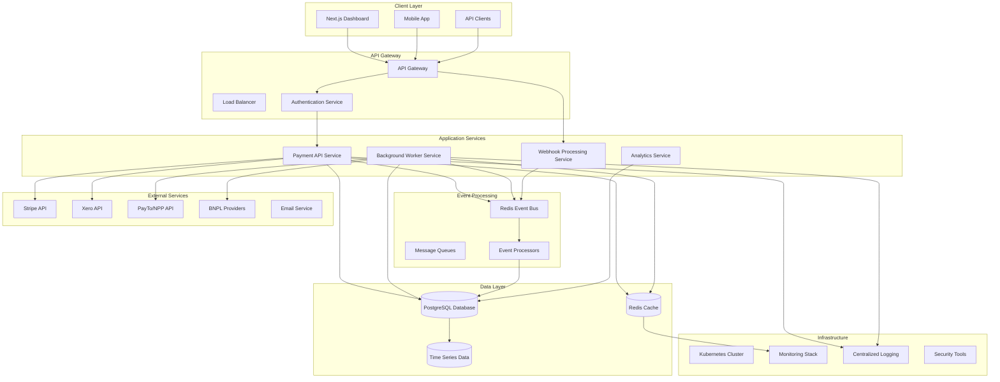
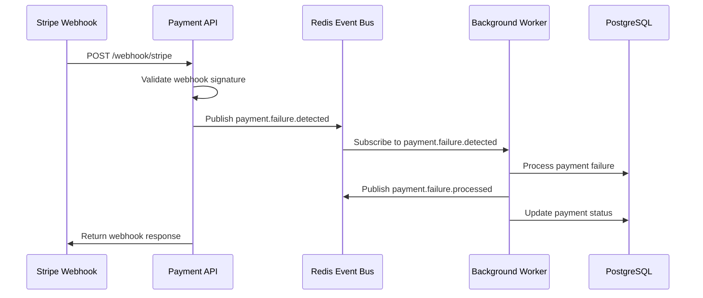

# Payment Watchdog - System Design Documentation

## 📋 Overview

Payment Watchdog is a microservices-based payment recovery platform designed for the Australian market. This document outlines the high-level system architecture, design principles, and key architectural decisions.

---

## 🎯 Architecture Principles

### **✅ Core Principles**
- **Microservices Architecture**: Loosely coupled, independently deployable services
- **Event-Driven Design**: Asynchronous communication via event bus
- **Domain-Driven Design**: Business logic separated from infrastructure
- **Sovereign Data Compliance**: Australian data residency requirements
- **Horizontal Scalability**: Designed for high-volume transaction processing
- **Fault Tolerance**: Graceful degradation and recovery mechanisms

### **🔒 Non-Functional Requirements**
- **Performance**: Sub-100ms API response times, 10k+ transactions/second
- **Reliability**: 99.9% uptime, graceful degradation
- **Security**: End-to-end encryption, compliance with Australian regulations
- **Observability**: Comprehensive monitoring, logging, and alerting
- **Maintainability**: Clean code, comprehensive test coverage

---

## 🏗️ High-Level Architecture

### **📐 System Architecture Diagram**



---

## 🚀 Service Architecture

### **📋 Service Breakdown**

#### **1. API Service (Payment API)**
**Responsibilities**:
- RESTful API endpoints for payment processing
- Webhook ingestion from payment providers
- Payment failure detection and processing
- Recovery workflow orchestration
- User authentication and authorization
- Real-time status updates

**Technology Stack**:
- **Language**: Go 1.24
- **Framework**: Gin HTTP Framework
- **Database**: PostgreSQL via GORM
- **Cache**: Redis for session management
- **Authentication**: JWT tokens

**Key Components**:
```go
type APIService struct {
    server         *gin.Engine
    db             *gorm.DB
    redis          *redis.Client
    eventBus       architecture.EventBus
    webhookService *services.WebhookService
    authService    *services.AuthService
    metricsService  *services.MetricsService
}
```

#### **2. Worker Service (Background Processing)**
**Responsibilities**:
- Event-driven background processing
- Payment recovery workflow execution
- Retry logic and failure handling
- Cost optimization for micro-transactions
- Cross-method reconciliation
- Distributed task coordination

**Technology Stack**:
- **Language**: Go 1.24
- **Framework**: Uber FX for dependency injection
- **Database**: PostgreSQL via GORM
- **Event Bus**: Redis for event streaming
- **Health Monitoring**: HTTP health endpoints

**Key Components**:
```go
type WorkerService struct {
    eventProcessor *services.EventProcessorService
    recoveryService *services.RecoveryOrchestrationService
    retryService    *services.RetryService
    analyticsService *services.AnalyticsService
    config         *config.Config
}
```

#### **3. Web Interface (Dashboard)**
**Responsibilities**:
- Real-time dashboard for payment metrics
- Recovery workflow monitoring
- Configuration management interface
- Analytics and reporting
- User management and permissions

**Technology Stack**:
- **Framework**: Next.js 14
- **Language**: TypeScript
- **Styling**: Tailwind CSS
- **State Management**: React Query
- **UI Components**: Custom component library

#### **4. Webhook Processing Service**
**Responsibilities**:
- Stripe webhook ingestion and validation
- Signature verification and security
- Event transformation and enrichment
- Rate limiting and throttling
- Dead letter queue management

#### **5. Analytics Service**
**Responsibilities**:
- Payment failure analytics and reporting
- Recovery success rate tracking
- Pattern detection and prediction
- Performance metrics collection
- Business intelligence dashboards

---

## 🔗 Event-Driven Architecture

### **📋 Event Flow Architecture**



### **🔄 Event Types**

#### **Payment Events**:
- `payment.failure.detected` - New payment failure detected
- `payment.failure.processed` - Failure processed through pipeline
- `payment.recovery.started` - Recovery workflow initiated
- `payment.recovery.completed` - Recovery workflow completed
- `payment.recovery.failed` - Recovery workflow failed

#### **System Events**:
- `system.health.check` - Health status updates
- `system.metrics.collected` - Performance metrics
- `system.alert.triggered` - Alert notifications

---

## 🗄 Data Architecture

### **📊 Database Schema Design**

#### **Core Entities**:
```sql
-- Payment Failures
CREATE TABLE payment_failures (
    id UUID PRIMARY KEY DEFAULT gen_random_uuid(),
    company_id UUID NOT NULL,
    provider_id VARCHAR(50) NOT NULL,
    provider_event_id VARCHAR(100) NOT NULL,
    amount_cents BIGINT NOT NULL,
    currency VARCHAR(3) NOT NULL DEFAULT 'AUD',
    customer_id VARCHAR(100),
    customer_name VARCHAR(255),
    failure_reason VARCHAR(50) NOT NULL,
    status VARCHAR(20) NOT NULL DEFAULT 'received',
    priority VARCHAR(20) NOT NULL DEFAULT 'medium',
    risk_score DECIMAL(5,2),
    occurred_at TIMESTAMP WITH TIME ZONE,
    detected_at TIMESTAMP WITH TIME ZONE DEFAULT NOW(),
    processed_at TIMESTAMP WITH TIME ZONE,
    created_at TIMESTAMP WITH TIME ZONE DEFAULT NOW(),
    updated_at TIMESTAMP WITH TIME ZONE DEFAULT NOW(),
    INDEX idx_company_id (company_id),
    INDEX idx_provider_id (provider_id),
    INDEX idx_status (status),
    INDEX idx_created_at (created_at)
);

-- Recovery Workflows
CREATE TABLE recovery_workflows (
    id UUID PRIMARY KEY DEFAULT gen_random_uuid(),
    company_id UUID NOT NULL,
    name VARCHAR(255) NOT NULL,
    description TEXT,
    priority VARCHAR(20) NOT NULL DEFAULT 'medium',
    is_active BOOLEAN DEFAULT true,
    created_at TIMESTAMP WITH TIME ZONE DEFAULT NOW(),
    updated_at TIMESTAMP WITH TIME ZONE DEFAULT NOW(),
    INDEX idx_company_id (company_id),
    INDEX idx_is_active (is_active)
);

-- Workflow Executions
CREATE TABLE recovery_workflow_executions (
    id UUID PRIMARY KEY DEFAULT gen_random_uuid(),
    workflow_id UUID NOT NULL,
    payment_failure_id UUID NOT NULL,
    company_id UUID NOT NULL,
    status VARCHAR(20) NOT NULL DEFAULT 'pending',
    current_step_index INTEGER DEFAULT 0,
    context JSONB,
    started_at TIMESTAMP WITH TIME ZONE,
    completed_at TIMESTAMP WITH TIME ZONE,
    created_at TIMESTAMP WITH TIME ZONE DEFAULT NOW(),
    updated_at TIMESTAMP WITH TIME ZONE DEFAULT NOW(),
    FOREIGN KEY (workflow_id) REFERENCES recovery_workflows(id),
    FOREIGN KEY (payment_failure_id) REFERENCES payment_failures(id),
    FOREIGN KEY (company_id) REFERENCES companies(id),
    INDEX idx_workflow_id (workflow_id),
    INDEX idx_payment_failure_id (payment_failure_id),
    INDEX idx_company_id (company_id),
    INDEX idx_status (status)
);
```

#### **Data Relationships**:
- **Companies** → **Payment Failures** (1:N)
- **Payment Failures** → **Recovery Executions** (1:N)
- **Workflows** → **Workflow Executions** (1:N)
- **Companies** → **Workflows** (1:N)

---

## 🔒 Security Architecture

### **🛡️ Security Layers**

#### **1. Network Security**
- **TLS/SSL** for all external communications
- **Network Segmentation** between services
- **Firewall Rules** for port restrictions
- **VPC Isolation** for Australian data residency

#### **2. Application Security**
- **JWT Authentication** for API access
- **RBAC Authorization** for permissions
- **Input Validation** and sanitization
- **SQL Injection Prevention** via GORM
- **Rate Limiting** and throttling

#### **3. Data Security**
- **Encryption at Rest** for sensitive data
- **Environment Variable Protection** for secrets
- **Audit Logging** for security events
- **Data Anonymization** for PII data

#### **4. Infrastructure Security**
- **Container Security** (non-root execution)
- **Image Scanning** (Trivy vulnerability scanning)
- **Secret Management** (HashiCorp Vault/AWS Secrets Manager)
- **Compliance Monitoring** (SOX, GDPR, Australian privacy laws)

---

## 🚀 Deployment Architecture

### **📦 Container Orchestration**

#### **Kubernetes Deployment**:
```yaml
apiVersion: apps/v1
kind: Deployment
metadata:
  name: payment-api-deployment
spec:
  replicas: 3
  selector:
    matchLabels:
      app: payment-api
  template:
    metadata:
      labels:
        app: payment-api
    spec:
      containers:
      - name: payment-api
        image: ghcr.io/payment-watchdog/api:latest
        ports:
        - containerPort: 8080
        env:
        - name: DATABASE_HOST
          valueFrom:
            secretKeyRef:
              name: database-secret
              key: host
        - name: DATABASE_PASSWORD
          valueFrom:
            secretKeyRef:
              name: database-secret
              key: password
        resources:
          requests:
            memory: "256Mi"
            cpu: "250m"
          limits:
            memory: "512Mi"
            cpu: "500m"
        livenessProbe:
          httpGet:
            path: /health
            port: 8080
          initialDelaySeconds: 30
          periodSeconds: 10
        readinessProbe:
          httpGet:
            path: /health/detailed
            port: 8080
          initialDelaySeconds: 5
          periodSeconds: 5
```

#### **Service Configuration**:
```yaml
apiVersion: v1
kind: Service
metadata:
  name: payment-api-service
spec:
  selector:
    app: payment-api
  ports:
  - port: 8080
    targetPort: 8080
  type: ClusterIP
```

#### **Ingress Configuration**:
```yaml
apiVersion: networking.k8s.io/v1
kind: Ingress
metadata:
  name: payment-api-ingress
spec:
  tls:
  - hosts:
    - api.payment-watchdog.com.au
    secretName: payment-api-tls
  rules:
  - host: api.payment-watchdog.com.au
    http:
      paths:
      - path: /
        backend:
          service:
            name: payment-api-service
            port:
              number: 8080
```

---

## 📊 Monitoring & Observability

### **🔍 Monitoring Stack**

#### **1. Application Monitoring**
- **Health Endpoints**: `/health`, `/health/detailed`, `/metrics`
- **Structured Logging**: Zap with JSON output
- **Performance Metrics**: Response times, throughput, error rates
- **Business Metrics**: Recovery rates, success rates, customer satisfaction

#### **2. Infrastructure Monitoring**
- **Kubernetes Monitoring**: Pod status, resource usage
- **Database Monitoring**: Connection pools, query performance
- **Redis Monitoring**: Memory usage, connection health
- **Network Monitoring**: Latency, throughput, error rates

#### **3. Security Monitoring**
- **Security Scanning**: CodeQL, Trivy, Gosec
- **Vulnerability Management**: Dependabot, security patches
- **Compliance Monitoring**: Data residency, privacy compliance
- **Audit Logging**: Security events, access logs

### **📈 Alerting Strategy**
- **Critical Alerts**: Service down, database connection failures
- **Warning Alerts**: High error rates, performance degradation
- **Info Alerts**: Deployments, configuration changes
- **Alert Channels**: Slack, email, SMS for critical issues

---

## 🔄 Scalability Architecture

### **📈 Horizontal Scaling**

#### **API Service Scaling**:
- **Pod Autoscaling**: Based on CPU/memory usage
- **HPA Autoscaling**: Based on custom metrics
- **Load Balancing**: Round-robin with health checks
- **Database Connection Pooling**: Optimize for high concurrency

#### **Worker Service Scaling**:
- **Partitioned Processing**: Sharded by company or region
- **Event Bus Scaling**: Redis clustering for high throughput
- **Task Queue Management**: Priority queues for critical events
- **Graceful Scaling**: No message loss during scaling events

#### **Database Scaling**:
- **Read Replicas**: Read scaling for analytics queries
- **Connection Pooling**: Optimized for high concurrency
- **Database Partitioning**: Partitioned by company for large datasets
- **Caching Strategy**: Redis caching for frequently accessed data

---

## 🎯 Technology Decisions

### **📋 Key Architectural Decisions (ADRs)**

#### **ADR-001: Microservices Architecture**
**Status**: Accepted  
**Date**: 2025-03-24  
**Context**: Decision to use microservices vs monolithic architecture

**Decision**: Adopt microservices architecture
**Rationale**:
- Independent scaling of services
- Technology diversity (Go for backend, Next.js for frontend)
- Fault isolation between services
- Team autonomy and parallel development

**Consequences**:
- Increased operational complexity
- Network latency between services
- Distributed transaction management
- Service discovery and configuration complexity

#### **ADR-002: Event-Driven Architecture**
**Status**: Accepted  
**Date**: 2025-03-24  
**Context**: Decision to use event-driven architecture for inter-service communication

**Decision**: Adopt event-driven architecture with Redis event bus
**Rationale**:
- Loose coupling between services
- Asynchronous processing capabilities
- Better scalability and resilience
- Audit trail of all system events

**Consequences**:
- Eventual consistency instead of immediate consistency
- Event ordering and duplication challenges
- Complex event debugging
- Need for event versioning and compatibility

#### **ADR-003: Database Technology Selection**
**Status**: Accepted  
**Date**: 2025-03-24  
**Context**: Database technology selection for payment processing

**Decision**: Use PostgreSQL with GORM ORM
**Rationale**:
- ACID compliance for financial transactions
- Strong JSON support for event data
- Mature ecosystem and tooling
- Good performance for transactional workloads
- Australian data residency compliance

**Consequences**:
- Vendor lock-in to PostgreSQL
- Migration complexity if database change needed
- Performance tuning required for high volume
- Licensing costs for enterprise features

#### **ADR-004: Sovereign Data Compliance**
**Status**: Accepted  
**Date**: 2025-03-24  
**Context**: Australian data residency requirements

**Decision**: Implement sovereign data compliance with AU-based infrastructure
**Rationale**:
- Australian privacy law requirements
- Customer trust and market positioning
- Regulatory compliance for financial data
- Competitive advantage in Australian market

**Consequences**:
- Increased infrastructure complexity
- Limited cloud provider options
- Higher operational costs
- Geographic latency considerations

---

## 🚀 Evolution Roadmap

### **📅 Phase 1: Foundation (Current - Q1 2025)**
- **Basic Payment Processing**: Stripe webhook integration
- **Simple Retry Logic**: Basic retry mechanisms
- **Fundamental Analytics**: Basic reporting and metrics
- **Worker Keep-Alive**: Stable background processing

### **📅 Phase 2: AU/NZ Specialization (Q2-Q3 2025)**
- **PayTo Integration**: NPP/PayTo rail integration
- **Cross-Method Reconciliation**: Xero integration
- **Micro-Transaction Optimization**: Cost-aware routing
- **Sovereign Data Compliance**: AU-based infrastructure

### **📅 Phase 3: Vertical Intelligence (Q4 2025 - Q2 2026)**
- **Gig Economy Specialization**: Income pattern analysis
- **Education Sector Focus**: Term-aware dunning
- **BNPL Integration**: Alternative payment methods
- **Healthcare Compliance**: Medicare integration

### **📅 Phase 4: Enterprise Platform (Q3-Q4 2026)**
- **Visual Workflow Builder**: No-code workflow creation
- **AI-Powered Analytics**: Machine learning predictions
- **Multi-Tenant Architecture**: Enterprise-scale platform
- **Advanced Security**: Enterprise security features

---

## 🎯 Conclusion

### **✅ Architecture Strengths**:
- **Microservices Design**: Scalable and maintainable
- **Event-Driven Architecture**: Flexible and resilient
- **Australian Market Focus**: Sovereign compliance and local integration
- **Modern Technology Stack**: Current and well-supported
- **Comprehensive Monitoring**: Full observability stack

### **🔥 Key Challenges**:
- **Event-Driven Complexity**: Managing eventual consistency
- **Microservices Coordination**: Service discovery and configuration
- **Australian Compliance**: Data residency and regulatory requirements
- **Performance Optimization**: High-volume transaction processing
- **Security Compliance**: Financial industry requirements

### **🚀 Strategic Position**:
Payment Watchdog is architecturally sound for Australian market domination through:
- **Local Payment Integration**: NPP/PayTo rail integration
- **Micro-Merchant Focus**: Specialized for small businesses
- **Sovereign Compliance**: Australian data residency
- **Intelligent Recovery**: AI-powered optimization
- **Enterprise Scalability**: Multi-tenant architecture

---

## 📞 Documentation Maintenance

### **🔄 Review Process**:
- **Quarterly**: Architecture review and updates
- **Major Changes**: ADR documentation and review
- **Technology Changes**: Architecture impact assessment
- **Security Updates**: Security architecture review

### **📋 Update Triggers**:
- **New Features**: Architecture impact assessment
- **Performance Issues**: Architecture optimization
- **Security Changes**: Security architecture updates
- **Market Changes**: Strategic alignment reviews

---

## 📚 Contact Information

### **👥 Architecture Team**:
- **Platform Architect**: System design and technology decisions
- **Feature Architect**: Feature architecture and integration
- **Security Architect**: Security architecture and compliance
- **DevOps Architect**: Deployment and infrastructure

### **📧 Documentation Updates**:
- **Changes**: Submit PRs to update documentation
- **Questions**: Create issues for clarification
- **Discussions**: Use architecture review meetings
- **Decisions**: Document in ADRs

---

## 🎯 Last Updated**
- **Date**: 2025-03-24
- **Version**: 2.0
- **Author**: Platform Architecture Team
- **Review**: Architecture Committee

---

**🚨 This document serves as the authoritative source for Payment Watchdog system architecture and design decisions.**
