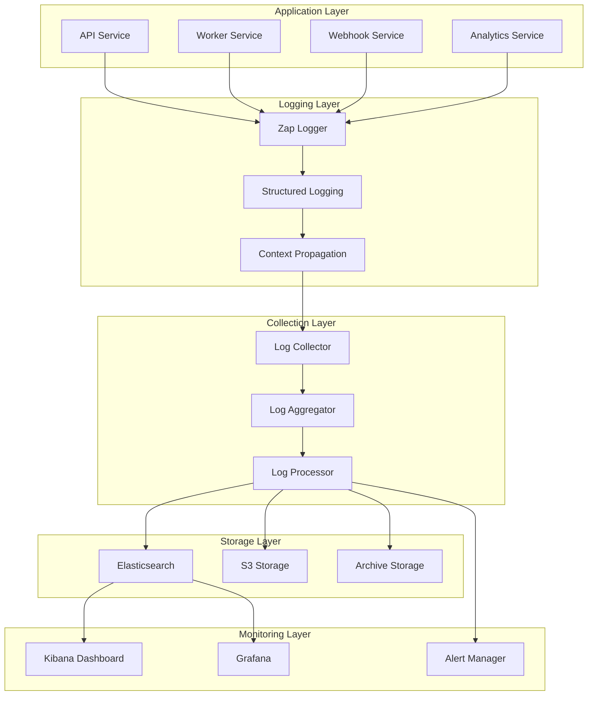

# Payment Watchdog - Logging Guidelines

## 📋 Overview

This document establishes comprehensive logging standards and practices for the Payment Watchdog platform, ensuring consistent, secure, and effective logging across all services and components.

---

## 🎯 Logging Principles

### **✅ Core Principles**
- **Structured Logging**: Use structured JSON format for all logs
- **Consistent Format**: Standardized log format across all services
- **Security First**: No sensitive data in logs
- **Performance Impact**: Minimal performance overhead
- **Operational Excellence**: Logs should be actionable and searchable
- **Compliance Ready**: Audit trail for regulatory requirements

### **🔒 Security Considerations**
- **No PII**: Never log personally identifiable information
- **No Secrets**: Never log passwords, API keys, or tokens
- **Data Masking**: Mask sensitive data in logs
- **Secure Storage**: Secure log storage and retention
- **Access Control**: Restricted access to logs
- **Audit Trail**: Complete audit trail for security events

---

## 📊 Logging Architecture

### **🏗️ Logging Stack**



### **📋 Log Levels**

| Level | Usage | Description | Examples |
|-------|--------|-------------|----------|
| **DEBUG** | Development | Detailed debugging information | Function calls, variable values |
| **INFO** | Production | General operational information | Service start, user actions |
| **WARN** | Production | Warning conditions | Configuration issues, deprecated usage |
| **ERROR** | Production | Error conditions | Failed operations, exceptions |
| **FATAL** | Production | Critical errors causing service failure | Service shutdown, database connection loss |

---

## 🛠️ Implementation Guidelines

### **📝 Structured Logging Format**

#### **Standard Log Structure**
```json
{
  "timestamp": "2025-03-24T23:30:00.000Z",
  "level": "info",
  "service": "payment-api",
  "version": "2.0.0",
  "environment": "production",
  "region": "au-east-1",
  "instance_id": "i-1234567890abcdef0",
  "request_id": "req_1234567890",
  "trace_id": "trace_1234567890",
  "span_id": "span_1234567890",
  "user_id": "user_1234567890",
  "company_id": "company_1234567890",
  "component": "webhook_processor",
  "message": "Payment failure processed successfully",
  "fields": {
    "payment_failure_id": "550e8400-e29b-41d4-a716-446655440000",
    "provider": "stripe",
    "amount_cents": 250000,
    "currency": "AUD",
    "processing_time_ms": 125,
    "retry_count": 2,
    "recovery_method": "payto"
  },
  "error": null
}
```

#### **Error Log Structure**
```json
{
  "timestamp": "2025-03-24T23:30:00.000Z",
  "level": "error",
  "service": "payment-worker",
  "version": "2.0.0",
  "environment": "production",
  "region": "au-east-1",
  "instance_id": "i-1234567890abcdef0",
  "request_id": "req_1234567890",
  "trace_id": "trace_1234567890",
  "span_id": "span_1234567890",
  "user_id": "user_1234567890",
  "company_id": "company_1234567890",
  "component": "recovery_service",
  "message": "Failed to process PayTo request",
  "fields": {
    "payment_failure_id": "550e8400-e29b-41d4-a716-446655440000",
    "provider": "payto",
    "attempt_count": 3,
    "error_code": "PAYTO_TIMEOUT",
    "processing_time_ms": 5000
  },
  "error": {
    "type": "timeout_error",
    "message": "PayTo API timeout after 5 seconds",
    "stack_trace": "github.com/payment-watchdog/api/internal/services.(*RecoveryService).ProcessPayToRequest",
    "cause": {
      "type": "network_error",
      "message": "Connection timeout"
    }
  }
}
```

### **🔧 Logger Configuration**

#### **Development Configuration**
```go
// Development logger configuration
config := zap.NewDevelopmentConfig()
config.Level = zap.NewAtomicLevelAt(zap.DebugLevel)
config.OutputPaths = []string{"stdout"}
config.EncoderConfig = zapcore.EncoderConfig{
  TimeKey:        "timestamp",
  LevelKey:       "level",
  NameKey:        "logger",
  CallerKey:      "caller",
  MessageKey:     "message",
  StacktraceKey:  "stacktrace",
  EncodeLevel:    zapcore.LowercaseLevelEncoder,
  EncodeTime:     zapcore.ISO8601TimeEncoder,
  EncodeDuration: zapcore.StringDurationEncoder,
  EncodeCaller:   zapcore.ShortCallerEncoder,
}

logger, err := config.Build()
if err != nil {
  log.Fatalf("Failed to build logger: %v", err)
}
```

#### **Production Configuration**
```go
// Production logger configuration
config := zap.NewProductionConfig()
config.Level = zap.NewAtomicLevelAt(zap.InfoLevel)
config.OutputPaths = []string{"stdout", "/var/log/payment-watchdog/app.log"}
config.EncoderConfig = zapcore.EncoderConfig{
  TimeKey:        "timestamp",
  LevelKey:       "level",
  NameKey:        "service",
  MessageKey:     "message",
  StacktraceKey:  "stacktrace",
  EncodeLevel:    zapcore.LowercaseLevelEncoder,
  EncodeTime:     zapcore.EpochTimeEncoder,
  EncodeDuration: zapcore.SecondsDurationEncoder,
  EncodeCaller:   zapcore.ShortCallerEncoder,
}

logger, err := config.Build()
if err != nil {
  log.Fatalf("Failed to build logger: %v", err)
}
```

### **📋 Context Propagation**

#### **Request Context**
```go
type RequestContext struct {
    RequestID    string `json:"request_id"`
    TraceID      string `json:"trace_id"`
    SpanID       string `json:"span_id"`
    UserID       string `json:"user_id"`
    CompanyID    string `json:"company_id"`
    IPAddress    string `json:"ip_address"`
    UserAgent    string `json:"user_agent"`
}

func (r *RequestContext) ToZapFields() []zap.Field {
    return []zap.Field{
        zap.String("request_id", r.RequestID),
        zap.String("trace_id", r.TraceID),
        zap.String("span_id", r.SpanID),
        zap.String("user_id", r.UserID),
        zap.String("company_id", r.CompanyID),
        zap.String("ip_address", r.IPAddress),
        zap.String("user_agent", r.UserAgent),
    }
}
```

#### **Service Context**
```go
type ServiceContext struct {
    Service     string `json:"service"`
    Version     string `json:"version"`
    Environment string `json:"environment"`
    Region      string `json:"region"`
    InstanceID  string `json:"instance_id"`
    Component   string `json:"component"`
}

func (s *ServiceContext) ToZapFields() []zap.Field {
    return []zap.Field{
        zap.String("service", s.Service),
        zap.String("version", s.Version),
        zap.String("environment", s.Environment),
        zap.String("region", s.Region),
        zap.String("instance_id", s.InstanceID),
        zap.String("component", s.Component),
    }
}
```

---

## 📝 Logging Standards

### **🔍 Service Logging**

#### **API Service Logging**
```go
// API service logging example
func (h *WebhookHandler) ProcessWebhook(ctx context.Context, req *WebhookRequest) error {
    startTime := time.Now()
    
    // Log request start
    h.logger.Info("Processing webhook request",
        zap.String("provider", req.Provider),
        zap.String("event_type", req.EventType),
        zap.String("webhook_id", req.ID),
        zap.String("ip_address", req.IPAddress),
        zap.String("user_agent", req.UserAgent),
    )
    
    // Process webhook
    result, err := h.processor.Process(ctx, req)
    if err != nil {
        h.logger.Error("Failed to process webhook",
            zap.String("webhook_id", req.ID),
            zap.String("error", err.Error()),
            zap.Duration("processing_time", time.Since(startTime)),
            zap.String("provider", req.Provider),
        )
        return fmt.Errorf("webhook processing failed: %w", err)
    }
    
    // Log successful processing
    h.logger.Info("Webhook processed successfully",
        zap.String("webhook_id", req.ID),
        zap.String("provider", req.Provider),
        zap.String("event_type", req.EventType),
        zap.Duration("processing_time", time.Since(startTime)),
        zap.String("payment_failure_id", result.PaymentFailureID),
    )
    
    return nil
}
```

#### **Worker Service Logging**
```go
// Worker service logging example
func (w *WorkerService) ProcessPaymentFailure(ctx context.Context, failure *PaymentFailure) error {
    startTime := time.Now()
    
    // Log processing start
    w.logger.Info("Starting payment failure processing",
        zap.String("payment_failure_id", failure.ID.String()),
        zap.String("provider", failure.ProviderID),
        zap.Int64("amount_cents", failure.AmountCents),
        zap.String("currency", failure.Currency),
        zap.String("failure_reason", failure.FailureReason),
    )
    
    // Process payment failure
    result, err := w.processor.Process(ctx, failure)
    if err != nil {
        w.logger.Error("Failed to process payment failure",
            zap.String("payment_failure_id", failure.ID.String()),
            zap.String("error", err.Error()),
            zap.Duration("processing_time", time.Since(startTime)),
            zap.String("provider", failure.ProviderID),
        )
        return fmt.Errorf("payment failure processing failed: %w", err)
    }
    
    // Log successful processing
    w.logger.Info("Payment failure processed successfully",
        zap.String("payment_failure_id", failure.ID.String()),
        zap.String("provider", failure.ProviderID),
        zap.String("recovery_method", result.RecoveryMethod),
        zap.Duration("processing_time", time.Since(startTime)),
        zap.Bool("recovered", result.Recovered),
    )
    
    return nil
}
```

### **🔍 Security Logging**

#### **Authentication Logging**
```go
// Authentication logging example
func (a *AuthService) AuthenticateUser(ctx context.Context, req *AuthRequest) (*AuthResult, error) {
    // Log authentication attempt
    a.logger.Info("Authentication attempt",
        zap.String("email", maskEmail(req.Email)),
        zap.String("ip_address", req.IPAddress),
        zap.String("user_agent", req.UserAgent),
        zap.String("method", req.Method),
    )
    
    // Authenticate user
    result, err := a.authenticator.Authenticate(ctx, req)
    if err != nil {
        a.logger.Error("Authentication failed",
            zap.String("email", maskEmail(req.Email)),
            zap.String("ip_address", req.IPAddress),
            zap.String("error", err.Error()),
            zap.String("reason", getAuthFailureReason(err)),
        )
        return nil, fmt.Errorf("authentication failed: %w", err)
    }
    
    // Log successful authentication
    a.logger.Info("Authentication successful",
        zap.String("user_id", result.UserID),
        zap.String("email", maskEmail(req.Email)),
        zap.String("ip_address", req.IPAddress),
        zap.String("method", req.Method),
        zap.String("session_id", result.SessionID),
    )
    
    return result, nil
}

// Helper function to mask email addresses
func maskEmail(email string) string {
    if len(email) < 4 {
        return "****"
    }
    
    parts := strings.Split(email, "@")
    if len(parts) != 2 {
        return "****"
    }
    
    username := parts[0]
    domain := parts[1]
    
    if len(username) <= 2 {
        return "****@" + domain
    }
    
    masked := username[:2] + "****@" + domain
    return masked
}
```

#### **Security Event Logging**
```go
// Security event logging example
func (s *SecurityService) LogSecurityEvent(ctx context.Context, event *SecurityEvent) {
    s.logger.Info("Security event",
        zap.String("event_type", event.Type),
        zap.String("severity", event.Severity),
        zap.String("user_id", event.UserID),
        zap.String("ip_address", event.IPAddress),
        zap.String("description", event.Description),
        zap.String("resource", event.Resource),
        zap.String("action", event.Action),
        zap.Bool("success", event.Success),
        zap.String("error_code", event.ErrorCode),
    )
    
    // For critical security events, also send to alerting system
    if event.Severity == "critical" {
        s.alertManager.SendSecurityAlert(ctx, event)
    }
}
```

### **🔍 Performance Logging**

#### **Performance Metrics Logging**
```go
// Performance logging example
func (p *PerformanceService) LogPerformanceMetrics(ctx context.Context, metrics *PerformanceMetrics) {
    p.logger.Info("Performance metrics",
        zap.String("service", metrics.Service),
        zap.String("endpoint", metrics.Endpoint),
        zap.Float64("response_time_ms", metrics.ResponseTime.Seconds()*1000),
        zap.Int("request_count", metrics.RequestCount),
        zap.Float64("error_rate", metrics.ErrorRate),
        zap.Float64("throughput_rps", metrics.ThroughputRPS),
        zap.Float64("cpu_usage_percent", metrics.CPUUsagePercent),
        zap.Float64("memory_usage_mb", metrics.MemoryUsageMB),
        zap.Int("active_connections", metrics.ActiveConnections),
    )
}
```

---

## 🔒 Data Masking Guidelines

### **🛡️ Sensitive Data Handling**

#### **PII Data Masking**
```go
// PII data masking functions
func maskCreditCard(cardNumber string) string {
    if len(cardNumber) <= 4 {
        return "****"
    }
    return "****-****-****-" + cardNumber[len(cardNumber)-4:]
}

func maskBankAccount(accountNumber string) string {
    if len(accountNumber) <= 4 {
        return "****"
    }
    return "****" + accountNumber[len(accountNumber)-4:]
}

func maskPhoneNumber(phoneNumber string) string {
    if len(phoneNumber) <= 4 {
        return "****"
    }
    return phoneNumber[:3] + "****" + phoneNumber[len(phoneNumber)-4:]
}

func maskEmail(email string) string {
    parts := strings.Split(email, "@")
    if len(parts) != 2 {
        return "****"
    }
    
    username := parts[0]
    domain := parts[1]
    
    if len(username) <= 2 {
        return "****@" + domain
    }
    
    return username[:2] + "****@" + domain
}
```

#### **Secret Data Handling**
```go
// Secret data handling
type SecretData struct {
    APIKey      string `json:"api_key"`
    Password    string `json:"password"`
    Token       string `json:"token"`
    Secret      string `json:"secret"`
}

func (s *SecretData) MarshalJSON() ([]byte, error) {
    // Create a copy for logging
    copy := *s
    copy.APIKey = "****"
    copy.Password = "****"
    copy.Token = "****"
    copy.Secret = "****"
    
    return json.Marshal(copy)
}
```

---

## 📊 Log Retention and Archival

### **📋 Retention Policy**

| Log Type | Retention Period | Archive Location | Access Level |
|----------|------------------|------------------|------------|
| **Application Logs** | 30 days | S3 Glacier | Admin |
| **Security Logs** | 1 year | S3 Standard | Security Team |
| **Audit Logs** | 7 years | S3 Glacier | Compliance Team |
| **Performance Logs** | 90 days | S3 Standard | DevOps Team |
| **Error Logs** | 1 year | S3 Standard | DevOps Team |

### **🔄 Log Rotation**

#### **Logrotate Configuration**
```bash
# /etc/logrotate.d/payment-watchdog
/var/log/payment-watchdog/*.log {
    daily
    missingok
    rotate 30
    compress
    delaycompress
    notifempty
    create 644 payment-watchdog payment-watchdog
    postrotate
        /bin/kill -USR1 $(cat /var/run/payment-watchdog.pid)
    endscript
}
```

#### **Docker Log Configuration**
```yaml
# docker-compose.yml logging configuration
logging:
  driver: "json-file"
  options:
    max-size: "100m"
    max-file: "3"
    labels: "service,payment-watchdog"
```

---

## 🔍 Monitoring and Alerting

### **📊 Log Monitoring**

#### **Log Metrics**
```go
// Log metrics collection
type LogMetrics struct {
    TotalLogs       int64 `json:"total_logs"`
    ErrorLogs       int64 `json:"error_logs"`
    WarningLogs     int64 `json:"warning_logs"`
    InfoLogs        int64 `json:"info_logs"`
    DebugLogs       int64 `json:"debug_logs"`
    LogsPerSecond   float64 `json:"logs_per_second"`
    AverageLogSize  float64 `json:"average_log_size_bytes"`
}

func (l *LogMetrics) Collect() *LogMetrics {
    // Collect log metrics
    return &LogMetrics{
        TotalLogs:      l.getTotalLogs(),
        ErrorLogs:      l.getErrorLogs(),
        WarningLogs:    l.getWarningLogs(),
        InfoLogs:       l.getInfoLogs(),
        DebugLogs:      l.getDebugLogs(),
        LogsPerSecond:  l.getLogsPerSecond(),
        AverageLogSize: l.getAverageLogSize(),
    }
}
```

#### **Alerting Rules**
```yaml
# alerting rules for logs
groups:
  - name: logging_alerts
    rules:
      - alert: HighErrorRate
        expr: rate(error_logs_total[5m]) > 10
        for: 5m
        labels:
          severity: warning
          service: payment-watchdog
        annotations:
          summary: "High error rate detected"
          description: "Error rate is {{ $value }} errors per second"

      - alert: CriticalErrorDetected
        expr: error_logs_total{level="fatal"} > 0
        for: 0m
        labels:
          severity: critical
          service: payment-watchdog
        annotations:
          summary: "Critical error detected"
          description: "Fatal error occurred: {{ $query }}"

      - alert: ServiceDown
        expr: up{service="payment-watchdog"} == 0
        for: 1m
        labels:
          severity: critical
          service: payment-watchdog
        annotations:
          summary: "Service is down"
          description: "Payment Watchdog service is not responding"
```

---

## 🧪 Testing and Validation

### **📋 Logging Tests**

#### **Unit Tests**
```go
func TestLoggingFormat(t *testing.T) {
    // Test logging format
    logger := zap.NewExample()
    
    logger.Info("Test message",
        zap.String("key1", "value1"),
        zap.Int("key2", 42),
    )
    
    // Validate log format
    // Implementation depends on your testing framework
}
```

#### **Integration Tests**
```go
func TestLogAggregation(t *testing.T) {
    // Test log aggregation
    logger := zap.NewProduction()
    
    // Generate test logs
    for i := 0; i < 100; i++ {
        logger.Info("Test message",
            zap.Int("iteration", i),
            zap.String("test", "integration"),
        )
    }
    
    // Validate aggregation
    // Implementation depends on your testing framework
}
```

### **🔍 Log Validation**

#### **Log Format Validation**
```bash
# Validate log format
curl -s http://localhost:8080/health | jq .
```

#### **Log Volume Validation**
```bash
# Check log volume
docker logs payment-watchdog-api | wc -l
```

#### **Log Content Validation**
```bash
# Check for sensitive data
docker logs payment-watchdog-api | grep -i "password\|secret\|token" || echo "No sensitive data found"
```

---

## 📚 Best Practices

### **✅ Do's**
- Use structured logging with consistent field names
- Include context information (request_id, user_id, etc.)
- Use appropriate log levels
- Mask sensitive data
- Log errors with full context and stack traces
- Monitor log volume and performance
- Regular log rotation and archival
- Test logging in development

### **❌ Don'ts**
- Don't log sensitive information (passwords, tokens, PII)
- Don't use string concatenation for log messages
- Don't log at DEBUG level in production
- Don't ignore error logs
- Don't create log storms
- Don't store logs indefinitely
- Don't use different logging formats
- Don't forget to handle logger errors

---

## 🔄 Maintenance

### **📋 Regular Tasks**
- **Daily**: Monitor log volume and performance
- **Weekly**: Review error patterns and trends
- **Monthly**: Check log retention compliance
- **Quarterly**: Review logging strategy and tools
- **Annually**: Audit logging practices and policies

### **🔧 Maintenance Tools**
- **Log Analysis**: ELK stack, Splunk, Datadog
- **Log Monitoring**: Grafana dashboards, Prometheus
- **Log Testing**: Log testing frameworks
- **Log Validation**: Log validation tools
- **Log Security**: Log security scanners

---

## 📞 Contact Information

### **👥 Logging Team**:
- **Platform Engineer**: Logging infrastructure and monitoring
- **Security Engineer**: Log security and compliance
- **DevOps Engineer**: Log deployment and maintenance
- **Application Engineer**: Logging implementation and best practices

### **📧 Documentation Updates**:
- **Changes**: Submit PRs to update logging guidelines
- **Issues**: Create issues for logging problems
- **Discussions**: Use logging review meetings
- **Decisions**: Document logging architecture decisions

---

## 🎯 Last Updated
- **Date**: 2025-03-24
- **Version**: 2.0.0
- **Author**: Security Architecture Team
- **Review**: Logging Committee

---

**🚨 This document serves as the authoritative source for Payment Watchdog logging guidelines and best practices.**
