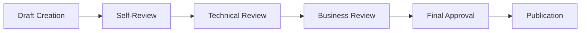
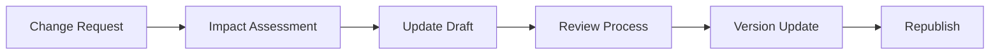

# Payment Watchdog - Documentation Review Process

## 📋 Overview

This document establishes the review process for all Payment Watchdog documentation, ensuring quality, accuracy, and consistency across all documentation materials.

---

## 🎯 Review Objectives

### **✅ Quality Assurance**
- **Accuracy**: Ensure all information is accurate and up-to-date
- **Clarity**: Verify content is clear, concise, and understandable
- **Completeness**: Ensure comprehensive coverage of topics
- **Consistency**: Maintain consistent formatting and structure
- **Relevance**: Ensure content is relevant to the target audience

### **🔒 Security and Compliance**
- **Security Review**: Verify no sensitive information is exposed
- **Compliance Check**: Ensure regulatory compliance requirements
- **Data Protection**: Verify proper data handling documentation
- **Access Control**: Review access and authorization documentation

### **🏗️ Architecture Alignment**
- **Technical Accuracy**: Verify technical implementation details
- **Architecture Consistency**: Ensure alignment with system architecture
- **Implementation Status**: Verify implementation status accuracy
- **Integration Points**: Review integration documentation

---

## 📊 Review Process

### **🔄 Documentation Lifecycle**

#### **1. Creation Phase**


**Steps:**
1. **Draft Creation**: Author creates initial draft
2. **Self-Review**: Author reviews and refines draft
3. **Technical Review**: Technical team reviews for accuracy
4. **Business Review**: Business stakeholders review for relevance
5. **Final Approval**: Architecture committee gives final approval
6. **Publication**: Document published to repository

#### **2. Maintenance Phase**


**Steps:**
1. **Change Request**: Documentation update requested
2. **Impact Assessment**: Evaluate impact and scope
3. **Update Draft**: Author updates documentation
4. **Review Process**: Full review process for major changes
5. **Version Update**: Update version number and dates
6. **Republish**: Publish updated documentation

### **📋 Review Types**

#### **🔧 Technical Review**
- **Reviewers**: Platform Architect, Security Architect, Feature Architect
- **Focus**: Technical accuracy, implementation details, architecture alignment
- **Timeline**: 3-5 business days
- **Approval**: Technical approval required

#### **📊 Business Review**
- **Reviewers**: Product Manager, Business Analyst, Stakeholders
- **Focus**: Business requirements, user stories, market alignment
- **Timeline**: 2-3 business days
- **Approval**: Business approval required

#### **🔒 Security Review**
- **Reviewers**: Security Architect, Compliance Officer
- **Focus**: Security policies, compliance requirements, data protection
- **Timeline**: 2-3 business days
- **Approval**: Security approval required

#### **📝 Quality Review**
- **Reviewers**: Technical Writer, Documentation Team
- **Focus**: Formatting, clarity, consistency, completeness
- **Timeline**: 1-2 business days
- **Approval**: Quality approval required

---

## 👥 Review Roles and Responsibilities

### **🏗️ Platform Architect**
**Responsibilities:**
- Review system architecture documentation
- Verify technical implementation details
- Ensure alignment with platform strategy
- Approve technical architecture changes

**Review Scope:**
- [📐 SYSTEM_DESIGN.md](ARCHITECTURE/SYSTEM_DESIGN.md)
- [🔌 API_SPECIFICATION.md](ARCHITECTURE/API_SPECIFICATION.md)
- [🏢 PLATFORM_BACKLOG.md](../PLATFORM_BACKLOG.md)
- Technical sections of other documents

### **📊 Feature Architect**
**Responsibilities:**
- Review business requirements and user stories
- Verify feature specifications and acceptance criteria
- Ensure alignment with product strategy
- Approve feature documentation changes

**Review Scope:**
- [📋 BUSINESS_REQUIREMENTS.md](STRATEGIC/BUSINESS_REQUIREMENTS.md)
- [🎯 FEATURE_BACKLOG.md](../FEATURE_BACKLOG.md)
- [📊 FUTURE_STATE.md](../FUTURE_STATE.md)
- Feature-related sections of other documents

### **🔒 Security Architect**
**Responsibilities:**
- Review security policies and procedures
- Verify compliance requirements
- Ensure data protection standards
- Approve security documentation changes

**Review Scope:**
- [🔒 SECURITY.md](../SECURITY.md)
- [📝 LOGGING_GUIDELINES.md](OPERATIONS/LOGGING_GUIDELINES.md)
- Security sections of all documents
- Compliance and data protection documentation

### **📝 Technical Writer**
**Responsibilities:**
- Review documentation quality and clarity
- Ensure consistent formatting and structure
- Verify completeness and accessibility
- Maintain documentation standards

**Review Scope:**
- All documentation materials
- Formatting and structure consistency
- Language and clarity
- Navigation and indexing

---

## 📋 Review Checklist

### **🔧 Technical Review Checklist**

#### **Architecture Documents**
- [ ] System architecture is accurately described
- [ ] Service interactions are correctly documented
- [ ] Data models and relationships are accurate
- [ ] Implementation status is current
- [ ] Technology choices are justified
- [ ] Scalability considerations are addressed
- [ ] Security architecture is documented

#### **API Documentation**
- [ ] All endpoints are documented
- [ ] Request/response formats are accurate
- [ ] Authentication methods are documented
- [ ] Error handling is documented
- [ ] Examples are correct and functional
- [ ] Rate limiting information is included
- [ ] Versioning strategy is documented

#### **Business Requirements**
- [ ] User personas are accurate
- [ ] User stories are well-formed
- [ ] Acceptance criteria are testable
- [ ] Business value is clear
- [ ] Priority levels are appropriate
- [ ] Dependencies are identified
- [ ] Success metrics are defined

### **🔒 Security Review Checklist**

#### **Security Documentation**
- [ ] Security policies are comprehensive
- [ ] Compliance requirements are met
- [ ] Data protection measures are documented
- [ ] Access controls are specified
- [ ] Incident response procedures are documented
- [ ] Security monitoring is described
- [ ] Vulnerability management is documented

#### **Data Protection**
- [ ] PII handling is properly documented
- [ ] Data encryption methods are specified
- [ ] Data retention policies are documented
- [ ] Data deletion procedures are documented
- [ ] Data access controls are described
- [ ] Audit logging requirements are met
- [ ] Privacy compliance is addressed

### **📝 Quality Review Checklist**

#### **Documentation Quality**
- [ ] Content is accurate and up-to-date
- [ ] Language is clear and concise
- [ ] Structure is logical and organized
- [ ] Formatting is consistent
- [ ] Links are functional and relevant
- [ ] Examples are helpful and correct
- [ ] Tables and diagrams are clear

#### **Navigation and Accessibility**
- [ ] Table of contents is comprehensive
- [ ] Cross-references are accurate
- [ ] Search functionality is effective
- [ ] Document index is current
- [ ] Navigation is intuitive
- [ ] Accessibility standards are met
- [ ] Mobile-friendly formatting

---

## 🔄 Review Workflow

### **📋 Review Request Process**

#### **1. Submit Review Request**
```bash
# Create review request issue
gh issue create \
  --title "Documentation Review: [Document Name]" \
  --body "Document: [Link to document]
Type: [Technical/Business/Security/Quality]
Reviewer: [Assigned reviewer]
Deadline: [Review deadline]
Changes: [Description of changes]
Priority: [High/Medium/Low]"
```

#### **2. Review Assignment**
- **Automatic**: Based on document type and content
- **Manual**: Manual assignment for complex reviews
- **Escalation**: Escalate for urgent or critical reviews

#### **3. Review Execution**
- **Initial Review**: First pass review and feedback
- **Author Response**: Author addresses feedback
- **Follow-up Review**: Review of changes and updates
- **Final Approval**: Final review and approval

#### **4. Review Completion**
- **Approval**: Document approved and published
- **Rejection**: Document rejected with feedback
- **Conditional**: Conditional approval with requirements

### **📊 Review Tracking**

#### **Review Status Tracking**
| Status | Description | Next Action |
|--------|-------------|-------------|
| **Requested** | Review requested | Assign reviewer |
| **In Progress** | Review in progress | Complete review |
| **Feedback** | Feedback provided | Author responds |
| **Revised** | Document revised | Follow-up review |
| **Approved** | Document approved | Publish document |
| **Rejected** | Document rejected | Address issues |

#### **Review Metrics**
- **Review Time**: Average time to complete reviews
- **Review Quality**: Quality of review feedback
- **Approval Rate**: Percentage of documents approved
- **Revision Count**: Number of revisions required
- **Review Backlog**: Number of pending reviews

---

## 📅 Review Schedule

### **🔄 Regular Reviews**

#### **Weekly Reviews**
- **Implementation Status**: Update implementation status tables
- **Quick Updates**: Minor documentation updates
- **Bug Fixes**: Fix documentation errors and typos
- **Link Updates**: Update broken links and references

#### **Monthly Reviews**
- **Strategic Documents**: Review business requirements and roadmap
- **Architecture Updates**: Review system architecture changes
- **Security Updates**: Review security policies and procedures
- **Quality Metrics**: Review documentation quality metrics

#### **Quarterly Reviews**
- **Comprehensive Audit**: Complete documentation audit
- **Standards Review**: Review and update documentation standards
- **Process Improvement**: Review and improve review process
- **Training**: Documentation team training and updates

#### **Annual Reviews**
- **Strategic Alignment**: Review alignment with business strategy
- **Technology Updates**: Review technology and architecture updates
- **Compliance Audit**: Complete compliance audit
- **Documentation Strategy**: Review and update documentation strategy

### **📋 Review Calendar**

| Month | Review Focus | Documents |
|-------|--------------|------------|
| **January** | Strategic Planning | FUTURE_STATE.md, FEATURE_BACKLOG.md |
| **February** | Architecture Review | SYSTEM_DESIGN.md, API_SPECIFICATION.md |
| **March** | Security Review | SECURITY.md, LOGGING_GUIDELINES.md |
| **April** | Business Review | BUSINESS_REQUIREMENTS.md |
| **May** | Platform Review | PLATFORM_BACKLOG.md |
| **June** | Mid-Year Audit | All documentation |
| **July** | User Experience | User-facing documentation |
| **August** | Technical Review | Technical documentation |
| **September** | Compliance Review | Compliance documentation |
| **October** | Quality Review | Documentation quality |
| **November** | Process Review | Review process documentation |
| **December** | Year-End Review | Annual documentation review |

---

## 🛠️ Review Tools and Templates

### **📋 Review Templates**

#### **Technical Review Template**
```markdown
## Technical Review: [Document Name]

### Review Information
- **Document**: [Link to document]
- **Reviewer**: [Reviewer name]
- **Date**: [Review date]
- **Version**: [Document version]

### Technical Assessment
- [ ] Architecture accuracy
- [ ] Implementation details
- [ ] Technical specifications
- [ ] Integration points
- [ ] Performance considerations
- [ ] Security implications

### Issues Found
1. **[Issue Type]**: [Description]
   - **Severity**: [High/Medium/Low]
   - **Recommendation**: [Fix recommendation]

### Recommendations
1. **[Recommendation]**: [Description]
   - **Priority**: [High/Medium/Low]
   - **Impact**: [Impact description]

### Approval Status
- [ ] Approved
- [ ] Approved with changes
- [ ] Needs revision
- [ ] Rejected

### Comments
[Additional comments and feedback]
```

#### **Business Review Template**
```markdown
## Business Review: [Document Name]

### Review Information
- **Document**: [Link to document]
- **Reviewer**: [Reviewer name]
- **Date**: [Review date]
- **Version**: [Document version]

### Business Assessment
- [ ] Business requirements accuracy
- [ ] User story quality
- [ ] Acceptance criteria clarity
- [ ] Market alignment
- [ ] Competitive positioning
- [ ] Business value justification

### Issues Found
1. **[Issue Type]**: [Description]
   - **Severity**: [High/Medium/Low]
   - **Recommendation**: [Fix recommendation]

### Recommendations
1. **[Recommendation]**: [Description]
   - **Priority**: [High/Medium/Low]
   - **Impact**: [Impact description]

### Approval Status
- [ ] Approved
- [ ] Approved with changes
- [ ] Needs revision
- [ ] Rejected

### Comments
[Additional comments and feedback]
```

### **🔧 Review Tools**

#### **GitHub Integration**
- **Issues**: Track review requests and status
- **Pull Requests**: Review documentation changes
- **Projects**: Manage review workflow
- **Actions**: Automate review processes

#### **Documentation Tools**
- **Markdown Editors**: VS Code, Typora
- **Diagram Tools**: Mermaid, Draw.io
- **Review Tools**: Grammarly, Hemingway
- **Version Control**: Git, GitHub

#### **Collaboration Tools**
- **Communication**: Slack, Microsoft Teams
- **Video Calls**: Zoom, Google Meet
- **Document Sharing**: Google Docs, Notion
- **Project Management**: Jira, Asana

---

## 📊 Review Metrics and KPIs

### **📈 Review Performance Metrics**

#### **Efficiency Metrics**
- **Average Review Time**: Time from request to completion
- **Review Throughput**: Number of reviews completed per period
- **Review Backlog**: Number of pending reviews
- **Review Cycle Time**: Total time for review cycle

#### **Quality Metrics**
- **Revision Count**: Average number of revisions per document
- **Approval Rate**: Percentage of documents approved on first review
- **Error Rate**: Number of errors found post-publication
- **Quality Score**: Overall documentation quality rating

#### **Compliance Metrics**
- **Security Compliance**: Percentage of documents meeting security standards
- **Regulatory Compliance**: Percentage of documents meeting regulatory requirements
- **Audit Findings**: Number of audit findings related to documentation
- **Compliance Score**: Overall compliance rating

### **📊 Review Reporting**

#### **Monthly Review Report**
```markdown
## Monthly Documentation Review Report

### Review Summary
- **Total Reviews**: [Number]
- **Average Review Time**: [Time]
- **Approval Rate**: [Percentage]
- **Quality Score**: [Score]

### Review Breakdown
- **Technical Reviews**: [Number]
- **Business Reviews**: [Number]
- **Security Reviews**: [Number]
- **Quality Reviews**: [Number]

### Issues and Resolutions
- **Issues Found**: [Number]
- **Issues Resolved**: [Number]
- **Open Issues**: [Number]
- **Resolution Rate**: [Percentage]

### Improvements
- **Process Improvements**: [Description]
- **Quality Improvements**: [Description]
- **Efficiency Improvements**: [Description]
```

---

## 🎯 Continuous Improvement

### **🔄 Process Improvement**

#### **Regular Assessment**
- **Quarterly Reviews**: Review and improve review process
- **Annual Audits**: Complete process audit and improvement
- **Feedback Collection**: Collect feedback from reviewers and authors
- **Best Practices**: Identify and document best practices

#### **Process Optimization**
- **Automation**: Automate repetitive review tasks
- **Standardization**: Standardize review templates and processes
- **Training**: Provide training for reviewers and authors
- **Tools**: Implement tools to improve review efficiency

### **📚 Knowledge Management**

#### **Documentation Standards**
- **Style Guide**: Maintain documentation style guide
- **Template Library**: Maintain template library
- **Best Practices**: Document best practices
- **Training Materials**: Create training materials

#### **Knowledge Sharing**
- **Review Sessions**: Regular review sessions and discussions
- **Knowledge Base**: Maintain knowledge base of review insights
- **Community**: Build documentation review community
- **Mentorship**: Mentor new reviewers and authors

---

## 📞 Support and Resources

### **🆘 Getting Help**
- **Documentation Team**: docs@payment-watchdog.com.au
- **Review Process Issues**: Create GitHub issue
- **Training Requests**: training@payment-watchdog.com.au
- **Tool Support**: tools@payment-watchdog.com.au

### **📚 Resources**
- **Style Guide**: [Documentation Style Guide](STYLE_GUIDE.md)
- **Templates**: [Review Templates](templates/)
- **Training**: [Documentation Training](training/)
- **Best Practices**: [Best Practices Guide](BEST_PRACTICES.md)

### **👥 Community**
- **Slack**: #documentation-review channel
- **GitHub**: Documentation discussions
- **Meetings**: Weekly review meetings
- **Workshops**: Monthly documentation workshops

---

## 🎯 Last Updated
- **Date**: 2025-03-24
- **Version**: 2.0.0
- **Author**: Documentation Team
- **Review**: Architecture Committee

---

**🚨 This document serves as the authoritative source for Payment Watchdog documentation review processes and standards.**
